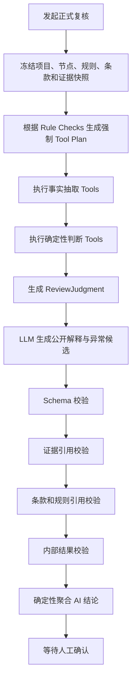
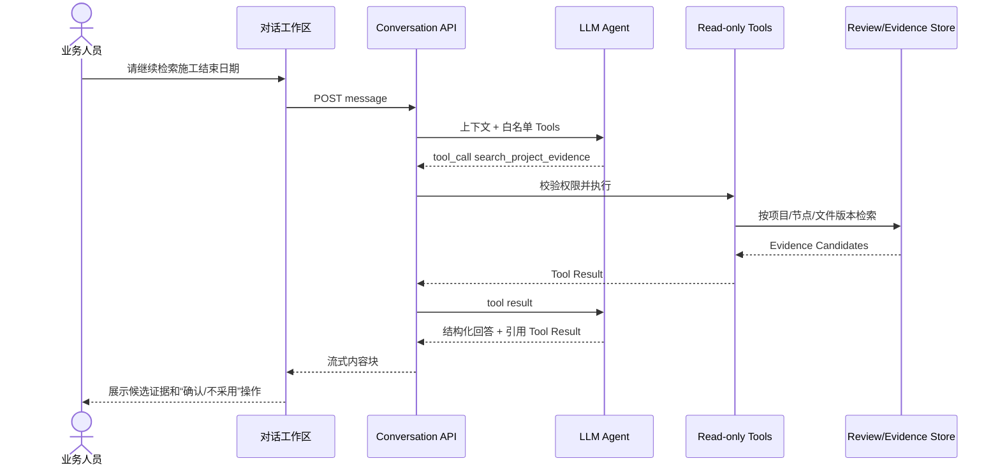
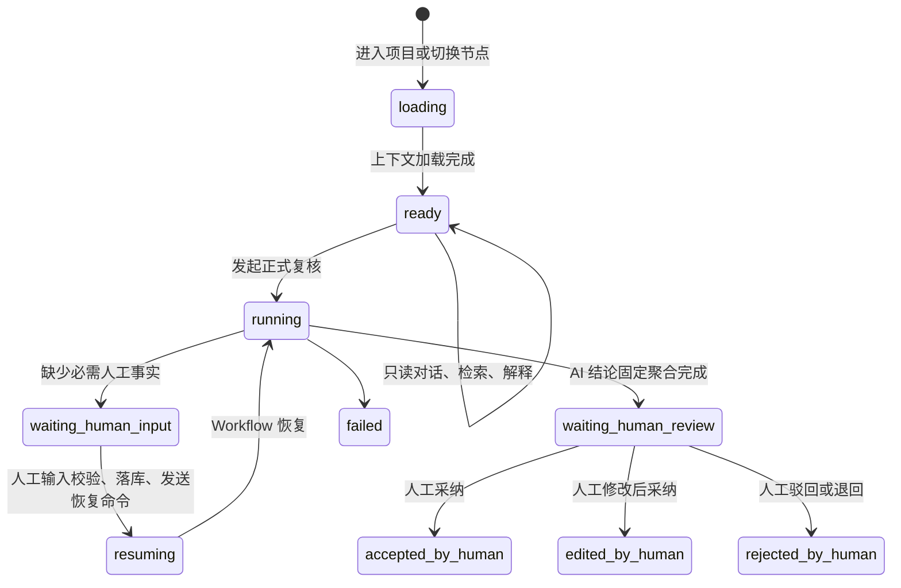
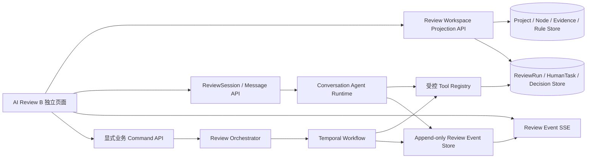

# AI 复核交互实现方案

## 1. 文档目标

本文结合“AI 工程监检复核工作台”交互稿和当前工程实现，说明对话式 AI 复核界面背后的整体调用方式、Tool 设计、ReviewRun 编排、会话状态、前后端接口、人工结论闭环及分阶段实施方案。

目标不是让 LLM 自由判断工程资料是否合格，而是形成以下边界清晰的业务闭环：

```text
固定标准条款 + 已发布业务规则 + 已确认文件证据
                    ↓
            强制执行确定性 Tools
                    ↓
        形成不可变事实与单项判断结果
                    ↓
      LLM 解释结果、检索补充证据、发现异常
                    ↓
              证据与依据校验
                    ↓
               AI 复核建议
                    ↓
              人工最终复核结论
```

核心原则：

- 对话是 ReviewRun 和审查数据的交互投影，不是正式业务事实的存储源。
- 标准条款绑定在规则发布时固定，运行时按 Clause ID 精确加载。
- 数值、日期、范围、比例、一致性和完整性判断必须由确定性 Tool 返回。
- 正式复核的必调 Tool 由编排器强制执行，不能依赖 LLM 自主决定是否调用。
- LLM 可以在对话中自主调用只读 Tool，但不能直接执行状态变更或形成最终人工结论。
- LLM 只能解释或引用 Tool Result，不能修改 Tool Result。
- 等待 AI 复核结果时，页面应像 Codex 等 Agent 产品一样持续输出实时工作动态，包括供应商 API 明确返回的 `reasoning_content`、正文 `content`、Tool Call 增量、计划、当前步骤、证据命中、规则计算、阶段性判断摘要和下一步。系统只采集模型接口实际返回的流式字段，不声称能够读取供应商未返回的内部隐藏状态。

## 2. 交互稿业务拆解

交互稿由四个主要区域组成。

### 2.1 左侧监检节点

左侧展示项目和监检节点树，包括：

- 节点分组；
- 节点名称；
- 已支撑资料数/所需资料数；
- AI 复核状态；
- 最近会话和执行记录入口。

节点切换只加载上下文，不应自动触发正式 AI 复核。节点切换后加载：

- NodePackage；
- 当前发布规则及固定条款；
- Evidence Readiness；
- 最近 ReviewRun；
- 当前 ReviewSession；
- 最近人工结论。

### 2.2 中间对话式复核工作区

中间区域承担两类任务：

1. 展示正式 ReviewRun 产生的规范依据、证据、规则判断和 AI 建议；
2. 允许业务人员继续要求 AI 检索证据、解释依据、分析异常和草拟意见。

对话消息不能只存 Markdown，应使用结构化内容块：

- `text`：普通说明；
- `basis_card`：标准规范依据；
- `evidence_card`：项目文件证据；
- `judgment_summary`：确定性判断摘要；
- `exception_candidate`：LLM 发现的异常候选；
- `action_suggestions`：可执行的下一步；
- `run_progress`：ReviewRun 或 Tool 执行进度；
- `agent_activity`：持续输出计划、Tool 调用、证据发现、规则计算和阶段性判断；
- `error`：可恢复错误。

### 2.3 右侧上下文与人工结论

右侧是当前会话的事实边界和正式人工写入口，包括：

- 当前任务；
- 当前状态；
- 已选择证据；
- 已采用规则；
- 快捷操作；
- 人工审查结论；
- 人工意见；
- 退回原因；
- 保存人工复核结论；
- 退回补正。

右侧“已选证据”是本次对话的工作集，不等于所有节点证据，也不等于正式结论已经引用的证据。正式保存时仍需经过 confirmed-only 校验。

### 2.4 ReviewRun 执行轨迹

底部折叠区展示后端真实执行结果：

- Graph Node；
- Tool Call；
- RuleCheckResult；
- Evidence Validation；
- Reference Validation；
- 内部结果校验（后端 `quality_gate`，不作为前端业务名称展示）；
- Timeline；
- 输入输出哈希。

这里必须直接读取后端 ReviewRun 数据，不能由前端根据状态自行拼装。

## 3. 当前项目实现评估

### 3.1 已有能力

当前工程已经具备较好的底座。

#### 业务上下文和证据

- `GET /api/projects/{projectId}/nodes/{nodeId}/package` 已返回节点、业务依据、资料要求、Evidence Readiness、EvidenceLink、OCR 字段、AI Run 和人工意见。
- `node_business_basis()` 已聚合规则、规则版本、标准文件和 `aiExecution`。
- `build_node_evidence_readiness()` 已实现 pending、missing、不可定位证据和 formal/gap_precheck 门禁。
- `EvidenceLocatorDialog.vue` 已能打开项目文件原文并按页码定位。
- `ReviewDecisionPanel.vue` 已实现 confirmed-only 人工结论证据选择。

#### ReviewRun 编排

当前 ReviewRun 已有以下真实步骤：

```text
load_context
load_ocr_result
run_rule_engine
retrieve_knowledge
build_prompt
llm_generate_findings
schema_validation
evidence_validation
reference_validation
critic_review
quality_gate（后端内部校验步骤，前端统一呈现为 AI 结论及其依据完整性状态）
persist_drafts
```

并已持久化：

- `review_runs`；
- `review_step_runs`；
- `review_graph_nodes`；
- `review_tool_calls`；
- `review_events`；
- `rule_check_results`；
- `retrieval_traces`；
- `review_findings`；
- `ai_feedback`。

#### 审计与安全边界

- 已保存 Prompt Hash、Response Hash、Input Hash 和 Output Hash。
- 已实现 EvidenceRef 与 Claim-to-Evidence 校验。
- 已实现 RuleRef、KBRef 校验。
- 已具备公开审计摘要策略；目标方案增加供应商 API 明确返回的 `reasoning_content` 和其他流式响应日志。普通审计包默认输出脱敏摘要，授权审计视图可以读取对应原始流事件。
- 已要求所有 AI Finding 进入人工确认。

### 3.2 当前关键缺口

#### 缺少真正的对话会话层

当前 `Workbench.vue` 主要展示节点包和 AI Run，没有：

- ReviewSession；
- ReviewMessage；
- 会话证据工作集；
- 命令解析；
- 对话流式事件；
- 会话与多个 ReviewRun 的关联。

#### 当前不是 LLM 原生 Tool Calling

目前由 Python 编排器提前调用少量 Tool，再把 `runtimeToolResults` 放进 Prompt。调用 QwenRuntime 时没有传递 `tools` 和 `tool_choice`，也没有处理模型返回的 `tool_calls`。

所以当前是：

```text
系统预调用 Tool → 结果写入 Prompt → LLM 生成 Finding
```

不是：

```text
LLM 发起 tool_calls → 系统执行 → Tool Result 回传 LLM
```

#### Tool 目录与真实实现不一致

Business Pack 已声明 T01—T12，但 `runtime_tools.py` 目前主要实现：

- OCR 结果读取；
- 印章识别读取；
- 结构化字段抽取；
- 焊工证字段抽取；
- 证照风险核验。

以下业务工具仍未形成统一、可执行的 Runtime Tool：

- `get_project_context`；
- `search_project_documents`；
- `search_knowledge_base`；
- `run_rule_engine`；
- `compare_cross_document_fields`；
- `analyze_field_media`；
- `calculate_sampling_plan`；
- `create_manual_confirmation_or_contact`；
- `create_review_finding_draft`。

#### 确定性规则能力不足

当前 `run_rule_engine` 仍偏流程占位，尚未实现通用原子算子：

- `required`；
- `all_equal`；
- `date_covers`；
- `range`；
- `coverage`；
- `ratio`；
- `cross_document_match`；
- `sampling_requirement`；
- `signature_completeness`。

#### 前端执行过程仍有推导内容

当前前端 `aiExecutionSteps` 会根据 Run 状态、下标和证据数量生成执行步骤。新的对话界面必须全部改为消费后端真实 Trace。

## 4. 总体调用架构

交互稿需要同时支持两种调用模式，不能把所有行为都交给同一种 Agent 循环。

### 4.1 模式 A：正式复核 ReviewRun

正式复核用于形成可进入人工确认的 AI 建议。

特点：

- 由用户点击“发起正式复核”或明确业务动作触发；
- 编排器根据已发布规则生成强制 Tool Plan；
- 所有必调 Tool 必须执行；
- Tool Result 是正式单项判断的唯一来源；
- LLM 只生成公开解释、风险摘要和异常候选；
- 总体 AI 结论由确定性聚合器生成；
- 完成后进入 `waiting_human_review`。



### 4.2 模式 B：对话式 AI 助理

对话模式用于解释、检索、补充分析和意见草拟。

特点：

- LLM 可以根据用户问题调用只读 Tool；
- Tool 必须受项目、节点、角色和证据范围限制；
- 只读 Tool 可以自动执行；
- 会产生写操作的动作必须转成显式业务 Action，由前端确认后调用正式接口；
- 对话回答不能覆盖 ReviewRun 结果；
- 对话中发现的新证据先进入 candidate/pending，不能直接成为 confirmed evidence。



### 4.3 为什么正式复核不能完全由 LLM 自主调用 Tool

如果让 LLM 自己决定正式复核调用哪些工具，会存在：

- 漏调必检项；
- 错传参数；
- 选择性忽略不利结果；
- 不同模型产生不同 Tool Plan；
- 同一输入无法保证可复现；
- 规则更新后无法精确审计。

因此正式复核的原则是：

```text
编排器强制调用 Mandatory Tools
LLM 可选调用 Supplemental Read-only Tools
```

## 5. 节点级 ReviewSession

### 5.1 会话对象

建议新增 `review_sessions`：

```json
{
  "id": "RSESSION-001",
  "projectId": "P-001",
  "nodeId": 1,
  "role": "inspection",
  "status": "active",
  "currentTask": "核对许可证有效期覆盖",
  "activeReviewRunId": "RRUN-001",
  "selectedEvidenceLinkIds": ["EV-001", "EV-002"],
  "selectedJudgmentIds": ["RJ-001"],
  "ruleVersion": "R01-v20260703",
  "contextRevision": 3,
  "createdBy": "USER-001",
  "createdAt": "2026-07-11 10:15:00",
  "updatedAt": "2026-07-11 10:21:00"
}
```

建议每个用户、项目、节点保留一个 active session，历史会话只读。

### 5.2 消息对象

新增 `review_messages`：

```json
{
  "id": "RMSG-001",
  "sessionId": "RSESSION-001",
  "role": "assistant",
  "messageType": "review_response",
  "contentBlocks": [
    {
      "type": "basis_card",
      "basisRefIds": ["BR-001"]
    },
    {
      "type": "evidence_card",
      "evidenceLinkIds": ["EV-001", "EV-002"]
    },
    {
      "type": "judgment_summary",
      "judgmentId": "RJ-001"
    },
    {
      "type": "action_suggestions",
      "actions": [
        {
          "actionKey": "continue_search_schedule",
          "label": "继续检索施工计划"
        }
      ]
    }
  ],
  "toolCallIds": ["RTC-001"],
  "reviewRunId": "RRUN-001",
  "createdAt": "2026-07-11 10:16:00"
}
```

禁止只保存最终渲染 Markdown。结构化内容块便于：

- 点击证据定位；
- 点击标准原文；
- 权限过滤；
- 更新卡片状态；
- 审计 LLM 引用了哪些 Tool Result；
- 避免模型输出任意 HTML。

## 6. Tool 体系设计

### 6.1 Tool Registry

建议统一 Business Pack 工具声明和 Runtime Tool 实现，形成唯一注册表：

```python
ToolDefinition(
    name="check_date_covers",
    description="判断一个有效期区间是否覆盖业务活动区间",
    input_schema={...},
    output_schema={...},
    handler=check_date_covers,
    risk_level="read_only_deterministic",
    allowed_modes=["formal_review", "gap_precheck", "conversation"],
    allowed_roles=["inspection", "fde"],
    result_authority="formal_judgment",
)
```

每个 Tool 必须声明：

- `name`；
- `version`；
- `description`；
- `inputSchema`；
- `outputSchema`；
- `handler`；
- `riskLevel`；
- `allowedModes`；
- `allowedRoles`；
- `timeout`；
- `resultAuthority`；
- `auditPolicy`。

### 6.2 上下文和检索 Tools

建议实现：

| Tool | 用途 | 对话可自动调用 |
| --- | --- | ---: |
| `get_review_context` | 获取项目、节点、规则版本和当前状态 | 是 |
| `get_node_requirements` | 获取节点必传资料和审查点 | 是 |
| `get_bound_rule_basis` | 按规则配置读取固定标准条款 | 是 |
| `get_confirmed_evidence` | 获取节点 confirmed evidence | 是 |
| `search_project_evidence` | 在授权文件版本中检索证据候选 | 是 |
| `get_evidence_detail` | 获取 EvidenceLink、字段和定位信息 | 是 |
| `get_review_run_trace` | 获取当前 ReviewRun 真实执行轨迹 | 是 |

### 6.3 事实抽取 Tools

建议实现：

| Tool | 输出 |
| --- | --- |
| `extract_org_name` | 单位名称及 EvidenceRef |
| `extract_license_scope` | 许可范围及 EvidenceRef |
| `extract_valid_period` | 开始/结束日期及 EvidenceRef |
| `extract_project_period` | 项目或施工起止日期 |
| `extract_pipeline_class` | GC1/GC2/GCD 等等级 |
| `extract_pressure_parameters` | 设计压力、试验压力、量程 |
| `extract_hold_duration` | 保压开始、结束和时长 |
| `extract_ndt_ratio` | 检测数量、总数和比例 |
| `extract_signature_status` | 签字、签章和审批完整性 |

事实输出必须包含：

- `factCode`；
- `value`；
- `normalizedValue`；
- `valueType`；
- `evidenceLinkId`；
- `documentVersionId`；
- `pageNo`；
- `bbox`；
- `quotedText`；
- `confidence`；
- `qualityFlags`。

### 6.4 确定性判断 Tools

建议实现原子算子：

| Tool | 用途 |
| --- | --- |
| `check_required` | 必填事实或必传证据是否存在 |
| `check_all_equal` | 多来源标准化值是否一致 |
| `check_date_covers` | 有效期是否覆盖业务周期 |
| `check_range` | 数值是否在规定范围 |
| `check_scope_coverage` | 许可或资格范围是否覆盖实际活动 |
| `check_ratio` | 检测、抽样或覆盖比例是否满足要求 |
| `check_cross_document_match` | 跨文件字段是否一致 |
| `check_sampling_requirement` | 抽查样本数量和覆盖范围 |
| `check_signature_completeness` | 签字、签章和审批是否完整 |

统一 Tool Result：

```json
{
  "toolCallId": "RTC-R01-DATE-001",
  "toolName": "check_date_covers",
  "toolVersion": "1.0.0",
  "checkId": "R01-valid-period",
  "status": "succeeded",
  "inputs": {
    "licenseStart": "2024-03-15",
    "licenseEnd": "2026-09-30",
    "constructionStart": "2026-06-01",
    "constructionEnd": null
  },
  "basisRefIds": ["BR-TSG07-B1.1"],
  "evidenceLinkIds": ["EV-001", "EV-002"],
  "result": "insufficient_evidence",
  "reasonCode": "MISSING_CONSTRUCTION_END_DATE",
  "publicExplanationTemplateData": {
    "missingField": "施工结束日期"
  },
  "inputHash": "sha256:...",
  "outputHash": "sha256:..."
}
```

### 6.5 聚合 Tool

新增 `aggregate_review_judgments`，根据固定优先级形成 AI 总体建议：

```text
有 fail
→ 需补正

无 fail，但有 insufficient_evidence / needs_human_review
→ 需人工确认

全部 not_applicable
→ 不适用

其余全部 pass / not_applicable
→ 满足要求
```

LLM不能覆盖该 Tool Result。

### 6.6 写操作 Tools 的边界

以下动作不能作为 LLM 可自动执行 Tool：

- 确认证据；
- 驳回证据；
- 保存人工结论；
- 退回补正；
- 修改节点状态；
- 生成正式报告；
- 归档项目；
- 发布或回滚规则。

LLM只能返回 Action Suggestion。用户点击后，前端调用现有业务接口，并要求：

- 身份和角色校验；
- 项目与节点范围校验；
- Idempotency-Key；
- 必要时 If-Match；
- confirmed-only 证据校验；
- 完整审计日志。

## 7. 规则配置调整

当前自然语言 `verificationSteps` 需要逐步升级为结构化 `checks`。

R01 有效期覆盖示例：

```yaml
checks:
  - id: R01-valid-period
    title: 设计许可证有效期覆盖
    requiredFacts:
      - license_start_date
      - license_end_date
      - construction_start_date
      - construction_end_date
    extractTools:
      - name: extract_valid_period
        sourceMaterialTypes: [design_license]
      - name: extract_project_period
        sourceMaterialTypes: [construction_schedule, design_document]
    decisionTool:
      name: check_date_covers
      arguments:
        coverStart: ${facts.license_start_date}
        coverEnd: ${facts.license_end_date}
        targetStart: ${facts.construction_start_date}
        targetEnd: ${facts.construction_end_date}
    basisRefs:
      - standardCode: TSG 07-2019
        clauseId: CLAUSE-TSG07-B1.1
        clauseNo: 附件 B 第 B1.1 条
    onMissing: insufficient_evidence
    onPass: pass
    onFail: fail
```

规则发布时校验：

- Tool 是否存在；
- Tool 版本是否可用；
- 参数表达式是否合法；
- Clause ID 是否存在且有效；
- 所需资料类型是否已配置；
- 输出是否可以映射到 ReviewJudgment；
- 测试样例是否全部通过。

## 8. LLM 调用协议

### 8.1 正式复核中的 LLM 输入

正式复核调用 LLM 时，只提供：

- 固定条款快照；
- Tool Results；
- Evidence Snippets；
- ReviewJudgments；
- 允许引用的 EvidenceLink ID；
- 允许引用的 Clause ID；
- 当前人工确认边界。

不提供整份项目文件全文，也不要求模型重新计算确定性规则。

```json
{
  "task": "explain_review_results_and_detect_exceptions",
  "reviewRunId": "RRUN-001",
  "judgments": [
    {
      "judgmentId": "RJ-001",
      "checkId": "R01-valid-period",
      "result": "insufficient_evidence",
      "reasonCode": "MISSING_CONSTRUCTION_END_DATE",
      "toolCallIds": ["RTC-R01-DATE-001"],
      "basisRefIds": ["BR-TSG07-B1.1"],
      "evidenceLinkIds": ["EV-001", "EV-002"]
    }
  ],
  "allowedEvidenceLinkIds": ["EV-001", "EV-002"],
  "allowedBasisRefIds": ["BR-TSG07-B1.1"],
  "allowedOutputs": [
    "publicExplanation",
    "riskSummary",
    "exceptionCandidates",
    "humanConfirmationQuestions",
    "actionSuggestions"
  ]
}
```

### 8.2 正式复核中的 LLM 输出

```json
{
  "judgmentExplanations": [
    {
      "judgmentId": "RJ-001",
      "publicExplanation": "许可证有效期截止至 2026-09-30，但施工计划中未识别到施工结束日期，因此无法完成覆盖校验。",
      "citedToolCallIds": ["RTC-R01-DATE-001"],
      "citedEvidenceLinkIds": ["EV-001", "EV-002"],
      "citedBasisRefIds": ["BR-TSG07-B1.1"]
    }
  ],
  "exceptionCandidates": [],
  "humanConfirmationQuestions": [
    "请确认项目计划施工结束日期。"
  ],
  "actionSuggestions": [
    {
      "actionKey": "search_construction_end_date",
      "label": "继续检索施工计划"
    }
  ]
}
```

正式 LLM 输出中不允许出现：

- 新的正式结论；
- 修改后的 Tool Result；
- 新 EvidenceLink ID；
- 新 Clause ID；
- 节点状态；
- 自动确认或驳回操作。

### 8.3 对话模式中的 Tool Calling

对话模式可以使用模型原生 `tools`：

```python
response = qwen_runtime_client.chat_sync(
    messages,
    model="review-chat",
    tools=conversation_tool_schemas,
    tool_choice="auto",
    response_format={"type": "json_object"},
)
```

服务端需要实现 Agent Loop：

```text
1. 调用模型
2. 检查 message.tool_calls
3. 校验 Tool 是否在当前角色和模式白名单
4. 校验参数不能越出 projectId/nodeId/documentVersionIds
5. 执行 Tool
6. 保存 Tool Call 和 Tool Result
7. 以 role=tool 回传结果
8. 再次调用模型
9. 达到最大轮次或获得最终结构化回答
```

建议限制：

- 单条用户消息最多 5 次 Tool Call；
- 最多 3 轮 Agent Loop；
- Tool 超时 30 秒；
- 搜索结果最多 20 条；
- LLM 最终引用必须是本轮或当前 ReviewRun 已存在的 Tool Result；
- 禁止模型自行扩大项目、节点或文件范围。

### 8.4 实时 Agent 推理活动流

用户发起正式复核或对话任务后，不能只显示一个静态 Loading，应该持续输出类似 Codex 的 Agent 工作动态。动态内容同时来自两部分：一是 ReviewRun、Tool Executor 在明确检查点产生的业务活动事件；二是模型供应商接口实际返回的 `reasoning_content`、`content`、`tool_calls`、`usage` 和完成原因等流式字段。

建议事件类型：

| 事件 | 页面展示示例 | 数据来源 |
| --- | --- | --- |
| `agent.plan.created` | 已生成复核计划：读取依据、核对两份证据、执行有效期覆盖检查 | Review Orchestrator |
| `agent.step.started` | 正在读取设计许可证和施工进度计划 | Graph Node |
| `tool.call.started` | 正在调用 `extract_valid_period` | Tool Executor |
| `tool.call.progress` | 已处理 2/4 个文档版本 | Tool Executor |
| `evidence.discovered` | 在设计许可证第 1 页识别到有效期 2026-09-30 | Evidence Tool Result |
| `tool.call.completed` | 有效期字段抽取完成，置信度 96% | Tool Result |
| `rule.evaluation.started` | 正在执行 `check_date_covers` | Rule Tool Executor |
| `rule.evaluation.completed` | 缺少施工结束日期，当前无法完成覆盖校验 | Rule Tool Result |
| `model.reasoning.delta` | 正在分析许可证截止日期与施工周期的覆盖关系…… | Provider `reasoning_content` |
| `model.content.delta` | 当前证据只能证明许可证截止日期…… | Provider `content` |
| `model.tool_call.delta` | 模型请求调用 `search_project_evidence` | Provider `tool_calls` |
| `agent.reasoning.summary` | 当前证据只能证明许可证截止日期，尚不能证明覆盖完整施工周期 | 公开阶段性摘要 |
| `agent.next_action` | 下一步检索施工计划、进度表及相关附件 | Orchestrator/LLM Suggestion |
| `ai.conclusion.ready` | AI结论：证据不足，需业务确认 | Aggregation Tool |
| `human.review.required` | 等待监检人员确认 | ReviewRun |

前端按时间顺序把这些事件渲染为“AI正在处理”的动态消息，例如：

```text
10:21:03  已生成复核计划，共 6 个步骤
10:21:04  正在读取固定依据：TSG 07-2019 附件 B 第 B1.1 条
10:21:05  正在检索已确认的项目证据，共 2 份文件
10:21:07  在设计单位许可证第 1 页识别到：有效期至 2026-09-30
10:21:09  施工进度计划中尚未识别到施工结束日期
10:21:10  正在执行日期覆盖检查 check_date_covers
10:21:10  阶段性判断：现有证据不足以完成有效期覆盖校验
10:21:11  正在继续检索施工计划、进度表和附件
```

实时输出规则：

- 每个事件必须来自真实 Graph Node、Tool Call、Tool Result 或明确的阶段性摘要；
- `model.reasoning.delta` 必须逐块来自供应商响应中的 `reasoning_content`，不得由前端或中间服务补写；
- `model.content.delta` 和 `model.tool_call.delta` 必须保留供应商返回顺序；
- 不使用预设假进度或前端拼装“思考内容”；
- 不展示未经过证据约束的自由联想；
- 阶段性摘要必须引用当前已存在的 Tool Call ID、EvidenceLink ID 或 BasisRef ID；
- Tool Result 更新后，可以追加新事件，但不能悄悄修改已经完成的历史事件；
- 最终 AI结论必须以 `ai.conclusion.ready` 单独输出，并与中间活动明确区分；
- Agent活动和供应商明确返回的推理流均可实时展示并持久化；供应商没有返回的内部隐藏状态不在系统能力范围内。

传输方式建议使用 SSE：

```text
event: agent.step.started
data: {"eventId":"REVT-001","step":"extract_facts","title":"正在提取有效期"}

event: evidence.discovered
data: {"eventId":"REVT-002","evidenceLinkId":"EV-001","summary":"有效期至 2026-09-30"}

event: agent.reasoning.summary
data: {"eventId":"REVT-003","toolCallIds":["RTC-001"],"summary":"缺少施工结束日期，暂不能完成覆盖校验"}

event: model.reasoning.delta
data: {"eventId":"MSEVT-018","sequence":18,"delta":"正在比较许可证截止日期与施工计划日期……"}

event: model.content.delta
data: {"eventId":"MSEVT-019","sequence":19,"delta":"当前证据不足以完成覆盖校验。"}
```

如果模型接口返回 `reasoning_content`，后端应在完成权限和脱敏处理后通过 SSE 直接透传给当前授权页面，并同步写入追加式模型流日志。业务页面需要把“模型实时推理”“Tool执行记录”“最终AI结论”明确分区，避免把尚未完成的推理文本误认为正式判断结果。

### 8.5 模型流式响应采集与日志保存

当前 `QwenRuntimeClient` 以同步完整响应为主。目标实现需要增加 `chat_stream()`，以 OpenAI 兼容流式协议处理：

```python
stream = qwen_runtime_client.chat_stream(
    messages,
    model="review-chat",
    tools=conversation_tool_schemas,
    tool_choice="auto",
    stream=True,
    stream_options={"include_usage": True},
)
```

后端逐块解析：

```text
choices[].delta.reasoning_content
choices[].delta.content
choices[].delta.tool_calls
choices[].finish_reason
usage
provider/model/conversation_id
```

不应把供应商 SSE 连接直接暴露给浏览器。正确链路是：

```text
模型供应商 SSE
→ QwenRuntime Stream Parser
→ 先写 model_stream_events
→ 发布 ReviewSession SSE
→ 前端按 sequence 渲染
```

建议新增 `model_stream_events`，按原始顺序追加写入：

```json
{
  "id": "MSEVT-001",
  "reviewRunId": "RRUN-001",
  "sessionId": "RSESSION-001",
  "messageId": "RMSG-001",
  "sequence": 1,
  "eventType": "reasoning.delta",
  "provider": "QwenRuntime",
  "modelAlias": "review-chat",
  "modelResolved": "qwen3-...",
  "conversationId": "chatcmpl-...",
  "choiceIndex": 0,
  "delta": "正在分析许可证有效期……",
  "rawChunkHash": "sha256:...",
  "previousEventHash": "sha256:...",
  "eventHash": "sha256:...",
  "visibility": "authorized_project_reviewers",
  "redactionStatus": "checked",
  "createdAt": "2026-07-11 10:21:03.183"
}
```

同时在模型调用完成后生成组装快照：

```json
{
  "reasoningText": "完整拼接后的 reasoning_content",
  "contentText": "完整拼接后的 content",
  "toolCalls": [],
  "usage": {},
  "finishReason": "stop",
  "firstEventSequence": 1,
  "lastEventSequence": 64,
  "reasoningHash": "sha256:...",
  "contentHash": "sha256:...",
  "streamHash": "sha256:..."
}
```

保存要求：

- 原始事件追加写入，禁止覆盖和重新排序；
- 每个事件记录 `sequence`、时间和前后哈希，支持完整性校验；
- PostgreSQL 保存检索元数据和组装快照，大体积原始流可以压缩后写入 MinIO；
- 日志写入成功后再向前端确认对应事件，避免页面可见但日志缺失；
- SSE 重连使用 `Last-Event-ID` 从最后确认序号续传；
- `reasoning_content`、`content` 和 Tool 参数分别存储，不能混成一个字符串；
- 过滤 API Key、Authorization Header、连接地址中的凭据和系统内部密钥；
- 按项目和节点权限控制在线查看；FDE/Admin 可以在授权后查看原始事件；
- 配置独立保留期限、导出权限和删除审计；
- 最终业务结论仍只引用 Tool Result 和 ReviewJudgment，不能引用未校验的推理片段作为证据。

## 9. 交互动作与调用映射

### 9.1 用户自然语言提问

示例：

> 请核对设计单位许可证有效期是否覆盖本工程施工周期，并说明依据。

处理：

1. 判断当前节点是否已有有效 ReviewRun；
2. 若无，则提示用户发起正式复核或运行缺项预审；
3. 若有，则加载对应 ReviewJudgment；
4. 若事实完整，直接基于 Tool Result 解释；
5. 若事实缺失，允许 LLM 调用 `search_project_evidence`；
6. 返回依据卡、证据卡、判断摘要和下一步操作。

### 9.2 `/检索证据`

调用：

- `get_node_requirements`；
- `search_project_evidence`；
- `get_evidence_detail`。

结果作为候选证据显示，状态为 pending。用户必须点击“确认”或“不采用”。

### 9.3 `/解释依据`

调用：

- `get_bound_rule_basis`；
- `get_review_run_trace`；
- 可选 LLM 生成通俗解释。

不进行向量猜测，不改变固定 Clause ID。

### 9.4 `/草拟意见`

前置条件：

- 当前 ReviewRun 已完成；
- Tool Results 已通过校验；
- 至少存在一个 ReviewJudgment；
- 当前用户有人工审查权限。

LLM仅生成意见文字草稿，并标记来源 Judgment、Evidence 和 Basis。用户确认后再写入右侧人工意见输入框。

### 9.5 `@规则库`

用于打开当前规则及固定条款选择器，不允许在对话中修改或发布规则。

### 9.6 “让 AI 解释依据”

复用当前已选 Judgment 和 Basis，不触发新的正式 ReviewRun。

### 9.7 “让 AI 补充证据”

调用只读证据搜索 Tool，结果进入候选证据，不自动加入正式结论。

### 9.8 “引用到审查意见”

属于人工界面动作：

- 将当前 Basis/Evidence/Judgment 引用加入人工意见草稿；
- 不由 LLM直接写数据库；
- 保存时统一走 `review-opinions` 证据校验。

### 9.9 “生成 AI 意见草稿”

LLM根据当前 Tool Results 生成可编辑文字，不能改变 AI 聚合结论。

### 9.10 “保存人工复核结论”

必须写入：

- `sourceReviewRunId`；
- `adoptedJudgmentIds`；
- `modifiedJudgments`；
- `evidenceLinkIds`；
- `basisRefIds`；
- 人工结论；
- 人工意见；
- 修改原因；
- 操作人和时间。

然后在同一业务事务中：

- 写 ReviewOpinion；
- 写 HumanDecision；
- 写 AI Feedback；
- 发送 Temporal Signal；
- 更新节点状态。

## 10. 后端接口方案

### 10.1 会话接口

```http
GET /api/projects/{projectId}/inspection/nodes/{nodeId}/review-session
POST /api/projects/{projectId}/inspection/nodes/{nodeId}/review-session
GET /api/review-sessions/{sessionId}/messages
POST /api/review-sessions/{sessionId}/messages
GET /api/review-sessions/{sessionId}/events
POST /api/review-sessions/{sessionId}/actions/{actionKey}
```

`events` 建议使用 SSE，事件类型：

- `assistant.started`；
- `assistant.delta`；
- `agent.plan.created`；
- `agent.step.started`；
- `tool.call.started`；
- `tool.call.progress`；
- `evidence.discovered`；
- `tool.call.completed`；
- `rule.evaluation.started`；
- `rule.evaluation.completed`；
- `model.reasoning.started`；
- `model.reasoning.delta`；
- `model.reasoning.completed`；
- `model.content.delta`；
- `model.tool_call.delta`；
- `model.usage`；
- `model.completed`；
- `agent.reasoning.summary`；
- `agent.next_action`；
- `ai.conclusion.ready`；
- `artifact.updated`；
- `review_run.progress`；
- `review_run.waiting_human`；
- `human.review.required`；
- `assistant.completed`；
- `error`。

### 10.2 正式复核聚合接口

```http
GET /api/projects/{projectId}/inspection/nodes/{nodeId}/review-runs/{reviewRunId}/audit-view
```

返回：

```json
{
  "reviewRun": {},
  "overallConclusion": {},
  "judgments": [],
  "basisSnapshot": [],
  "evidenceSnapshot": [],
  "toolCalls": [],
  "executionTrace": [],
  "qualityGate": {},
  "humanDecision": null
}
```

### 10.3 Tool 调试接口

仅 FDE 可用：

```http
GET /api/fde/runtime-tools
POST /api/fde/runtime-tools/{toolName}/dry-run
GET /api/fde/review-runs/{reviewRunId}/tool-calls
```

### 10.4 人工结论接口调整

现有 `POST /review-runs/{id}/human-decision` 与 `POST /review-opinions` 建议收敛为一个业务事务接口，或由一个服务函数统一处理，避免出现 ReviewRun 已接受但 ReviewOpinion 未保存的双状态。

## 11. 前端实现方案

### 11.1 页面组件拆分

不要继续把全部功能堆进现有大型 `Workbench.vue`，建议新增页面和组件：

```text
views/AICheck/ConversationalReviewWorkbench.vue
views/AICheck/components/review-chat/
├─ ReviewNodeSidebar.vue
├─ ReviewConversationHeader.vue
├─ ReviewConversationList.vue
├─ ReviewMessageRenderer.vue
├─ ReviewBasisCard.vue
├─ ReviewEvidenceCard.vue
├─ ReviewJudgmentCard.vue
├─ ReviewActionSuggestions.vue
├─ ReviewComposer.vue
├─ ReviewContextPanel.vue
├─ HumanConclusionPanel.vue
├─ ReviewRunTracePanel.vue
└─ ReviewToolProgress.vue
```

复用现有：

- `ProjectNodeTree.vue`；
- `EvidenceLocatorDialog.vue`；
- `ReviewDecisionPanel.vue` 中的人工结论校验逻辑；
- `AuditWorkflowProgress.vue` 的状态表达；
- `status.ts`；
- `confidence.ts`。

### 11.2 前端状态管理

建议增加 Pinia Store：

```text
store/modules/reviewConversation.ts
```

主要状态：

- currentProjectId；
- currentNodeId；
- session；
- messages；
- selectedEvidence；
- selectedJudgments；
- activeReviewRun；
- auditView；
- toolProgress；
- reasoningStream；
- contentStream；
- modelStreamSequence；
- humanDraft；
- connectionStatus；
- pendingAction。

### 11.3 页面加载顺序

```text
1. 加载 Project Context
2. 加载 Project Tree
3. 加载 Node Package
4. 加载或创建 ReviewSession
5. 加载 Messages
6. 加载最新 ReviewRun Audit View
7. 建立 SSE 连接
8. 恢复右侧人工草稿
```

节点切换时必须取消旧节点的：

- SSE；
- 轮询；
- 文件预览 Object URL；
- 未完成请求；
- 临时 Tool Progress。

### 11.4 消息渲染

`ReviewMessageRenderer` 按 `contentBlocks.type` 渲染组件，不使用不受控的 `v-html`。

模型流式消息应拆成三个可折叠区域：

- “AI 实时推理”：逐块追加供应商返回的 `reasoning_content`；
- “执行记录”：展示 Graph、Tool、Evidence 和 Rule 事件；
- “AI 回复/结论”：展示 `content` 和最终确定性 AI结论。

`reasoning_content` 只能以纯文本或受控 Markdown 渲染，禁止执行 HTML、脚本、链接协议或模型输出的前端指令。

证据卡操作：

- 查看原文；
- 确认；
- 不采用；
- 加入当前上下文；
- 从当前上下文移除。

依据卡操作：

- 查看规范原文；
- 查看条款版本；
- 查看绑定规则；
- 引用到人工意见。

判断卡操作：

- 查看 Tool Result；
- 查看证据；
- 查看依据；
- 采纳；
- 修改；
- 驳回；
- 生成解释。

### 11.5 实时 Agent 动态与进度展示

交互稿中的“正在检索……60%”应升级为持续输出的 Agent 活动流，不能使用虚假百分比或前端伪造的思考内容。

建议：

- 在对话区持续追加计划、步骤、Tool、证据发现、规则计算和阶段性判断事件；
- 有确定步骤总数时显示真实百分比；
- Tool 未知耗时时使用不确定进度条；
- 展示当前 Tool 名称和已完成数量；
- 失败时保留已完成产物并提供重试。

示例：

```text
正在检索施工计划和进度文件
已完成 3/5：目录检索、OCR字段搜索、日期候选归一化
当前：证据定位校验
阶段性判断：已找到许可证截止日期，尚未找到施工结束日期
```

## 12. 数据持久化调整

建议新增集合：

- `review_sessions`；
- `review_messages`；
- `review_judgments`；
- `review_tool_results`；
- `review_action_runs`；
- `model_stream_events`；
- `model_stream_snapshots`。

继续复用：

- `review_runs`；
- `review_tool_calls`；
- `review_events`；
- `rule_check_results`；
- `retrieval_traces`；
- `evidence_links`；
- `node_evidence_links`；
- `review_opinions`；
- `ai_feedback`。

Tool Result 和 Judgment 必须不可被对话覆盖。重跑生成新记录并保留 parent ID。

## 13. 权限、安全与审计

### 13.1 Tool 权限

每次 Tool 执行必须校验：

- 当前登录用户；
- 角色；
- projectId；
- nodeId scope；
- documentVersionIds 是否属于授权节点；
- Tool 是否允许在当前模式调用；
- Tool 是否只读；
- 当前会话是否仍有效。

不能信任 LLM 传入的 projectId、nodeId 和 documentVersionIds，应由服务端覆盖为当前 Session Scope。

### 13.2 敏感数据

- Temporal Payload 继续只保存 ID、版本和哈希；
- 供应商实际返回的 `reasoning_content`、`content`、Tool Call增量和Usage写入独立模型流日志，不写入 Temporal Payload；
- 模型流日志按项目、节点、ReviewRun和Session隔离，使用静态加密及传输加密；
- 授权监检人员可以查看所属项目当前Run的实时推理流，FDE/Admin通过授权查看原始历史流；
- 建设方、施工方、无损检测方默认只查看最终AI结论和公开执行摘要；
- 原文和 OCR 大文本保存在 PostgreSQL/MinIO；
- 普通业务页面不返回完整 Prompt；
- FDE 原始访问继续使用 Access Grant；
- 对话日志按项目权限隔离；
- 导出只包含公开审计摘要。

### 13.3 审计记录

每次对话调用至少记录：

- Session ID；
- Message ID；
- ReviewRun ID；
- Model Alias/Resolved Model；
- Prompt Version；
- Tool Definitions Hash；
- Tool Calls；
- Tool Input/Output Hash；
- EvidenceLink IDs；
- BasisRef IDs；
- Assistant Output Hash；
- 用户后续采纳、修改或驳回。

## 14. 错误和降级策略

### 14.1 LLM不可用

- 正式确定性 Tool Results 保留；
- 使用模板生成最小可读说明；
- 页面标记“解释生成失败，不影响规则计算结果”；
- 继续展示已经产生的计划、Tool 调用、证据发现和规则计算事件，不伪造后续思考内容；
- 人工仍可查看证据、依据和 Tool Result。

### 14.2 Tool失败

- 对应 Judgment 进入 `needs_human_review`；
- 显示 Tool 名称、错误码和可恢复操作；
- 不允许 LLM猜测缺失结果；
- 可重试 Tool，但生成新的 Tool Call 记录。

### 14.3 证据不足

- 输出 `insufficient_evidence`；
- LLM可以提出需要补充的资料；
- 可以调用只读搜索 Tool；
- 搜索结果先进入 pending evidence；
- 正式结论不得变成 pass。

### 14.4 对话超时或断线

- 消息先创建为 `processing`；
- Tool 和 LLM执行异步化；
- SSE重连后按事件序号补发；
- 前端刷新后可以恢复执行状态；
- Idempotency-Key 防止重复消息或重复 Tool 执行。

## 15. 测试与验收

### 15.1 后端测试

- Tool Registry 与 Business Pack 工具声明一致；
- 所有已发布规则引用的 Tool 均可执行；
- Mandatory Tool 不会被 LLM跳过；
- Tool输入不能越出 Session Scope；
- 同一输入和 Tool版本得到相同结果；
- LLM不能修改 Tool Result；
- LLM引用的 ToolCall、EvidenceLink、Clause 均存在；
- 无证据时不能形成满足要求；
- ReviewRun重跑不覆盖原记录；
- HumanDecision和ReviewOpinion保持一致。

### 15.2 前端测试

- 节点切换正确清理旧会话请求；
- 对话消息结构化渲染；
- 证据点击能打开原文；
- 条款点击能打开规范原文；
- SSE断线可恢复；
- Tool进度来自真实事件；
- 只读角色不能执行人工结论操作；
- pending evidence不能用于满足要求结论；
- 人工修改必须填写原因；
- 保存后AI结论、人工结论、节点状态清晰区分。

### 15.3 核心验收标准

1. 每条正式 AI 判断至少关联一个成功的确定性 Tool Result。
2. 每个 Tool Result 引用的事实都能定位到 EvidenceLink。
3. 每个正式判断的标准依据来自规则固定 Clause ID。
4. LLM输出不能新增未授权 EvidenceLink、Clause ID 或 Tool Result。
5. 前端判断过程全部来自后端真实数据。
6. LLM不可用时仍能查看事实、计算和规则结果。
7. 对话补充证据必须经过人工确认才能用于正式结论。
8. 人工最终结论保存来源 ReviewRun、Judgment 和证据引用。
9. 执行轨迹可以还原本次使用的模型、规则、Tool和文件版本。
10. 等待结果期间持续展示真实 Agent 活动流，且所有阶段性判断均能关联 Graph Node、Tool Call、EvidenceLink 或 BasisRef。
11. 对供应商 API 实际返回的 `reasoning_content`、`content`、`tool_calls` 和 `usage` 完成按序透传、追加式保存、断线续传和哈希校验。
12. 系统不声称或尝试采集供应商接口没有返回的内部隐藏状态。

## 16. 分阶段实施计划

### 第一阶段：正式 ReviewRun 工具化

目标：先保证“怎么判”完全可审计。

- 统一 Tool Registry；
- 实现原子判断 Tools；
- 规则 YAML 增加结构化 checks；
- 新增 ReviewJudgment；
- 强制 Tool Plan；
- LLM输出收窄为解释和异常候选；
- 新增 audit-view 聚合接口；
- Workbench 使用真实 Trace。

建议优先试点：

- R01 设计单位许可资质；
- 焊工资格覆盖；
- 压力试验参数。

### 第二阶段：对话式会话

目标：实现交互稿中间会话区。

- ReviewSession；
- ReviewMessage；
- 结构化 Content Blocks；
- Conversation Tool Calling Agent Loop；
- SSE；
- 命令和快捷操作；
- 证据候选确认闭环。

### 第三阶段：人工结论一体化

目标：统一AI建议、对话辅助和人工正式结论。

- Judgment级采纳、修改、驳回；
- HumanDecision与ReviewOpinion事务化；
- 意见草稿引用；
- 修改差异记录；
- 报告和证据包输出。

### 第四阶段：治理与上线

- Tool版本发布、回滚和兼容性；
- 规则发布前Tool测试集；
- LLM提示词和模型评估；
- 误报/漏报反馈集；
- 性能、成本和缓存；
- 权限、脱敏和安全回归；
- 生产环境全链路探针。

## 17. 最终建议

这套交互界面应该建立在“双层 AI 调用模型”上：

```text
正式复核层：
规则驱动 → 强制 Tools → ReviewJudgment → LLM解释 → AI结论 → 人工确认

对话辅助层：
用户问题 → LLM Tool Calling → 只读 Tools → 结构化回答 → 人工选择后进入正式业务动作
```

当前工程已经具备 ReviewRun、LangGraph、Temporal、EvidenceLink、规则版本、知识条款、Tool Call审计和人工结论门禁，可以复用大部分底座。主要缺口是：

1. T01—T12 与真实 Runtime Tool 尚未统一；
2. 确定性业务规则工具尚未完成；
3. LLM 原生 Tool Calling Agent Loop 尚未实现；
4. ReviewSession 和结构化对话消息尚未实现；
5. 人工结论与 ReviewRun HumanDecision 尚未事务化；
6. 当前前端执行过程仍需替换为真实后端 Trace。

因此推荐先完成正式复核工具化，再实现对话交互。否则界面虽然呈现为 Agent 对话，底层仍然只是“结果文本聊天化”，无法达到可复现、可审计、可上线的 AI 复核要求。

## 18. 本轮固定条款落地状态（2026-07-14）

正式复核工具化的第一个前置问题“业务节点与具体标准条款固定绑定”已经完成六批梳理：

- 69 条已发布、原文核验的主条款绑定；
- 69 个节点条款包，包含专业补充条款和条件分支；
- 189 个由业务规则拆出的原子审核项；
- 29 份本地标准目录记录；
- 112 条专业条款引用已补齐 202 个 PDF 页级 locator，组合条款的不连续落点已拆分；
- 节点标准接口优先返回固定主条款和专业条款，并通过 `previewUrl#page=N` 跳转标准原文；
- R10 已直接绑定 TSG 31—2025 第 1.9(3)，不再用 TSG D7006 D2.2 间接推定；
- R69 已绑定 TSG D7006—2020 第 2.2.4 条及附件 G，Tool 仅校验证据和人工评价报告，不能自动生成评价结论；
- 加载器会校验节点、规则、条款、原子项、标准目录和发布状态的一致性；
- 独立二次检查已复核 TSG D7006 PDF 第 27～32 页及扫描件专业条款，并纠正章号错位。

运行时读取顺序固定为：

```text
businessPackVersion + sourceRuleId + nodeId
                ↓
standardClausePackage（冻结进 ReviewRun）
                ↓
atomicChecks → deterministic tools → Tool Result
                ↓
LLM 组织证据与解释结果 → AI结论 → 人工结论
```

条款包明确设置 `llmMaySelectClause=false` 和 `llmMayChangeDeterministicResult=false`。因此后续实现 Tool Registry 与 Agent Loop 时，不应重新让 LLM 决定采用哪条标准，也不应让 LLM 覆盖数值、日期、范围、比例或完整性 Tool 的返回结果。

完整矩阵见 `docs/业务节点具体标准条款审核矩阵.md`，机器配置见 `backend/business_packs/engineering_inspection_v1/standard_clause_packages.yaml`，二次检查结果见 `docs/标准条款二次检查报告.md`。

## 19. 标准条款数据库固化状态（2026-07-11）

固定条款已接入现有 SQLite/PostgreSQL `aicheck_state` 持久化模型，形成标准版本、条款引用、locator、节点条款包、项目节点绑定和 ReviewRun 快照七类逻辑集合。项目创建/应用业务包时固化节点绑定；节点预览读取数据库条款包的 `compiledPayload`；创建 ReviewRun 时把实际条款包冻结到 `review_run_clause_snapshots`。

正式工程业务包存在固定条款配置但数据库绑定缺失时，节点预览和 AI 复核失败关闭，不允许用动态检索结果冒充固定依据。具体实现、同步命令和审计方法见 `docs/标准条款数据库固化实现.md`。

## 20. R12 半自动 Agent 试点落地（2026-07-15）

R12 已按“LLM 主控交互、工作流强制守门、固定 Tool 输出业务结论”的路径完成首个中途人工输入试点：

```text
OCR / Fact Builder
  → 筛选制造许可证候选（排除焊工证、人员证和仅安装许可页）
  → LLM Tool Calling：inspect_r12_license_candidates
  → LLM Tool Calling：request_official_registry_verification
  → ReviewRun.waiting_human_input
  → 监检人员官网逐证查询并提交结构化结果
  → Temporal submit_human_input signal
  → 恢复原 ReviewRun
  → check_license_registry_match
  → evaluate_component_manufacturer_scope
  → 原子项结果 / AI结论 / 最终人工结论
```

若模型未调用人工核验 Tool、模型调用失败或系统处于确定性测试模式，工作流守门器仍会创建同样的必办任务，模型不能绕过官网核验。人工结果以追加修订方式保存在 ReviewRun 内，保留 OCR 原值、官网填写值、查询地址、附件 ID、确认人、确认时间和更正原因；输入哈希变化后旧结果不得复用。

本次同时完成：

- `waiting_human_input → resuming → waiting_human_review` 状态与 Temporal 暂停/恢复；
- 人工输入查询、提交 API 及 `If-Match` / 幂等命令；
- 前端 R12 官网核验弹窗、证据页定位和等待任务卡片；
- `check_license_registry_match` 专用确定性 Tool；
- `evaluate_component_manufacturer_scope` 专用 handler 与逐项覆盖矩阵；
- R12 正式绑定移除无关的签字、印章 Tool；
- 原子 Tool 绑定集保持 `draft`，仅通过 `pilotRules` 为 R12 开启正式复核，未完成的其他节点不会被连带发布；
- 规则编译优先使用业务规则的 `sourceRuleId`，避免 `RULE-...` 与 `R12` 绑定键不一致。

## 21. 独立 B 版本实施方案（2026-07-18）

本章综合本文前述方案与 `llm交互.md` 的人工参与 Agent 方法，对交互稿给出一个**独立于现有监检 `Workbench.vue` 的 B 版工作台**实施方案。

这里的“B 版”是产品页面版本，不等同于第 4.2 节的“模式 B：对话式 AI 助理”。B 版页面同时承载两种执行模式：

- `formal_review`：正式 ReviewRun，规则和 Workflow 强制执行必检步骤；
- `conversation`：对话辅助，LLM 可以调用限定范围内的只读 Tool。

### 21.1 方案结论

建议采用“**前端独立、领域服务共享、业务数据同源**”的实现方式：

1. 新增顶层路由 `/ai-review-b` 和独立页面目录，不嵌入、不扩写现有 `Workbench.vue`；
2. B 版自行管理三栏布局、节点导航、ReviewSession、消息时间线、事件订阅和人工草稿；
3. ReviewRun、规则条款、EvidenceLink、HumanInputTask、HumanDecision 继续使用同一后端领域对象和 Workflow，不复制一套审核引擎；
4. 新增 Review Workspace 聚合读模型和会话 API，降低前端拼接状态的复杂度；
5. 先用现有 ReviewRun Timeline 做真实事件轮询兼容，再切换到持久化 SSE；前端从第一天就只依赖统一事件归约器；
6. 以 R01 完成第一个端到端页面切片，再用 R12、R19 验证通用人工任务暂停/恢复能力；
7. 使用功能开关和角色白名单灰度，A 版和 B 版可以同时存在，但对同一 ReviewRun 不做双写。

该方案的核心边界是：

```text
独立的是页面与交互状态
共享的是项目、节点、规则、证据、ReviewRun、Tool Result 和人工结论
```

### 21.2 建设目标与非目标

#### 建设目标

- 提供一个以 AI 对话和执行时间线为中心的复核入口；
- 从节点选择、正式复核、Tool 执行、中途人工输入到最终人工结论形成完整闭环；
- 页面刷新、切换节点或关闭浏览器后，仍可从持久化状态恢复；
- 所有依据、证据、判断和人工操作均可反向追溯；
- 不依赖前端推断 ReviewRun 状态，不展示虚假进度或伪造的模型思考；
- 为后续非监检类资料审查保留可复用的 AgentConversation 和 HumanTask 基础组件。

#### 本期非目标

- 不重写现有资料上传、组包、整改、报告归档等监检业务页面；
- 不让自由对话直接修改节点状态、确认正式证据或保存人工结论；
- 不为 B 版复制规则库、证据库或 ReviewRun 表；
- 不在首期同时开放给施工方、无损检测方和建设方；
- 不以供应商会话记忆作为 Workflow 暂停恢复的必要条件；
- 不把未实现的逐 token 流式能力包装成“实时推理”。

### 21.3 页面入口、路由与隔离方式

建议新增独立顶层路由：

```text
/ai-review-b
/ai-review-b?projectId=P-001&nodeId=1
/ai-review-b?projectId=P-001&nodeId=1&reviewRunId=RRUN-001
```

路由名称建议使用 `ConversationalReviewWorkbenchB`，菜单名称使用“AI 复核工作台（B 版）”。首期仅向 `inspection` 角色开放；`admin/fde` 如需进入，应在补齐独立业务授权后再纳入试点，不能只依赖菜单隐藏。

当前 `AICheckStaticLayout.vue` 只包含 `RouterView`，因此 B 版可以继续复用登录、动态路由和权限基础设施，同时由页面自身实现截图中的全屏三栏布局。路由需要同时登记在：

- `frontend/src/router/index.ts` 的静态/异步路由；
- `backend/apps/api/routes.py::simple_routes()` 的服务端动态路由；
- 角色权限和菜单配置；
- 功能开关 `features.aiReviewB.enabled`。

B 版不得直接导入 `Workbench.vue`，也不得通过条件分支把 B 版模板继续堆入该文件。可以复用稳定的叶子组件和领域函数，例如：

- `EvidenceLocatorDialog.vue`；
- `ProjectNodeTree.vue` 的纯树展示能力；
- `ReviewDecisionPanel.vue` 中的 confirmed-only 校验规则；
- `status.ts`、`confidence.ts`；
- R12/R19 现有人工任务的字段组件。

如复用组件仍依赖 `Workbench.vue` 的局部状态，应先抽成无业务副作用的公共组件，不在 B 版中复制旧页面状态机。

### 21.4 界面信息架构

交互稿的桌面端结构保留为三栏，中间区域底部附带执行轨迹：

| 区域 | 展示内容 | 主要数据源 | 允许操作 |
| --- | --- | --- | --- |
| 左栏 | 项目选择、监检节点树、资料就绪数量、最近对话、执行记录 | Project、ProjectTree、NodeEvidenceReadiness、ReviewSession、ReviewRun | 切换项目/节点、打开历史会话或运行 |
| 中栏顶部 | 节点名称、运行编号、规则版本、当前问题、关联证据、过程待办、运行状态 | ReviewWorkspaceProjection | 查看执行轨迹、切换当前问题 |
| 中栏时间线 | 用户消息、AI 说明、依据卡、证据卡、判断卡、Tool 卡、人工任务卡、AI 结论 | ReviewMessage、ReviewEvent、ReviewJudgment | 提问、查看原文、执行建议动作、处理人工任务 |
| 中栏输入区 | 自然语言输入、附件入口、快捷命令、发送/停止当前回答 | ReviewSession | 发送消息、调用只读对话 Agent |
| 底部轨迹 | Graph Node、Tool Call、Rule Result、模型调用、输入输出哈希 | ReviewRun Audit View | 展开、筛选、复制审计编号 |
| 右栏 | 当前上下文、工作集证据、快捷操作、过程人工待办、最终人工结论 | Session Context、HumanInputTask、HumanDecision Draft | 调整工作集、生成草稿、提交任务、保存最终结论 |

桌面端建议尺寸：左栏 280～320px，右栏 300～340px，中栏最小 720px。低于 1280px 时左右栏改为抽屉；首期不为手机端压缩正式人工结论表单。

节点后的 `2/3` 必须定义清楚，统一表示“已确认且可用于正式复核的资料要求数 / 当前节点必需资料要求数”，不能混用文件数量、候选证据数量或已上传数量。鼠标悬停时分别展示 `confirmed / pending / missing`。

### 21.5 五类对象必须分离

B 版不能用一个“对话状态”承载所有业务事实。至少区分以下对象：

| 对象 | 作用 | 可变性 | 是否是正式业务事实 |
| --- | --- | --- | ---: |
| `ReviewSession` | 当前用户在项目/节点上的对话上下文、证据工作集和草稿 | 可持续追加和修改 | 否 |
| `ReviewRun` | 一次正式复核的输入快照、Workflow 状态和输出 | 追加式，重跑新建 | 是 |
| `ReviewEvent/AgentTrace` | 模型、Tool、规则、人工暂停恢复的真实过程 | 只追加 | 是，作为审计轨迹 |
| `HumanInputTask` | ReviewRun 中途缺失的权威人工事实 | 按修订追加；可失效 | 是，提交后成为结构化事实 |
| `HumanDecision/ReviewOpinion` | ReviewRun 完成后的最终人工结论 | 提交后版本化 | 是 |

还需要明确三种“证据集合”：

```text
节点全部证据
  └─ 会话工作集 selectedEvidenceLinkIds
       └─ 最终人工结论 adoptedEvidenceLinkIds（必须 confirmed-only）
```

用户把证据加入会话工作集，不等于确认该证据；AI 搜索发现的候选证据也不能直接进入最终人工结论。

### 21.6 页面状态机与操作门禁

ReviewSession 状态和 ReviewRun 状态分别维护。选择节点只加载上下文，不自动创建正式 ReviewRun。



页面门禁如下：

| ReviewRun 状态 | 中间对话 | 过程人工任务 | 最终人工结论 | 重新复核 |
| --- | --- | --- | --- | --- |
| 无运行/历史终态 | 可用，只读 Tool | 无 | 只读历史 | 可发起 |
| `queued/running/resuming` | 可提问，不得覆盖运行结果 | 仅展示已产生任务 | 禁用 | 禁用或显式取消后重跑 |
| `waiting_human_input` | 可解释当前缺口 | 必须处理或有权限取消 | 禁用 | 禁用 |
| `waiting_human_review` | 可解释、草拟意见 | 只读已完成任务 | 启用 | 禁用 |
| 人工终态 | 可基于历史解释 | 只读 | 只读，显示版本 | 新建 ReviewRun |
| `failed/cancelled` | 可查看失败前产物 | 只读 | 禁用 | 可新建或按策略重试 |

用户可以在 ReviewRun 后台运行时切换节点或关闭页面；离开页面只断开订阅，不取消 Workflow。

### 21.7 关键用户流程

#### 流程一：进入 B 版并选择节点

1. 加载授权项目列表和最近使用项目；
2. 加载项目节点树、资料就绪摘要和每个节点最近 ReviewRun 状态；
3. 根据 URL 或用户选择加载节点 Workspace Projection；
4. 恢复该用户在该项目/节点上的 active ReviewSession；
5. 加载消息、当前运行、未完成过程人工任务和人工结论草稿；
6. 从最后一个事件序号开始订阅；
7. 如果没有正式 ReviewRun，展示“发起正式复核”，但不自动执行。

#### 流程二：发起正式复核

1. 用户点击“发起正式复核”；
2. 前端展示输入快照摘要：文件版本、规则版本、固定条款包、Evidence Readiness；
3. 用户确认后调用现有 `ai-recheck` 业务入口，并传入 `Idempotency-Key`；
4. 后端创建 ReviewRun，冻结文件、规则、条款、Tool 版本和输入哈希；
5. 页面收到 `run.created/run.status.changed` 后切换到执行时间线；
6. 编排器强制执行 Mandatory Tool Plan，LLM 只能在规定边界内编排补充 Tool 和生成解释；
7. 固定聚合器形成 AI 节点结论。

#### 流程三：中途需要人工输入

1. LLM 调用 `request_human_input`，或 Workflow Guard 判断存在必需人工步骤；
2. 创建/复用 `HumanInputTask`，ReviewRun 进入 `waiting_human_input`；
3. 时间线和右栏同时显示“过程待办”，不能只弹一次对话框；
4. 用户根据 `taskType + schemaVersion` 打开结构化表单；
5. 提交时携带 `If-Match`、`Idempotency-Key`、`taskId` 和 `inputHash`；
6. 后端校验并先落业务库，再发送 Workflow 恢复命令；
7. 页面展示“已受理，等待恢复”，直到收到 `agent.run.resumed`；
8. 恢复后的 Agent 上下文从数据库重建，不依赖暂停前的模型记忆。

#### 流程四：形成并保存最终人工结论

1. ReviewRun 进入 `waiting_human_review` 后，右栏最终人工结论区才可编辑；
2. 用户选择采纳、修改后采纳或驳回/退回；
3. 可以让 AI 根据已校验 Judgment 生成文字草稿，但草稿只写入前端表单；
4. 用户选择最终采用的 confirmed EvidenceLink、BasisRef 和 Judgment；
5. 提交时服务端在同一业务事务内写入 HumanDecision、ReviewOpinion、AI Feedback 和节点状态；
6. 成功事件返回后再锁定右栏并更新节点树状态。

### 21.8 总体技术架构



各层职责：

- **Workspace Projection API**：聚合只读页面快照，不产生业务结论；
- **ReviewSession Service**：保存会话、消息、工作集和对话动作；
- **Conversation Agent Runtime**：处理自然语言和只读 Tool Calling；
- **Review Orchestrator/Temporal**：处理正式 ReviewRun、暂停、恢复和强制守门；
- **Tool Registry**：统一事实读取、确定性判断、语义结果校验和人工任务 Tool；
- **Event Store/Gateway**：按序保存并推送真实过程事件；
- **Command API**：承载确认、提交、取消等显式写操作，LLM 不直接调用。

### 21.9 前端模块设计

建议新建以下目录，作为第 11.1 节在独立 B 版中的替代实现：

```text
frontend/src/views/AIReviewB/
├── ConversationalReviewWorkbenchB.vue
├── components/
│   ├── ReviewBProjectNodeSidebar.vue
│   ├── ReviewBHeader.vue
│   ├── ReviewBContextChips.vue
│   ├── ReviewBTimeline.vue
│   ├── ReviewBMessageRenderer.vue
│   ├── ReviewBBasisCard.vue
│   ├── ReviewBEvidenceCard.vue
│   ├── ReviewBJudgmentCard.vue
│   ├── ReviewBToolCallCard.vue
│   ├── ReviewBHumanTaskCard.vue
│   ├── ReviewBComposer.vue
│   ├── ReviewBContextPanel.vue
│   ├── ReviewBHumanDecisionPanel.vue
│   └── ReviewBRunTraceDrawer.vue
├── human-tasks/
│   ├── HumanTaskDialogHost.vue
│   ├── R12RegistryTaskForm.vue
│   └── R19SemanticEvidenceTaskForm.vue
└── composables/
    ├── useReviewWorkspace.ts
    ├── useReviewEventStream.ts
    └── useReviewDraftPersistence.ts

frontend/src/store/modules/aiReviewB.ts
frontend/src/types/ai-review-b.ts
```

Store 建议分为五个 slice：

```text
navigation     projectId / nodeId / recent sessions
workspace      node package / session / active run / permissions
timeline       messages / normalized events / lastSequence
interaction    selected evidence / composer / pending commands
humanReview    active human task / final decision draft / etag
```

关键实现规则：

- 所有异步请求使用 `AbortController`，切换节点时取消旧请求；
- 每个事件按 `eventId + sequence` 去重，乱序事件先缓存再归约；
- 前端可以乐观显示“命令已提交”，但不能乐观修改 ReviewRun 业务状态；
- 草稿按 `userId + projectId + nodeId + reviewRunId` 隔离；
- 消息使用结构化 Content Block，不使用不受控 `v-html`；
- 证据预览继续复用原文件版本、页码和 bbox 定位；
- 节点切换时关闭旧 SSE、清理 Object URL 和临时进度，但不删除持久消息。

### 21.10 页面聚合读模型

为避免 B 版进入节点后并行调用十余个接口再自行判断状态，建议新增：

```http
GET /api/projects/{projectId}/inspection/nodes/{nodeId}/review-workspace
```

建议返回：

```json
{
  "workspaceRevision": 12,
  "project": {},
  "node": {},
  "permissions": {
    "canStartReview": true,
    "canSubmitHumanInput": true,
    "canSubmitHumanDecision": false
  },
  "evidenceReadiness": {},
  "basisSnapshot": [],
  "session": {},
  "activeReviewRun": {},
  "activeHumanInputTask": null,
  "latestHumanDecision": null,
  "contextSummary": {
    "currentTask": "核对许可证有效期覆盖",
    "selectedEvidenceCount": 2,
    "confirmedEvidenceCount": 1,
    "processTodoCount": 0,
    "finalReviewTodoCount": 1
  },
  "lastEventSequence": 102
}
```

该接口是读模型，不替代现有细粒度 API。它应直接根据后端真实对象生成 `permissions` 和计数，前端不得根据状态字符串自行猜测。

建议支持 `ETag` 或 `workspaceRevision`。事件断档、提交冲突或浏览器从后台恢复时，前端重新读取 Projection 做权威对账。

### 21.11 API 分层与复用范围

#### 直接复用的现有接口

```text
GET  /api/workbench/projects
GET  /api/projects/{projectId}/tree
GET  /api/projects/{projectId}/nodes/{nodeId}/package
POST /api/projects/{projectId}/inspection/nodes/{nodeId}/ai-recheck
GET  /api/review-runs/{reviewRunId}
GET  /api/review-runs/{reviewRunId}/timeline
GET  /api/review-runs/{reviewRunId}/graph
GET  /api/review-runs/{reviewRunId}/human-input-tasks/active
POST /api/review-runs/{reviewRunId}/human-input-tasks/{taskId}/responses
POST /api/review-runs/{reviewRunId}/human-decision
POST /api/projects/{projectId}/nodes/{nodeId}/evidence-links/{evidenceLinkId}/confirm
POST /api/projects/{projectId}/nodes/{nodeId}/evidence-links/{evidenceLinkId}/reject
```

#### B 版必须新增或公共化的接口

```text
GET  /api/projects/{projectId}/inspection/nodes/{nodeId}/review-workspace
GET  /api/projects/{projectId}/inspection/nodes/{nodeId}/review-sessions/active
POST /api/projects/{projectId}/inspection/nodes/{nodeId}/review-sessions
GET  /api/review-sessions/{sessionId}/messages?after={sequence}
POST /api/review-sessions/{sessionId}/messages
GET  /api/review-sessions/{sessionId}/events
POST /api/review-sessions/{sessionId}/actions/{actionKey}
GET  /api/review-runs/{reviewRunId}/audit-view
```

发送对话消息建议返回 `202 Accepted`，消息处理异步执行：

```json
{
  "messageId": "RMSG-001",
  "status": "accepted",
  "sessionRevision": 4,
  "eventCursor": 102
}
```

所有写接口必须使用服务端 Session Scope 覆盖模型传入的 `projectId/nodeId/documentVersionIds`，并具备角色校验、对象归属校验、幂等和审计。

### 21.12 统一事件协议与流式实现

`AI复核交互实现.md` 和 `llm交互.md` 中已有两组相近事件命名。B 版落地时应收敛为版本化的 `review-event/v1`，旧 ReviewRun Timeline 事件通过 Adapter 映射，不让前端同时理解多套命名。

推荐核心事件：

| 事件 | 含义 |
| --- | --- |
| `run.created` / `run.status.changed` | ReviewRun 创建或状态变化 |
| `agent.plan.created` | 形成公开可展示的执行计划 |
| `agent.message.delta` | 面向用户的回答增量 |
| `agent.reasoning.delta` | 供应商实际返回且允许展示的 `reasoning_content` 增量 |
| `agent.tool_call.started/completed/failed` | Tool 生命周期 |
| `evidence.discovered/status.changed` | 证据候选发现或人工确认状态变化 |
| `rule.evaluation.completed` | 确定性规则结果 |
| `agent.human_input.required/accepted` | 过程人工任务创建或受理 |
| `agent.run.paused/resumed` | Workflow 持久暂停或恢复 |
| `agent.conclusion.created` | 固定聚合器已形成 AI 结论 |
| `human.decision.submitted` | 最终人工结论已提交 |
| `command.failed` / `run.failed` | 可恢复命令失败或运行失败 |

统一事件信封：

```json
{
  "schema": "review-event/v1",
  "eventId": "EVT-001",
  "sequence": 103,
  "tenantId": "TENANT-001",
  "projectId": "P-001",
  "nodeId": 1,
  "sessionId": "RSESSION-001",
  "reviewRunId": "RRUN-001",
  "traceId": "TRACE-001",
  "eventType": "agent.tool_call.completed",
  "occurredAt": "2026-07-18T10:21:09Z",
  "visibility": "project_reviewer",
  "payload": {},
  "payloadHash": "sha256:..."
}
```

流式链路：

```text
Provider SSE / Workflow / Tool Executor
  → 事件标准化
  → 先追加写入 Event Store
  → 发布 ReviewSession SSE
  → 浏览器按 sequence 归约
```

断线重连使用 `Last-Event-ID`。服务端先补发持久化事件，再订阅新事件；如果游标已超出保留范围，返回 `event_cursor_expired`，前端重新读取 Workspace Projection 和消息快照。

当前模型客户端仍以同步 `chat_sync` 为主。在 `chat_stream()` 完成前，B 版只能按模型轮次展示已经落库的 `reasoning_content`、Tool 和 Timeline 事件。此阶段可以上线页面骨架和真实流程，但不得显示逐 token 光标动画或假造“60%”。

### 21.13 进度计算规则

进度只允许来自后端明确可计数的计划：

```text
progress = 已完成 mandatory step weight / 全部 mandatory step weight
```

如果 ReviewRun 没有冻结的可计数步骤，则展示不确定进度条和当前阶段，不展示百分比。等待人工输入不计作执行百分比，并明确显示“AI 复核已暂停，等待人工输入”。

截图中的 `60%` 只有在后端返回 `completedWeight=60,totalWeight=100` 或等价真实数据时才展示；前端不得根据节点下标、定时器或消息数量推算。

### 21.14 对话、快捷命令与 Tool 调用

自然语言对话和快捷命令最终都进入同一个 Conversation Agent Runtime，但命令应有明确语义：

| 入口 | 后端动作 | 是否可自动写业务状态 |
| --- | --- | ---: |
| 普通问题 | LLM + 当前 Session Scope 内只读 Tool | 否 |
| `/检索证据` | `search_project_evidence`，返回 candidate | 否 |
| `/解释依据` | 读取固定 ClauseRef、Judgment、Tool Result | 否 |
| `/草拟意见` | 基于已校验结果生成可编辑草稿 | 否 |
| `@规则库` | 打开当前节点固定条款和规则查看器 | 否 |
| “发起正式复核”按钮 | 显式调用 `ai-recheck` Command | 是，需用户确认 |
| “确认/不采用证据” | 显式 Evidence Command | 是，需权限和幂等 |
| “保存最终人工结论” | 显式 Human Decision Command | 是，需权限和事务校验 |

Agent 每轮的 Tool 白名单由 `mode + nodeId + role + rule binding` 共同决定。服务端限制最大 Tool 轮次、最大结果数、超时和文档范围。模型提出写操作时，只能输出结构化 `action_suggestion`：

```json
{
  "actionKey": "confirm_evidence",
  "label": "确认该证据",
  "targetRefs": ["EV-001"],
  "requiresUserConfirmation": true
}
```

前端点击后再调用业务 API，不能把 Action Suggestion 当成已完成结果。

### 21.15 消息与卡片协议

B 版消息继续使用结构化 `contentBlocks`。建议首期支持：

```text
text
basis_card
evidence_card
judgment_summary
tool_call_card
human_input_task
action_suggestions
run_progress
ai_conclusion
human_decision
error
```

每个卡片只保存引用 ID 和必要的不可变展示快照。重新打开页面时，权限允许的最新状态通过 Projection 补齐；历史卡片已经展示的 Tool Result、条款版本和输入哈希不得被静默替换。

为了避免消息和事件重复显示：

- Message 表示面向人的稳定叙事和卡片；
- Event 表示机器执行时间线；
- 同一 Tool Call 可以在消息中出现摘要卡，在执行轨迹中出现完整事件，但二者共享 `toolCallId`；
- AI 最终结论只生成一张权威 `ai_conclusion` 卡，来源必须是聚合器事件。

### 21.16 过程人工任务的通用化

当前工程已经具备 R12、R19 专用人工任务。B 版应先用 Adapter 接入现有结构，再逐步落到 `llm交互.md` 定义的公共模型：

```text
HumanTaskDialogHost
  ├─ 根据 taskType + schemaVersion 查注册表
  ├─ 通用展示 title / reason / subjects / source / attestation
  ├─ JSON Schema 字段级校验
  └─ 复杂任务加载专用表单组件
```

首期注册：

| `taskType` | UI |
| --- | --- |
| `official_registry_license_verification` | R12 官网核验表单 |
| `r19_semantic_evidence_confirmation` | R19 八项语义证据确认表单 |

关闭弹窗不取消任务。节点树、时间线和右栏都要保留待办入口。相同 `taskType + inputHash` 只存在一个 pending 阻塞任务；文件、规则或相关事实变化后旧任务变为 `stale`。

右栏必须把“过程待办”和“最终人工复核”分开计数，不能都显示成截图中的“待业务确认”：

- `过程待办 1`：ReviewRun 暂停，需补充结构化事实；
- `待最终复核 1`：AI 结论已完成，需提交 HumanDecision。

### 21.17 最终人工结论的事务收敛

当前 `POST /review-runs/{id}/human-decision` 与节点 `review-opinions` 是两条业务写路径。B 版正式上线前，应按第 10.4 节收敛为同一领域服务和同一事务；可以保留兼容路由，但不能由前端串行调用两个接口来模拟事务。

推荐统一提交模型：

```json
{
  "decision": "accept | edit | reject",
  "sourceReviewRunId": "RRUN-001",
  "adoptedJudgmentIds": ["RJ-001"],
  "modifiedJudgments": [],
  "result": "满足要求 | 需补正 | 不适用",
  "opinion": "人工复核意见",
  "returnReason": "",
  "evidenceLinkIds": ["EV-001"],
  "basisRefIds": ["BR-001"],
  "shouldEnterEvaluationSet": false
}
```

事务内依次完成：

1. 校验 ReviewRun 必须处于 `waiting_human_review`；
2. 校验 `If-Match`、角色和项目/节点范围；
3. 校验 EvidenceLink 均为 confirmed，且属于本次输入或允许的补充证据；
4. 校验 Judgment、BasisRef 和修改原因；
5. 写 HumanDecision 和 ReviewOpinion；
6. 写 AI Feedback；
7. 更新 ReviewRun 和节点状态；
8. 写审计事件并提交 Workflow Command；
9. 返回新的 Workspace Projection revision。

任何一步失败必须整体回滚，避免出现“ReviewRun 已接受，但节点审查意见未保存”。

### 21.18 权限与安全

- B 版路由、Projection、SSE 和每个 Tool 都要做独立的服务端授权，不能只依赖菜单隐藏；
- Session Scope 由服务端根据登录用户、项目成员关系和节点计算，不能信任模型参数；
- 项目文档、OCR、人工输入均视为不可信内容，不能改变系统提示或 Tool 白名单；
- 原始 `reasoning_content` 默认只对授权监检人员在线可见，并配置脱敏、保留期和导出审计；
- SSE 事件逐条应用 visibility 过滤，不能先推送再由前端隐藏；
- 对话附件只进入候选工作集，完成病毒检查、文件归属和 OCR 后才能生成 EvidenceLink；
- 页面只渲染纯文本或受控 Markdown，不执行模型 HTML、脚本或自定义 URL 协议；
- 人工任务和最终结论的提交都需要 ETag、幂等键、输入哈希和审计人。

### 21.19 实施顺序

#### 阶段 B0：契约和隔离骨架

- 新增 `/ai-review-b`、功能开关和角色权限；
- 建立独立页面目录、Store、类型和 API 模块；
- 固化 `ReviewWorkspaceProjection`、`review-event/v1`、Content Block 契约；
- 建立旧 Timeline 到统一事件的 Adapter；
- 明确 A/B 两版共享同一 ReviewRun，不做数据双写。

完成标志：B 版可以独立进入，读取项目、节点、证据就绪状态和历史 ReviewRun，不修改现有 Workbench 行为。

#### 阶段 B1：R01 正式复核纵向切片

- 实现三栏布局、节点切换、运行头部和执行轨迹；
- 复用 `ai-recheck` 发起 R01 ReviewRun；
- 展示真实 Tool、Evidence、Rule、AI 结论；
- 接入证据原文定位；
- 接入最终人工结论统一领域服务；
- 暂以 Timeline 增量轮询驱动统一事件归约器。

完成标志：R01 可在 B 版独立完成“发起 → 执行 → AI结论 → 人工结论”，且刷新可恢复。

#### 阶段 B2：ReviewSession 与对话 Agent

- 实现 ReviewSession、ReviewMessage 和会话工作集；
- 实现只读 Tool Calling Agent Loop；
- 实现 `/检索证据`、`/解释依据`、`/草拟意见`、`@规则库`；
- 接入结构化消息卡和显式 Action Suggestion；
- 对话不能改变正式 ReviewRun 结果。

完成标志：用户可以围绕当前节点和 ReviewRun 连续提问，所有引用都能定位到 Tool Result、证据或固定条款。

#### 阶段 B3：通用人工任务与持久暂停恢复

- 建立 `HumanTaskTypeRegistry` 和通用 Dialog Host；
- 通过 Adapter 接入 R12、R19；
- 打通过程待办、ETag、幂等、inputHash、stale 和恢复命令状态；
- 明确区分过程人工任务与最终人工结论。

完成标志：R12、R19 可以关闭页面后重新进入，继续完成同一 ReviewRun，不重复建任务或丢失上下文。

#### 阶段 B4：真正的 SSE 和模型流

- 模型客户端实现 `chat_stream()`；
- Worker 按增量持久化模型、Tool 和 Workflow 事件；
- 建立 Review Event SSE、Last-Event-ID、断线续传和背压；
- 前端从轮询 Transport 无缝切换为 SSE Transport；
- 建立模型流访问权限、脱敏、保留期和哈希链。

完成标志：页面能持续展示供应商真实返回的内容和后端真实执行事件，断线重连不丢、不重、不乱序。

#### 阶段 B5：灰度和替换评估

- 对试点账号开放 B 版，A 版保持可用；
- 比较任务完成率、人工处理时长、证据定位成功率、断线恢复率和误操作率；
- 完成权限、提示注入、并发、故障恢复和大项目性能测试；
- 根据数据决定 B 版是否成为监检人员默认入口。

### 21.20 测试与验收清单

#### 页面与状态

- [ ] B 版路由和组件不依赖 `Workbench.vue` 的页面状态；
- [ ] 选择节点不会自动发起正式复核；
- [ ] 切换节点会取消旧请求和订阅，但不会取消后台 Workflow；
- [ ] 页面刷新能恢复 Session、ReviewRun、事件游标、人工任务和草稿；
- [ ] 节点计数严格使用 confirmed requirement / required requirement 定义；
- [ ] 过程待办和最终复核待办分别展示。

#### Agent 与事件

- [ ] Mandatory Tool 不会因 LLM 漏调而跳过；
- [ ] Conversation Agent 不能调用未授权或写操作 Tool；
- [ ] 每个事件具有稳定 `eventId/sequence/schema/payloadHash`；
- [ ] 重连后事件不丢失、不重复、不乱序；
- [ ] 无后端可计数计划时不展示百分比；
- [ ] 供应商不返回 `reasoning_content` 时不伪造模型推理。

#### 证据与结论

- [ ] candidate/pending 证据不能支撑“满足要求”；
- [ ] AI 结论只来自固定聚合器；
- [ ] LLM 语义主导节点的 atomicCheck 必须通过 Schema、ClauseRef 和 EvidenceRef 校验；
- [ ] 过程人工输入只能作用于其绑定的 task/atomicCheck；
- [ ] 最终人工结论只在 `waiting_human_review` 可提交；
- [ ] HumanDecision、ReviewOpinion、AI Feedback 和节点状态同事务成功或失败。

#### 安全与恢复

- [ ] 跨项目、跨节点、跨文件版本的 Tool 参数被服务端拒绝；
- [ ] 重复消息、重复人工提交和重复 Workflow Signal 均幂等；
- [ ] 两人并发处理同一人工任务时后提交者收到 409 并刷新；
- [ ] 输入文件或规则变化后旧人工任务变为 stale；
- [ ] LLM、Tool、Worker 或 SSE 任一不可用时，已完成产物和审计轨迹仍可查看；
- [ ] A 版回归测试保持通过，B 版变更不改变现有监检页面行为。

### 21.21 需要优先落实的工程决策

为避免实现过程中再次分叉，建议直接固定以下决定：

1. B 版采用顶层独立路由，不在现有 `Workbench.vue` 增加模式开关；
2. 一个用户在一个项目/节点最多一个 active ReviewSession，一个 Session 可以关联多个历史 ReviewRun；
3. 一个 ReviewRun 同时最多一个 blocking HumanInputTask；
4. B 版和 A 版共享 ReviewRun ID、EvidenceLink ID、Rule/Clause Snapshot 和 HumanDecision，不复制业务记录；
5. 事件协议统一为 `review-event/v1`，前端只面向标准事件；
6. 首期 Transport 可以轮询，产品验收中的“实时 Agent”必须以 SSE 完成为准；
7. 最终人工结论必须通过统一领域事务提交，不能由前端串行拼接；
8. R01 是页面纵向切片，R12/R19 是通用人工参与能力的验收节点；
9. B 版只替换交互入口，不改变固定条款、确定性 Tool、Workflow Guard 和固定聚合器的业务权威边界。

### 21.22 本次工程落地说明（2026-07-18）

本次已完成 B 版首个可运行纵向切片，落地范围如下：

- 原监检节点页右上角入口已调整为“文件库”，并新增“AI辅助”按钮；按钮携带 `projectId/nodeId/reviewRunId` 进入独立路由 `/ai-review-b`；
- B 版页面独立实现项目与节点导航、会话消息、固定依据卡、证据工作集、ReviewRun 执行动态、R12/R19 过程人工任务和最终人工结论，不复用 `Workbench.vue` 的页面状态；
- 新增 `ReviewSession/ReviewMessage/ReviewSessionEvent` 持久化集合，以及 Workspace Projection、会话、消息、上下文动作、统一事件轮询和审计视图接口；
- 会话写操作使用 `Idempotency-Key + If-Match`，过期 Session ETag 返回 `409`；页面和接口均限制为 `inspection` 角色，并继续校验项目成员及节点范围；
- 普通对话接入现有 QwenRuntime，并升级为有界 Conversation Agent。Agent 最多执行 6 轮“模型决策—只读 Tool—Tool Result—模型回答”循环；模型只接收当前节点固定条款、会话已选证据、ReviewRun 摘要和最近消息，模型不可用时降级为确定性摘要；
- Conversation Agent 首期只开放 `get_review_context`、`search_node_evidence`、`get_fixed_basis`、`get_document_ocr_result`、`locate_evidence_fragment`、`extract_document_fields` 六个只读 Tool。OCR/字段/片段 Tool 只能读取人工加入当前会话证据集的文档版本，跨会话文档参数由后端拒绝；
- 每条助手消息返回 `execution.mode/modelCalled/agentEnabled/toolCallCount/turnCount/provider/model/failureReason`，前端明确显示“真实 Agent”“本地受控命令”或“确定性降级”，不能把模板回复或失败降级伪装成真实模型结果；
- 模型轮次、Tool 调用和最终回答分别写入 `agent.model_call.*`、`agent.tool_call.*`、`agent.execution.completed`、`agent.message.completed` 审计事件，不记录或展示隐藏思维链；
- `/检索证据`、`/解释依据`、`/草拟意见` 继续使用确定性只读逻辑，任何证据确认、正式复核、人工任务响应和最终结论均由显式业务 API 完成；
- 当前统一事件 Transport 为 3 秒增量轮询。真正的 SSE、`Last-Event-ID` 续传和逐 token 模型流仍属于阶段 B4，不在本次实现中伪装为已完成能力。

对话模型执行模式默认跟随 `AICHECK_REVIEW_LLM_EXECUTION`，也可通过 `AICHECK_REVIEW_CONVERSATION_LLM_EXECUTION` 单独设置；支持 `deterministic/disabled/mock` 安全降级模式。单轮对话超时可通过 `AICHECK_REVIEW_CONVERSATION_TIMEOUT_SECONDS` 配置，Agent 最大轮次可通过 `AICHECK_REVIEW_CONVERSATION_AGENT_MAX_TURNS` 配置，服务端强制限制在 2～8 轮。

2026-07-19 本地真实链路验收：B 版通过 QwenRuntime `official_api` 成功调用 Model Studio / DashScope `qwen3.7-plus`，在一次自由问答中完成 2 轮模型调用，并由模型自主调用 `get_review_context`、`get_fixed_basis` 两个只读 Tool；响应记录 `modelCalled=true`、`agentEnabled=true`、`toolCallCount=2`、`turnCount=2`，对应模型和 Tool 审计事件完整，无降级事件。该验收只证明本次运行配置真实可用；部署环境仍必须显式提供执行模式、API 地址和密钥，页面会按每次消息的实际执行结果展示状态。
