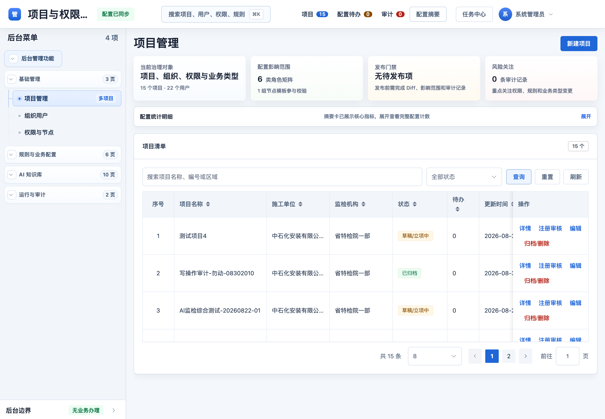
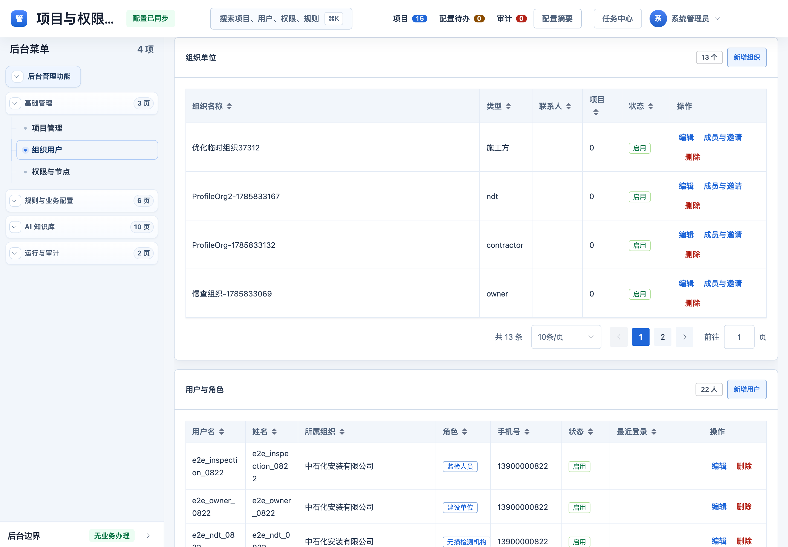
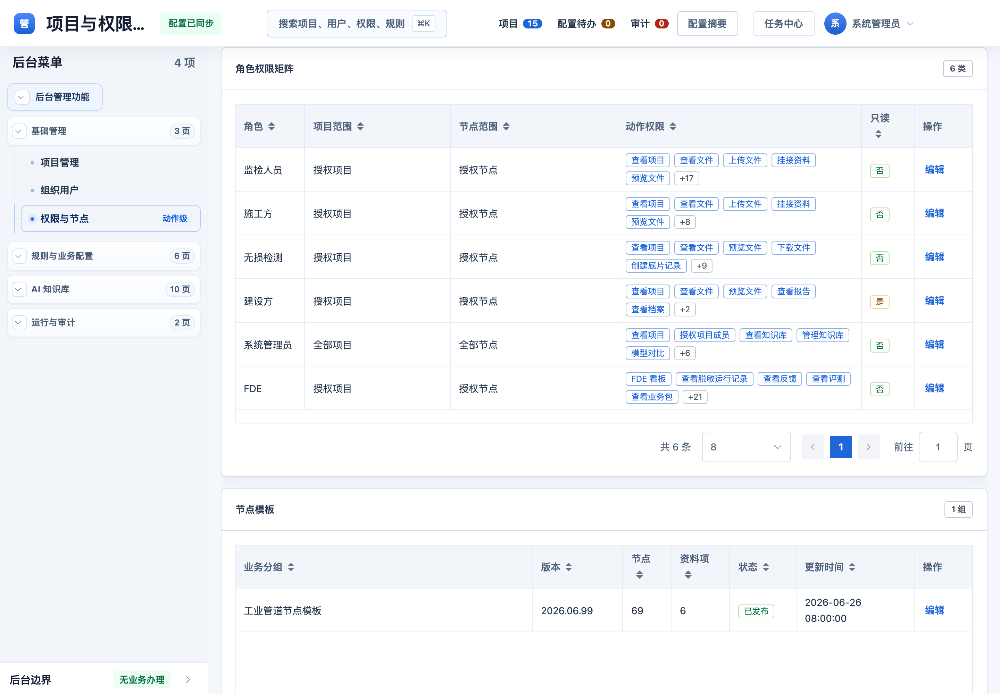
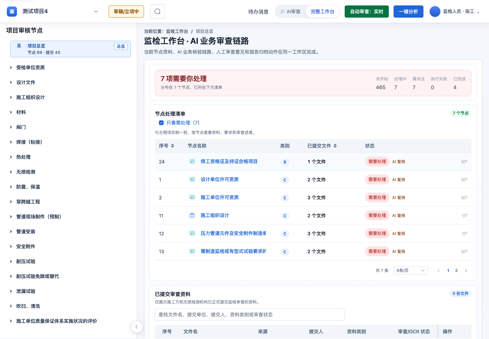
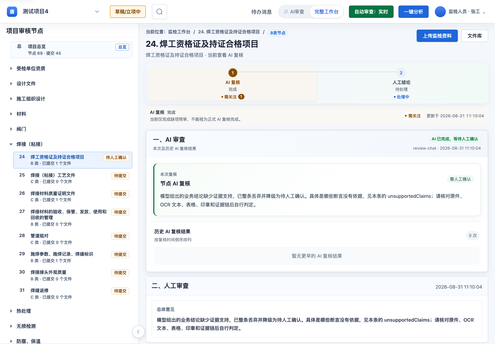
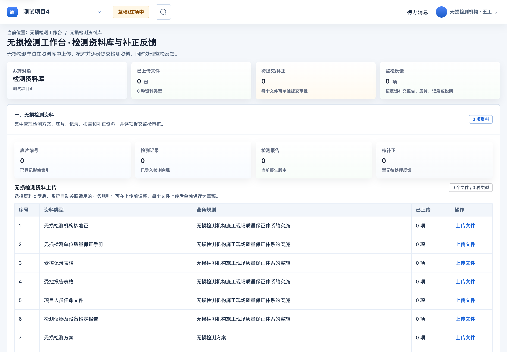
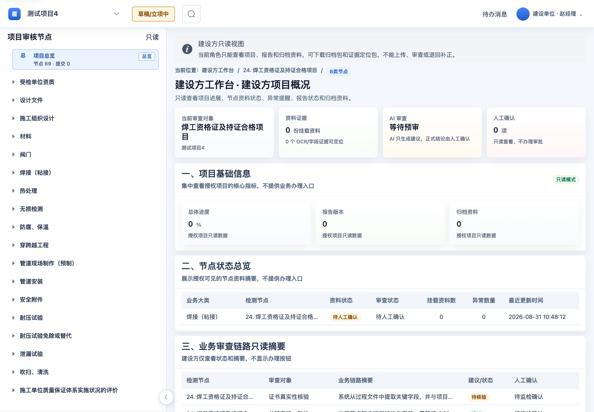
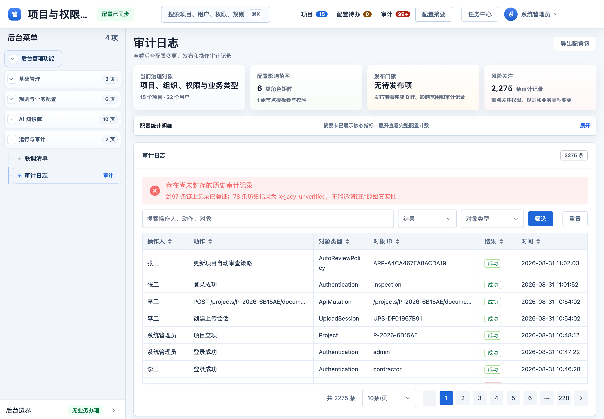
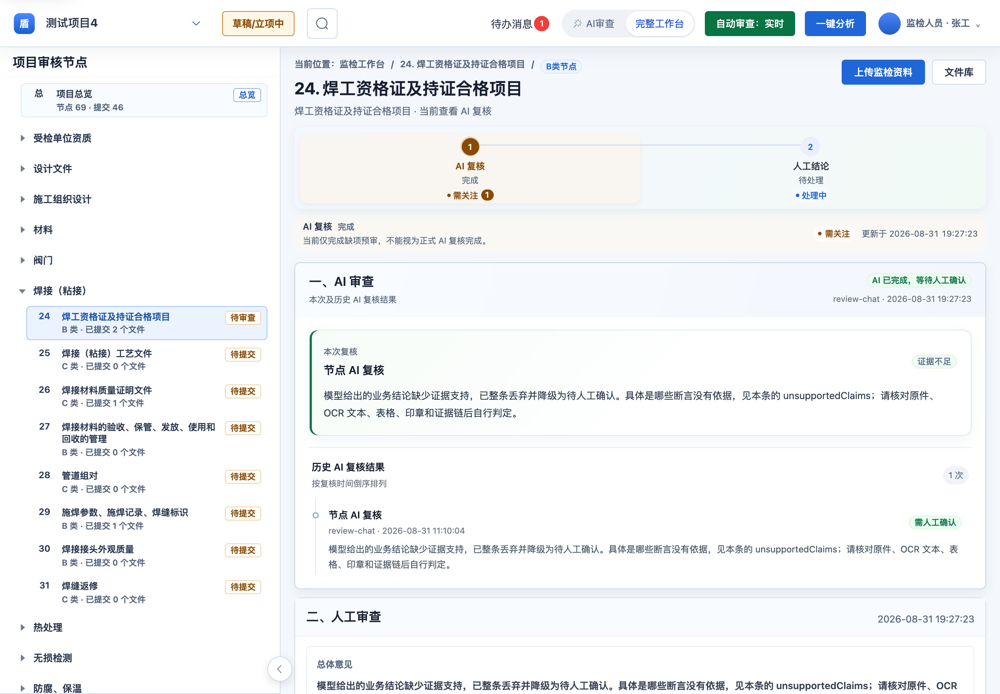
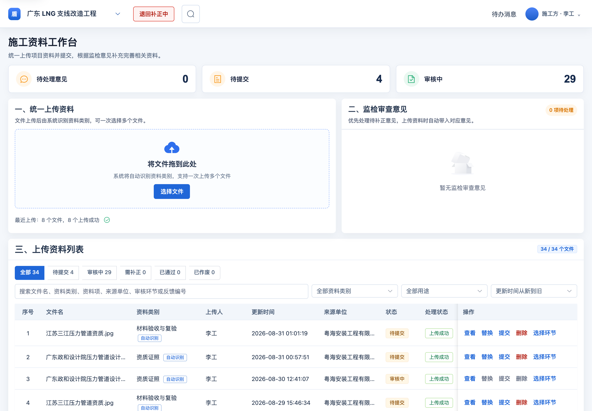

# 压力管道施工监督检验协作系统 — 合同功能验收审计报告

| 项目 | 内容 |
| --- | --- |
| 审计依据 | 《附件：压力管道施工监督检验协作系统功能需求》(functions.docx)，9 项功能条款 |
| 审计方式 | 线上生产环境真实 UI 操作，六个角色分别登录，逐项核对功能条款 |
| 生产地址 | http://39.108.65.148:8081 |
| 代码版本 | `2568e71`（已同步远程最新） |
| 审计时间 | 2026-08-31 |
| 审计结论 | **8 项 UI 功能条款全部具备，第 9 项为交付物条款、不属 UI 审计范围** |

---

## 审计方法说明

本次审计**不是**读代码或查数据库推断功能存在，而是**以真实用户身份登录生产系统、逐个界面操作核对**：

- 六个角色（系统管理员 / 监检人员 / 施工方 / 无损检测 / 建设方 / FDE）分别建立登录态；
- 每项功能条款对应到实际界面，抓取界面文本与截图作为证据；
- 涉及数据量的指标（审计记录数、项目状态分布等）直接调用生产 API 取证，避免凭界面观感下结论；
- **深度操作验证见附录 A**：真实写入生产、记录前后状态对比、含 8 项越权边界测试；
- **界面截图使用 Playwright 驱动真实浏览器整页采集**（1440×1000 视口、2 倍像素密度），原图存于 `docs/audit/screens/`。

---

## 逐条审计结果

### 功能 1 · 项目管理与基础配置 — ✅ 具备

> 合同要求：负责项目立项、详情展示、状态筛选，以及参建各单位（建设/施工/检测/特检院）等基础信息维护。

**界面证据**（系统管理员 → 项目管理）：

- 项目清单 **15 个项目**，列出项目名称、施工单位、监检机构、状态、待办数、更新时间；
- 提供「新建项目」入口，每行含「详情 / 注册审核 / 编辑 / 归档删除」操作；
- 状态筛选下拉 + 关键字查询 + 重置 + 刷新；
- 参建单位在列表内直接呈现（如「中石化安装有限公司 / 省特检院一部」「粤海安装工程有限公司 / 省特检院三部」）。

**数据证据**：项目状态分布覆盖完整生命周期 — 草稿/立项中 3、AI 预审中 4、监检审查中 1、退回补正中 1、已归档 4。

图 1　系统管理员 · 项目管理（15 个项目、状态筛选、参建单位、立项与归档操作）

---

### 功能 2 · 用户中心与组织权限 — ✅ 具备

> 合同要求：组织机构、用户账号、角色配置、项目成员授权、菜单权限、接口权限、审核动作权限。

**界面证据**（系统管理员 → 组织用户 / 权限与节点）：

- **组织机构**：13 个组织单位，含类型（施工方/ndt/contractor/owner）、联系人、关联项目数、启用状态，可「编辑 / 成员与邀请 / 删除」；
- **用户账号**：22 名用户，含用户名、姓名、所属组织、角色、手机号、状态、最近登录；
- **角色权限矩阵**：**6 类角色**（监检人员 / 施工方 / 无损检测 / 建设方 / 系统管理员 / FDE），每类明确列出：
  - 项目范围（授权项目 / 全部项目）
  - 节点范围（授权节点 / 全部节点）
  - **动作权限**（如监检人员含「查看项目、查看文件、上传文件、挂接资料、预览文件」等 22 项；建设方标记为**只读**）
- **节点模板**：工业管道节点模板 v2026.06.99，**69 个节点 / 6 资料项**，状态「已发布」；
- 具备「发布配置」门禁，要求完成 Diff、影响范围与审计记录后方可发布。

图 2　组织用户（13 个组织单位 / 22 名用户）

图 3　角色权限矩阵（6 类角色 · 项目范围 · 节点范围 · 动作权限）与节点模板

---

### 功能 3 · 流程管理与待办任务 — ✅ 具备

> 合同要求：构建项目节点的流程状态机，驱动资料上传、多级审核、退回补正、归档结项，并联动待办与消息提醒。

**界面证据**（监检工作台 · 节点处理清单）：

- **69 个节点**的流程状态机，状态维度：未开始 / 处理中 / 需关注 / 执行失败 / 已完成；
- 实测项目「测试项目4」显示 **7 项需要处理、4 项已完成**，可筛选「只看需处理」；
- 左侧节点树按业务大类组织：受检单位资质 / 设计文件 / 施工组织设计 / 材料 / 阀门 / 焊接（粘接）/ 热处理 / 无损检测 / 防腐保温 / 穿跨越工程 / 管道现场制作（预制）等。

**状态机闭环证据**：项目状态实际流转覆盖「草稿/立项中 → AI 预审中 → 监检审查中 → 退回补正中 → 已归档」全链路（见功能 1 数据证据）。

**联动证据**：待办 **65 条**、消息 **2 条**（生产 API 取证）。

图 4　监检工作台 · 69 节点流程状态机（未开始/处理中/需关注/执行失败/已完成）

---

### 功能 4 · 特检院工作台与检验记录 — ✅ 具备

> 合同要求：提供检验任务清单，支持在线查看附件、上传现场资料、AI 智能识别图表资料、AI 辅助填写检查结果与审核意见、填写检查结果与审核意见、办理退回补正及复核确认。

**界面证据**（监检人员 → 监检工作台 · AI 业务审查链路），以节点「24. 焊工资格证及持证合格项目」为例：

| 合同要求 | 界面实现 |
| --- | --- |
| 检验任务清单 | 节点处理清单，69 节点、按需处理筛选 |
| 在线查看附件 | 「文件库」页签，显示已挂载文件数 |
| 上传现场资料 | 「上传监检资料」页签 |
| AI 智能识别图表资料 | AI 复核结果含 OCR 字段定位，例：「姓名 · 10.姜军焊工证.pdf · 第 1 页 · 姓名：姜军」 |
| AI 辅助填写检查结果 | 「一、AI 审查」区块给出复核结论与理由，含本次与历史复核记录 |
| 填写检查结果与审核意见 | 「二、人工审查」区块：审查结论下拉、结论引用证据、人工审查意见（限 500 字） |
| 办理退回补正 | 「退回补正」按钮 + 退回补正原因输入（限 300 字） |
| 复核确认 | 人工结论状态：待处理 / 处理中 / 完成；「保存审查意见」提交 |

**值得记录的设计**：系统对 AI 结论做**证据链校验**。实测该节点 AI 结论被系统主动降级：

> 「模型给出的业务结论缺少证据支持，已整条丢弃并降级为待人工确认。具体是哪些断言没有依据，见本条的 unsupportedClaims；请核对原件、OCR 文本、表格、印章和证据链后自行判定。」

同时存在前置阻断：「仍有必传审查点缺少已确认资料证据，不能形成满足要求类结论」，证据计数显示「1 / 3 条 confirmed 证据」。这表明 AI 仅作辅助、结论须有据可查，符合监督检验业务对可追溯性的要求。

图 5　节点 24 · AI 复核 → 人工结论两段式流程，含 AI 结论降级说明与节点树状态

---

### 功能 5 · 施工方工作台 — ✅ 具备

> 合同要求：面向施工单位，支持本单位资料上传、AI 智能识别图表资料、AI 辅助判断资料异常情况、节点办理、补正反馈、整改说明、现场资料补充和本单位任务状态查看。

**界面证据**（施工方 → 施工资料工作台）：

- **统一上传资料**：拖拽上传区 + 「选择文件」，支持一次多文件，「系统将自动识别资料类别」；上传状态实测「**最近上传：8 个文件，8 个上传成功**」；
- **AI 智能识别**：资料列表「资料类别」列标注「**自动识别**」（如「材料验收与复验 · 自动识别」「资质证照 · 自动识别」）；
- **监检审查意见**：独立区块，「优先处理待补正意见，上传资料时自动带入对应意见」；
- **任务状态查看**：顶部指标卡（待处理意见 0 / 待提交 4 / 审核中 29），资料列表按状态分类（全部 34 / 待提交 4 / 审核中 29 / 需补正 0 / 已通过 0 / 已作废 0）；
- **节点办理与补正**：每行操作含「查看 / 替换 / 提交 / 删除 / 选择环节」，并显示「关联审核环节」「关联反馈」「资料项」「文件用途」「版本」。

图 6　施工资料工作台（拖拽上传、8 个文件 8 个上传成功、34 份资料六态分类）

---

### 功能 6 · 无损检测单位工作台 — ✅ 具备

> 合同要求：支持底片编号手工录入、检测记录和检测报告上传、补正提交和任务状态查看。

**界面证据**（无损检测 → 无损检测工作台 · 检测资料库与补正反馈）：

- 四个核心指标区：**底片编号**（已登记影像索引）、**检测记录**（已导入检测台账）、**检测报告**（当前报告版本）、**待补正**（待处理反馈）；
- 资料类型清单按业务规则关联，含无损检测机构核准证、质量保证手册、受控记录表格、受控报告表格、项目人员任命文件、检测仪器及设备检定报告、无损检测方案、不合格品与不符合项控制程序、无损检测委托单、不合格品联络单或意见书、不合格品处理反馈见证文件、无损检测人员明细等；
- 每种资料类型独立「上传文件」入口，「每个文件上传后单独保存为草稿」「可单独提交审批」；
- 顶部指标：办理对象、已上传文件数、待提交/补正数、监检反馈项数。

图 7　无损检测工作台（底片编号 / 检测记录 / 检测报告 / 待补正 四区）

---

### 功能 7 · 建设方工作台 — ✅ 具备

> 合同要求：支持建设单位查看项目进展、异常提醒、资料状态、报告状态和归档资料。

**界面证据**（建设方 → 建设方工作台 · 建设方项目概况）：

- 顶部醒目**只读边界声明**：「当前角色只能查看项目、报告和归档资料，可下载归档包和证据定位包，**不能上传、审查或退回补正**」；
- **项目基础信息**：总体进度、报告版本、归档资料三项指标，标注「只读模式」「不提供业务办理入口」；
- **节点状态总览**：业务大类、检测节点、资料状态、审查状态、挂载资料数、**异常数量**、最近更新时间；
- **业务审查链路只读摘要**：显示证书真实性核验、关键字段一致性、只读边界核验等链路项及其状态，标注「建设方仅查看状态和摘要，不显示办理按钮」；
- **关键时间线**：按日期展示各方动作（如「06-20 首批资料上传 · 施工方」）。

权限隔离经界面与权限矩阵双重验证：建设方角色在权限矩阵中标记「只读 = 是」，动作权限仅含查看类。

图 8　建设方工作台（顶部只读边界声明，无办理入口）

---

### 功能 8 · 报告、归档与审计 — ✅ 具备

> 合同要求：维护报告模板，基于项目、节点、记录表和审核意见生成可编辑报告版本，支持报告导出、归档、操作日志和关键数据留痕。

**证据**：

| 合同要求 | 实测结果 |
| --- | --- |
| 报告模板维护 | **3 个报告模板** |
| 归档 | **4 个已归档项目**（重庆老厂酸碱管线整改工程等） |
| 操作日志与关键数据留痕 | **2275 条审计记录** |
| 报告版本 | 建设方工作台「报告版本」指标位；监检工作台含报告归档动作 |

**审计留痕样本**（生产 API 取证）：

| 时间 | 操作人 | 动作 | 目标类型 |
| --- | --- | --- | --- |
| 2026-08-31 11:02:03 | 张工 | 更新项目自动审查策略 | AutoReviewPolicy |
| 2026-08-31 11:01:52 | 张工 | 登录成功 | Authentication |
| 2026-08-31 10:54:02 | 李工 | POST /projects/P-2026-6B15AE/documents/upload-session | ApiMutation |

留痕覆盖业务动作、认证事件与 API 写操作三类，含操作人、时间戳、目标对象。

图 9　审计日志（2275 条记录 · 操作人/动作/对象/结果/时间）

---

### 功能 9 · 部署、测试、培训与交付 — 不属 UI 审计范围

> 合同要求：完成测试环境或双方确认环境部署联调、测试报告、源代码、部署文档、操作手册和培训材料交付。

本项为**交付物条款**，需以文档移交与双方签认方式验收，无法通过界面操作核实。

已可佐证的部分：

- **环境部署联调**：生产环境 http://39.108.65.148:8081 运行中，六角色均可正常登录使用；
- **源代码**：仓库 `bjy1984/AIcheck`，本次审计已同步至最新提交 `2568e71`。

测试报告、部署文档、操作手册、培训材料的交付情况，建议由双方按合同另行清点确认。

---

## 审计结论

| 序号 | 功能 | 结论 |
| --- | --- | --- |
| 1 | 项目管理与基础配置 | ✅ 具备 |
| 2 | 用户中心与组织权限 | ✅ 具备 |
| 3 | 流程管理与待办任务 | ✅ 具备 |
| 4 | 特检院工作台与检验记录 | ✅ 具备 |
| 5 | 施工方工作台 | ✅ 具备 |
| 6 | 无损检测单位工作台 | ✅ 具备 |
| 7 | 建设方工作台 | ✅ 具备 |
| 8 | 报告、归档与审计 | ✅ 具备 |
| 9 | 部署、测试、培训与交付 | 交付物条款，需双方另行清点 |

**合同附件所列 8 项系统功能，经生产环境真实操作核对，全部具备。**

---

## 审计过程中观察到的事项

以下不构成功能缺失，但建议知悉：

1. **AI 结论的证据约束是严格的**。实测节点的 AI 复核结论因「缺少证据支持」被系统整条丢弃并降级为人工确认。这是设计意图（避免无据结论进入监检记录），但意味着 AI 辅助的实际可用率取决于 OCR 与证据链质量。

2. **部分演示项目的节点资料尚未填充**。如「测试项目4」的无损检测工作台显示 0 份资料、建设方工作台总体进度 0%。这是数据状态而非功能缺陷——功能入口、规则关联与状态位均已就绪。

3. **审计链存在 78 条未封存的历史记录**。审计日志页面顶部明确告警：「2197 条链上记录已验证；78 条历史记录为 `legacy_unverified`，不能追溯证明原始真实性」（见图 9）。
   这说明系统具备审计记录的链式哈希验证能力——这是超出合同要求的设计；但那 78 条早期记录未纳入链上验证，其原始真实性无法自证。
   建议交付前确认这批记录的处置方式（补链封存或明确标注为历史数据）。

4. **组织列表含测试遗留数据**。13 个组织中有若干形如「ProfileOrg-1785833132」「测速组织-1785833020」的自动化测试残留，建议正式交付前清理。

---

## 附录 A　深度操作验证（端到端闭环）

> 前一版报告的证据以「界面存在性」为主——能证明*界面有这个功能*，
> 证明不了*点下去真的能用*。本附录补做真实业务写入，每步记录
> **前置状态 → 动作 → 后置状态**，并以界面截图交叉印证。

### A.1 业务闭环：施工方上传 → 提交 → 监检可见 → AI 复核

| # | 动作（真实写入生产） | 结果 |
| --- | --- | --- |
| ① | 取节点 24 前置状态 | 状态=待人工确认，已挂资料 0 份 |
| ② | 施工方创建上传会话 | `DOC-E6001D8B` / `UPS-3D5700C7BF` |
| ③ | 文件字节落对象存储 | HTTP 200，799 字节 |
| ④ | 完成上传会话 → 触发处理链 | processingStatus=排队中 |
| ⑤ | OCR 处理完成 | 状态=已识别 |
| ⑥ | 施工方提交至监检 | `SUB-B76DC787`，code=0 |
| ⑦ | 监检方看到该资料（跨角色协同） | 挂载绑定命中本次文件 `审计验证-焊工资格证.pdf` |
| ⑧ | 工作台按角色下发操作权限 | 6 项：canStartReview / canSubmitHumanDecision / canReturnCorrection 等 |
| ⑨ | 触发节点 AI 复核 | `AIRUN-24-03F2A94D`，code=0 |
| ⑩ | AI 复核跑到终态 | 状态=完成，19:25:48 → 19:27:23（95 秒） |
| ⑪ | 操作进入审计日志 | 最近 30 条命中 3 条（创建上传会话等） |

**界面前后对比**（图 5 摄于操作前，图 10 摄于操作后，同一节点）：

| 指标 | 操作前 | 操作后 |
| --- | --- | --- |
| 节点 24 状态 | 待人工确认 | **待审查** |
| 该节点已提交文件 | 1 个 | **2 个** |
| 项目总览提交数 | 45 | **46** |
| 历史 AI 复核次数 | 0 次 | **1 次** |
| AI 复核时间戳 | 11:10:04 | **19:27:23** |
| 待办消息 | 无 | **1** |

这组对比证明的不是「界面有按钮」，而是**写入真的落库、状态机真的流转、
跨角色真的可见、AI 链路真的被触发并跑完**。

图 10　闭环结果 · 监检工作台：节点 24 转为「待审查」、已提交 2 个文件、AI 复核 19:27:23 完成并判定证据不足

图 11　施工方工作台：本次提交的「审计验证-焊工资格证.pdf」已在资料列表中

另外值得记录：AI 对本次上传的极简 PDF 判定为「证据不足」，
整条业务结论被丢弃并降级为待人工确认（图 10）。
**模型拒绝在证据不足时给结论**，这是正确行为，也印证了功能 4 中
「AI 只作辅助、人工负最终责任」的设计。

### A.2 权限边界：越权访问必须被拒

判据看信封业务码（本系统 HTTP 200 + `body.code` 表达业务错误），不看 HTTP 状态。

| 越权尝试 | 结果 |
| --- | --- |
| 施工方读监检 AI 判定工作台 | ✅ 被拒 HTTP 403 |
| 建设方（只读角色）上传资料 | ✅ 被拒 code=403 |
| 施工方提交监检审查意见 | ✅ 被拒 code=403 |
| 无损检测方提交监检审查意见 | ✅ 被拒 code=403 |
| 建设方提交监检审查意见 | ✅ 被拒 code=403 |
| 无损检测方读监检工作台 | ✅ 被拒 HTTP 403 |
| 匿名访问项目列表 | ✅ 被拒 code=401 |
| **正向对照**：监检读自己的工作台 | ✅ 放行 HTTP 200 |

8/8 符合预期——既没有越权放行，也没有把正常操作误拦。

### A.3 本次验证中我自己的三次误判

诚实记录，因为它们直接影响结论可信度：

1. **「监检看不到提交的资料」** — 实为我读错字段。资料挂在 `returnableBindings`
   / `evidenceLinks`，不在我假设的 `documents` 下。改用正确字段后确认可见。
2. **「AI 复核 5 分钟没跑完」** — 实为我轮询的字段位置不对。查 `ai_runs` 表，
   该次运行 95 秒即完成。
3. **「施工方越权下结论未被拒」** — 实为我猜的端点路径不存在（HTTP 404）。
   换成真实端点 `review-opinions` 后，三个角色一致返回 403。

三次都是**验证工具的问题，不是产品缺陷**。若不追查而直接记为缺陷，
这份报告会凭空多出三条不存在的问题。

