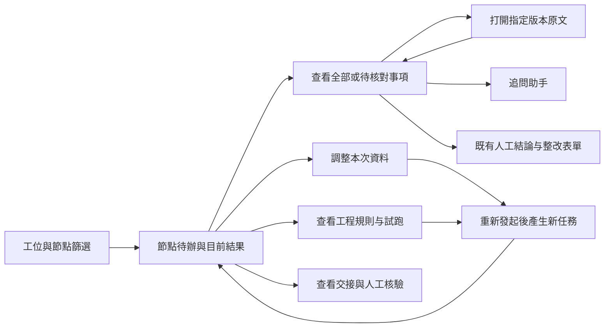

# Lab 現況與剩餘工作

更新：2026-09-09。這份清單按最新實作校準；README 的逐批紀錄保留當時狀態，不把早期「待做」當成現在仍未開發。

| 項目 | 已完成基礎 | 現在還差什麼 | 分類 |
|---|---|---|---|
| 工位 | 九份角色、69節點唯一歸屬、執行端工具隔離 | 全路徑驗收、輸出口语化的業務回放 | 待驗收／增補 |
| 文件 | 搜尋、跨頁批選、補充掛載、固定版本原文；頁碼選取、實際PDF頁數、API／任務／證據包範圍已接通 | 頁碼開關預設關閉；工具追加引用全路徑、大文件和真實案件重放驗收 | 待驗收／放行 |
| 規則 | 工程草稿、複合條件表單、原子映射、示例與任務OCR試跑、通用與R19條件替代、修改前後對照、工程文本規則發布預覽與回滾入口（正常登入流程已驗） | 試跑對象選取已實作；任務映射與前端套用已接線，完整登入與真實案件驗收、剩餘路徑核查、結構化條件發布資格、發布視覺／鍵盤與真實案件驗收、自然語言草稿 | 待接線／開發 |
| 交接 | 草稿、來源檢查、核驗API；原工作台建立入口與授權接收任務查詢；PostgreSQL跨連線核驗衝突實測通過；新任務交接輸入／依賴失效與工作程序按需載入已接線 | 前端選用／需重驗提示、完整登入跨工位流程、執行中途來源變動及HTTP多程序併發驗收 | 待接線／驗收 |
| 結果UI | 分層卡片、口語提示、完整清單、證據定位；本批接入待辦首頁 | 已登入種子工程選資料／人工保存已驗；仍需帶真實原文的完整案件及可用性驗收 | 待驗收 |
| 工位導航 | 已接原工作台桌面節點樹及手機抽屜，保留工程總覽計數 | 具來源的跨節點需重驗統計；手機依使用者要求暫緩 | 待驗收／增補 |
| 證據側欄 | 本批复用原定位器增加inline模式，桌面並排、窄螢幕沿用彈窗 | 完整登入的PDF定位／焦點返回／尺寸切換驗收 | 待驗收 |
| R35–R37、R39 | 專用核心、凍結事實及實際綁定 | 剩餘業務能力與完整規則驗收；R39三類pendingCapabilities仍阻擋發布 | 待補齊 |
| 其餘待驗收規則 | 既有工具與部分資料 | R10/R11/R40/R43–R58/R63–R64/R66–R68逐條缺口驗收 | 待核查／補齊 |
| 標準 | 已入庫資料及部分查詢修復 | 26查詢／原因清單未結項，14976／13296／47014 C–F剩餘資料 | 待補齊 |
| 驗收工具 | 發布門檻、R35–37重放、三組品質統計 | 69×4及邊界、原36差異、真實樣本；PG/MinIO/Temporal本機實測已通過，完整回歸4128通過、1項外部真人查詢跳過 | 待驗收 |
| 發布 | 版本與發布門檻、ID生成修復基礎 | 69全量驗收後發布；另行維護窗口完成ID演練／遷移 | 前置條件 |

## 結果優先的操作流程

## 本批UI實作與原型邊界

- 新ReviewNodeOverview接入現有workspace、有效任務、資料選取及三個既有工具元件；Lab預設待辦與結果，main未啟用開關時仍是對話。對話使用v-show保留內容與輸入，不重建會話。
- 工位導航只有篩選已有授權節點，配置鏡像以測試核對後端registry；不把節點數冒充待辦數，不推測其他節點已過期。
- 有當前任務但尚無結果時，不以舊通過結果補位。待核對篩選只排除有grounded引用且明確符合／不適用的項目；未知、缺引用及矛盾都保留，完整項目和原始序號可查看。
- 選取摘要屬下次發起輸入；缺件提示標明是節點既有資料，不能冒充剛選文件的檢查結果。啟動、人工確認、整改沿用既有權限及保存處理。
- inline定位器共用原來的固定版本讀取、Blob生命週期及來源校驗；不另寫一個文件播放器。主工作台在1280px以上使用右欄，窄螢幕沿用彈窗；關閉返回原焦點，切換工程節點清除舊預覽。
- 可交互原型：frontend/e2e/lab-rules/workstation-overview.html。正常、載入、失敗、空資料、唯讀、過期六態使用真實Vue元件和合成資料；文件／規則／交接彈窗使用模擬API，人工結論不寫入、審查按鈕不調模型。不是完整登入驗收。
- 原型覆蓋六個區域的入口；原型記錄保留初始狀態；交接建立現已接入原工作台，規則發布仍受验收門檻限制。

## 接下來的批次

1. 完整登入的首頁／工位導航／文件選取／人工保存已完成種子驗證；繼續非空真實原文、交接建立與跨節點待辦驗收。
2. 頁碼全路徑驗收與開關放行、規則對象映射與發布／回滾、交接消費／依賴；資料庫原有交易已實測，補HTTP多程序驗收。
3. 逐條補齊規則與標準，跑69條四態、原36差異；本機三服務實測已完成，收尾完整回歸並記錄部署環境差異。
4. 真實案例品質評估與分開發布；付費、維護窗口、stage2和施焊記錄沿用既有前置條件。

- 本批另修定位器的版本回退：一般文件引用帶documentVersionId時，按工程／文件／版本組裝原文請求；不採用目前版本URL。缺文件身份不回退，標準條款與無版本的舊引用保持原契約。inline初次打開立即載入，版本／頁碼變動重讀並沿用過期回應隔離；彈窗增加窄螢幕最大寬度。
- 前端89測試檔通過；瀏覽器通過六態、待核對／完整清單、既有文件入口、指定版本請求與版本切換、404不回退、inline／彈窗切換及390px彈窗界限，另通過390／900／1440深淺色原型、工具區回歸及main CSS比對。元件測試使用合成資料，不能代替完整登入及真實PDF驗收。

- 本批最後全量vue-tsc通過，修改檔ESLint、新首頁／結果卡Stylelint及diff check通過；已檢視桌面淺色與手機深色截圖。原型已送至Codex預覽，4394開發伺服器保留供本地查看；沒有部署生產。

## 2026-09-09：回到原工作台整合

- 真正入口為 `/workbench/inspection`，由 `AICheck/Workbench.vue` 嵌入 AIReviewB；獨立 e2e 原型不代表此入口已驗收。
- 原頂欄、工程切換、AI審查／完整工作台切換及節點樹沿用 main。Lab 工位與狀態篩選接到原桌面樹及手機抽屜，只篩選授權節點列表；工程切換會重置篩選。
- ProjectNodeTree 的 overviewGroups 保留工程總節點／文件數，不隨工位篩選變小。既有呼叫方不傳入時維持原行為。
- 修復嵌入頁面固定三列 grid 與新工具／結果區衝突造成的重疊：Lab 嵌入區改為垂直內容流；窄螢幕使用內容高度排列結果與人工表單，main 未啟用 Lab 時維持原樣。
- 實測使用正常登入的本機完整 Vue 應用與隔離記憶體後端（種子測試工程），不是 e2e transport mock。節點16選 A 工位後列表11/69、總覽69/提交4、當前節點16均符合預期；恢復全部工位正常。實際畫面確認重疊消除，瀏覽器 error 日誌為空。
- 前端89個測試檔通過；本次不觸發 AI 任務或保存人工結論。實際案件的選資料→審查→原文→保存，以及手機／深淺色完整工作台回歸仍待驗收。main 原版對照服務已準備，但登入對照尚未完成，不宣稱完成像素對照。
- 使用者預覽改為本機完整入口 `http://127.0.0.1:4395/#/workbench/inspection`；4394 的 HTML 僅是元件原型。

## 2026-09-09：桌面人工结论闭环

按用户最新安排，手机布局暂缓，优先桌面流程。

- Lab 保存前集中显示节点、人工判断、意见、实际随结论保存的已确认引用证据（版本／页码）以及当前结构化结果中待核对事项；没有结果、资料已变化、人工待办分别说明。待核对项只做提示，不替代人工判断或自动消除系统问题。
- 沿用原 buildFinalConclusionPayload，仅 confirmed 证据随结论保存；未确认的所选证据显示排除数量。右栏改称“已选引用证据”，避免与本次 AI 输入文件混淆。
- 保存请求固定确认时的工程、节点、意见、证据 ID 及 etag；确认期间切换节点（含切走再返回）、工程版本变化或失去权限时中止。取消返回保留意见，阻止重复开启确认；异步返回不清除其他节点的输入。
- 正常登入的本机完整应用实测：选择钢管质量证明书后首页显示已选1个版本；打开人工结论摘要；返回修改保留意见；在隔离内存种子工程保存“证据不足”成功，显示已保存内容并清空输入。浏览器 error 日志为空。没有发起 AI 审查，未修改生产数据。
- 89个前端测试文件通过，包含新增的工程／节点／generation／etag 失效与证据 payload 快照回归。页面样式检查及类型检查通过。
- 尚未完成：带真实原文及非空证据的全流程、长结果列表实测、页面范围、规则发布和交接闭环。此次局部成功不能代替完整业务验收。

## 2026-09-09：文件页码底层阶段（尚未开放入口）

按用户要求，每阶段同步实际交付与剩余范围。本批不处理手机布局。

- 阶段1完成：定义 inputDocumentPageRanges 为选定版本到 `{start,end}` 的映射，1起算、含首尾、每版本一个连续范围；省略版本表示整份固定版本。拒绝未知版本、布尔／小数／零／反向／结构错误。范围进入 documentScopeSnapshot 哈希；变更范围、篡改快照或给旧快照追加范围均阻止读取。首次39项针对性测试通过。
- 阶段2完成：selected_parse_results 共用入口按范围返回定位明确的 fields/tables/seals/fragments 副本；排除页码未知、范围外、跨界及嵌套位置冲突的记录，不保留全文／摘要等无页码后备内容。人工字段修正要求修正页码与字段页码一致；未限定版本保持旧行为。扩展93项测试通过，覆盖材料事实及R37/R39原有路径；Ruff修改文件通过。
- API仍明确拒绝 inputDocumentPageRanges，避免忽略参数后按整份执行；前端页码控件尚未开放。已定义的底层能力不能视为完整页码功能。
- 下一阶段：接入 grounded model input、独立 extracted_fields/evidence_links、正式readiness／证据包、任务建立与复制、pure_llm原文读取／页数上限检查；逐路审计后才能解除API阻挡。随后接桌面选择器、摘要及发起确认。节点补充挂载是否携带范围需明确同一契约，不得默默丢范围。
- 边界仍需补测：实际PDF页数越界、OCR未完成、大文件、历史重放、跨页表格提示及无页码人工修正提示；所排除内容不应被解释为不符合。

## 2026-09-09：模型依据页码阶段

- build_grounded_review_input 增加可选 review_run，检查冻结来源与版本集合，不允许扩大版本范围。存在页码范围时，OCR走共用按页入口，独立 extracted_fields／evidence_links 按相同页码与嵌套定位约束过滤；未指定范围维持原行为。
- 限定页码任务的来源指纹加入独立字段与证据链接，防止这些来源更新后旧任务静默读入新值。原整份文档任务指纹保持原契约。
- execution 的 load_ocr_result 与 prompt fallback 接入；有范围时重新组装 grounded input，不复用未限定范围的缓存；同步覆盖提示词字段和引用ID，并将 documentPageRanges 写入任务提示内容。
- 测试：首次页码／快照／grounding组合59 passed；加入实际 build_review_prompt_parts 缓存旁路测试后，模型页码与工位prompt回归28 passed。两组有重叠，不相加为独立总数。小模块Ruff通过，git diff --check通过；未触发付费模型调用。
- 尚未完成：任务建立／复制、readiness与证据包、业务工具追加事实与引用的全路径核查、pure_llm原文按页、实际PDF页数检查、桌面控件。API继续拒绝页码请求，不能宣称完整页码审查已可用。

## 2026-09-09：页码任务建立／重放阶段

整体仍粗估约50%，未以底层测试通过冒充用户功能完成。桌面优先，手机暂缓。

- AiRun→ReviewRun复制并标准化页码范围，工位初始化将范围与快照分别深拷贝，源对象修改不会改变任务；不同页码范围进入不同inputHash。
- 已有ReviewRun复用时拒绝范围不一致，并检查冻结来源；未开启工位模式不能默默丢弃范围后建立任务。
- replay保留原范围、快照与inputHash，复制不修改父任务；来源已变动时在插入子任务前拒绝重放，避免以旧指纹运行新资料。
- 48项针对性回归通过（任务生命周期、文档快照、模型页码、工位prompt），测试使用隔离repository替身，不写数据库、不调用模型。5项新增生命周期用例覆盖创建独立性／不同范围哈希、重复创建、重放保留、来源失效、非工位拒绝。
- 剩余：公开API仍阻挡页码，证据包／readiness、直接原文读取、工具追加事实范围、PDF实际页数校验、桌面选择器未全部接通；尚不能按页发起正式或预审任务。

## 2026-09-09：证据包与节点修正范围阶段（90%目标持续执行）

- 用户要求完成90%以上再确认；目标保持完整Lab计划，不能把页码子项冒充整体验收。整体当前仍约50%的粗估；继续执行，不请求阶段批准。
- 证据snapshot／manifest携带documentPageRanges并参与哈希；按范围在压缩／分片前过滤fields、tables、seals、fragments、evidenceLinks；无范围保持旧契约。AiRun附加证据包时强制使用明确的输入版本集，持久化分片不含范围外内容。
- 无可用页内证据时manifest为空且coverage不通过，不回退全文件。测试覆盖跨页表格、未知页引用、快照范围哈希变化及实际attach持久化路径。
- 节点级factPath修正加入范围检查，未定位或范围外修正不覆盖事实；限定任务的来源指纹也覆盖factPath修正。原整份任务行为保留。
- 首组证据包测试11通过；加入节点修正／任务／模型／快照后组合41通过（非累加独立总数），修改模块Ruff通过。未运行付费模型或外部发布。
- 审计发现pure_llm当前实现为跳过OCR并产生advisory输入，不是直接读取PDF的替代路径。此前“pure_llm原文按页”待办须依实际能力处理，不宣称存在已实现的原文模型阅读器。
- 后续继续：页数来源与越界校验、readiness／业务引用追加、API开关放行条件、桌面范围输入，以及其他Lab规则／交接／业务验收。页码API暂仍阻挡。

## 2026-09-09：页码接口与桌面闭环阶段

- 新固定版本PDF页数读取器：仅storageKey精确原文，本机或对象存储流到临时文件，解析失败仍关闭连接；不依赖客户端pageCount或同名回退。仅可读未加密PDF支持页码选择。
- 页码接口增加显式验收开关 AICHECK_REVIEW_PAGE_RANGES_ENABLED（默认关闭）；开启后必须指定授权版本，检查合法范围与实际页数，pure_llm不读取页内OCR因此拒绝范围请求。readiness与AiRun引用列表过滤页外引用，AiRun携带标准化范围进入后续任务／证据包。
- 桌面选择器增加起止页码与整份默认，首页显示范围，发起请求传递范围，确认时深拷贝避免中途修改。VITE_AICHECK_REVIEW_PAGE_RANGES_ENABLED默认关闭；补充挂载保留整份版本，范围只属于本次选择及新任务，UI明确说明。
- 后端页码组合56通过；真实API路由集3通过，包含实际PDF越界后不新增AiRun，正常范围传递到证据快照与分片。没有真实模型调用。PyMuPDF与Starlette有依赖弃用警告，非失败。
- 前端90个测试文件通过、完整vue-tsc通过、相关ESLint／选择器Stylelint通过。新增范围快照测试也执行实际handleStartReview，确认期间编辑范围不改请求。
- 正常登录的完整本机工作台4397实测：选钢管质量证明书第2–3页，首页正确显示；重新打开改结束页9再取消，已选范围仍2–3。浏览器error日志为空。此环境只验证桌面选择流程，未发起付费审查；后端4180仍未开启页码，API正向整合由隔离TestClient完成。
- 尚待：所有工具业务结果追加引用的范围核查、非空真实案件模型回放／原文定位、开关正式验收放行。用户90%目标保持active，不能以90个测试文件代表90%完成。手机仍暂缓。

## 2026-09-09：交接建立与真实 PostgreSQL 并发验收

- 原工作台的工位交接面板增加发起入口，选择授权接收任务、对象、事件、返修轮次、问题与已有页码引用；加载／保存失败保留输入，切换节点隔离过期响应。仍是协作草稿，不自动重跑。
- 新增接收任务查询，限定同租户／工程／业务包、可见版本及节点权限。来源限定页码时，交接不能引用范围外页面。
- 后端交接组合87项通过；前端90个测试文件和完整vue-tsc通过，相关ESLint／新增组件Stylelint通过。交接新入口尚待完整登录创建流程实测，不能标成业务验收完成。
- 独立本机PostgreSQL 16.10数据库实际执行5项测试全部通过：租户隔离、跨进程陈旧写入、幂等锁恢复、会话场景，以及新增交接核验冲突。新增用例验证第二写入者不能覆盖首条核验，刷新后旧previousId仍被拒绝，显式基于最新核验追加才成功，两条历史均保留。
- 校正旧待办：repository已有数据库交易／行锁／baseline比较，交接并非仅靠单程序锁；本轮补的是实际交接跨连接持久性证据，没有重写已有事务机制。HTTP多进程整条请求路径、下游消费与依赖失效仍待验收／实现。
- 整体仍约50–55%的粗估，未达用户90%目标。手机暂缓；MinIO／Temporal、全量规则与真实业务回放未因本批通过而计为完成。

## 2026-09-09：服务实测与规则修改对照

- 独立本机服务实测：PostgreSQL核心5项、outbox／raw-vault另5项通过；Temporal本地真实服务2项通过，含活动失败重试、服务器重启后恢复待处理信号、R12人工输入后继续同一工作流。活动使用确定性测试替身，不调用模型。
- MinIO独立目录 `/tmp/aicheck-minio-verify.CUqQSD`，仅监听127.0.0.1:19000。审计锚点对象锁与精确版本测试首轮1项通过；终止并重启同一目录后，EXPECT_EXISTING_ANCHOR=true再次1项通过，确认旧版本仍可读、COMPLIANCE保留仍有效。非生产服务。
- 本批后端collect-only收集4129项，Ruff当前289／基线289通过。包含三服务的完整后端回归进行中，尚未报为通过。
- 原ProjectRuleEditor增加修改前后对照，分别列文字、判定条件、适用范围与原子项绑定；区分数值3和文字“3”、布尔值，保留组合条件和单位。不改变判定或发布状态。
- 前端91个测试文件通过，完整vue-tsc、相关ESLint及Stylelint通过。4397真实工作台登录后验证新草稿对照、关闭后继续编辑保留输入、放弃后返回原节点；测试草稿未保存。规则发布／回滚闭环仍待完成。
- 整体约50–55%，目标仍为完整计划90%以上，手机暂缓。

## 2026-09-09：完整回归发现与修复

- 第一轮启用本机PostgreSQL／MinIO／Temporal的完整后端：4125通过、3失败、1跳过。逐项定位为monolith大小护栏、交接targets新路由未生成OpenAPI、PostgreSQL16缺pgvector。未以通过总数放行。
- 页码任务兼容与提示词范围逻辑抽入review_page_scope，保留原grounder与来源检查回调；原工作台导航抽成复用原ProjectNodeTree的WorkstationProjectTree与筛选组合函数。核心文件回到原基线之内，没有放宽护栏。
- 新路由OpenAPI已重新生成。相关后端52项通过、Ruff289／289通过、monolith通过；前端91个测试文件与完整vue-tsc通过，相关ESLint通过。实际4397工作台材料工位显示12/69，恢复全部正常，当前节点保持不变。
- 本机pgvector原安装仅支持PG17／18，按官方v0.8.5源码提交159b79aaad5983fb7459c1e3df2897fbb2d11788为PG16编译安装；仅在独立测试数据库启用，原旧库准备测试已通过。第二轮完整回归进行中。
- 69条静态能力清单见verification/current-rule-capabilities.json（相对于docs/lab），含工具、必要事实、试点状态及pendingCapabilities。69条可编译、36条试点，R39有3项明确能力缺口；其他规则没有声明pendingCapabilities并不表示已完成验收，清单不会替代源证据绑定的69×4业务验收。

### 本輪完整回歸收尾

第二輪後端4128通過、0失敗、1跳過（CNSE真人查詢未開啟）、6項依賴棄用警告，耗時332.30秒；前端91測試文件及vue-tsc通過。原3項失敗逐條消除，未放寬Ruff或monolith基線。紀錄：docs/lab/verification/2026-09-09-live-regression/。整體粗估約55%，仍未達90%目標，剩餘業務閉環與規則驗收繼續推進。

## 2026-09-09：规则试跑对象选取

- condition_candidates_from_run仅从冻结版本／页码的服务器OCR生成候选ID；ID包含字段名、值、单位和原文定位。对象映射要求明确对象编号、类型、字段候选及同一对象确认；未选字段不自动回退，候选不存在／重复、已标明对象不符、来源变化均阻止采用。
- 原RuleTrialPanel接入RuleObjectMapping，试跑后可按焊口／批次选择原文；候选展示值、单位、对象、版本／页码／字段编号。修改选择或对象清除确认，结果修改后失效；切换规则／任务清除旧候选。选择仅用于本次试跑。
- 结果附objectMappingSnapshot，包含规则修订、来源快照、操作人及选择哈希；未写入正式任务，不宣称人工证据背书或发布验收。正式任务的映射冻结与执行仍待接线，完整登录对象选择流程尚未验收。
- 同时补试跑权限校验：任务必须同租户，所有输入版本必须属于当前用户可见文件集。服务端不接受客户端注入的字段值作为OCR映射。
- 后端73项回归通过（规则条件／条件执行／映射与实际API），新增案例覆盖明确选择、缺字段、伪造候选、对象不符、未确认、来源变化／重复候选；API还验证返回快照与不可见文档拒绝。前端91测试文件、vue-tsc、相关ESLint／Stylelint通过，Ruff289／289无新增。
- 上轮4128通过是d58fa43b版本的完整回归，本轮为针对性验证，不将旧全量结果冒充当前全量。整体仍粗估约55%。

## 2026-09-09：新任务对象映射冻结与执行

- 新增review_condition_mapping，明确绑定规则ID／修订、来源快照、对象选择；规则或文件范围变化、未确认／无效候选均拒绝冻结。初始化时深拷贝为conditionObjectMappingSnapshot，参与inputHash，未携带映射的历史任务不改变原行为。
- API显式文件选择路径增加conditionObjectMapping校验：只接受当前已发布且有可执行绑定的规则、授权固定版本和OCR模式。AiRun携带已校验请求，ReviewRun在冻结规则／来源后再次校验；未启用工位模式不能静默丢弃选择。
- 条件执行读取冻结映射，工具输出携带映射快照hash；符合／不符合／证据不足／不适用均已测试。原始请求与事实仍沿用现有raw capture。
- 重复创建校验映射一致性；重放深拷贝映射及inputHash，来源或快照失效在写入新子任务前拒绝。旧执行快照不被改写。
- 后端核心78项通过；R19语义／真实API页码证据包／规则试跑等整合24项通过。全量collect-only共4150项可收集；Ruff289／289、monolith护栏、diff check通过。本批没有再次运行全部测试，也未发布规则。
- 尚待：前端将选取应用到下次审查的入口、实际请求全链路与正常登录验收，规则正式发布／回滚闭环。不能将后端接口完成冒充整个用户操作闭环。整体仍约55%，90%目标保持active。

## 2026-09-09：试跑选择带入下次审查

- 原RuleTrialPanel增加套用入口和正式复核／缺项预审选择；仅已发布、具绑定计划且完成对象确认的试跑可套用，唯读／处理中禁止操作。通过原ProjectRuleEditor、ReviewWorkstationTools回到现有文件选择状态，没有新建工作台。
- 试跑API返回授权固定版本的文件身份、名称、页码范围；前端套用时深拷贝对象和资料。首页工具区显示对象与规则修订，可移除对象选择；重新保存文件选择会清除映射，避免资料变化后误用。
- 发起确认列出对象，确认期间修改界面不改变待发送选择；请求携带conditionObjectMapping与固定文件／页码。保留显式空页码范围及版本顺序，使旧任务来源快照不会因客户端重排而失配。
- 实际TestClient路径已验证：API接收映射→AiRun→创建ReviewRun→冻结选择→条件工具使用SELECTED原文而非同名OTHER；规则修订不符拒绝且不新增AiRun。调度使用测试替身，未调用模型或开放规则发布。
- 后端首组28通过；补充版本顺序／来源元数据断言后相关14通过（有重叠，不累加）。前端92测试文件、完整vue-tsc、ESLint／Stylelint通过；新增测试覆盖深拷贝、草稿／缺绑定／缺版本拒绝、空范围及确认过程中对象变更。Ruff289／289、diff check通过。
- 尚待完整登入账户的套用操作与真实案件验收；未将合成数据TestClient或组件测试计为真实业务验收。下一批规则发布／回滚和交接下游。整体粗估55–60%，90%目标继续。

## 2026-09-09：工程規則發布與回滾入口

- 在原 `ProjectRuleEditor.vue` 接入 `ProjectRuleRelease.vue`，沿用 Element Plus 與原工作台；先填原因、查看節點及內容差異，再確認發布／回滾。操作期間停用版本切換與保存，修改原因／目標／版本後舊預覽失效，失敗保留輸入，重試沿用同一冪等鍵。
- 新增工程範圍的發布／回滾 API 包裝，復用既有正式操作。要求監檢工程及節點權限、必填預覽與 If-Match；平台規則不能經此入口修改。工程回滾限定現行版本至已回滾的歷史版本，有重疊生效版本時拒絕；成功重試返回原結果。
- 修正共用發布預覽：逐項列出所有被替換的工程版本，回滾對照方向改為目前內容→恢復內容，操作後狀態按已發布顯示。新任務採用新版本，歷史快照不改。
- 結構化條件仍受發布驗收阻擋，更新原因為「執行已接入、發布驗收未完成」。本批完成文本規則的操作入口，不能當作條件正式放行或69條工具發布已完成。
- 驗證：規則／作用域／條件／快照／OpenAPI／接口回歸初跑392通過、2條舊提示斷言失敗；更新提示斷言後兩條重驗通過，仍檢查拒絕及資料不變。新增工程發布6條測試全部通過（含發布與回滾重試、舊版本拒絕、角色限制、多版本差異、禁止回滾到草稿）。前端92測試檔、vue-tsc、修改檔ESLint／Stylelint通過；Ruff289/289，monolith無新增。
- 瀏覽器實際檢查4397原工作台登入後的規則入口、載入和平台唯讀、關閉返回。4180仍是較早啟動的後端；新版發布完整登入流程尚未验收，未把API測試冒充瀏覽器驗收，未發布生產。下一批需在新版隔離測試服務完成此流程，再補結構化條件發布資格與交接下游依賴。
- 整體估計仍約55–60%，屬粗估；此批完成不代表五批總計畫完成。剩餘真實業務驗收、標準資料和交接閉環仍列為未完成。

## 2026-09-09：發布流程完整登入實測與首次比較修正

- 正常監檢帳號在新版隔離服務4181／原工作台4398，完成草稿→發布→第二版替換→回滾；確認原因變更後預覽失效、未驗收條件仍拒絕發布。詳細記錄見 `docs/lab/verification/2026-09-09-rule-publication.md`。
- 修復新啟動Vite遇到的API型別排版錯誤。首次工程發布改為對照目前平台規則，平台本身不被修改；比較來源使用實際執行的規則選擇函數，平台版本變動也使舊預覽失效。修正後已用登入介面重驗。
- 發布／作用域16條測試與4條共用發布門檻回歸通過，前端92測試檔通過。真實案件、結構化條件資格、視覺截圖／鍵盤驗收仍待完成；未將此文本操作驗收當作69條發布驗收。
- 目前整體粗估約60%；下一主項仍為交接資料下游使用及依賴失效，沒有自動重跑或付費執行。

## 2026-09-09：交接下游輸入、依賴校驗與工作程序載入

- 新任務可明確提交 `handoffSelection`（對象／事件／返修輪次、交接ID、核驗ID、同對象確認），在建立AI任務前校驗工程、租戶、來源與接收節點權限及固定文件可見性。只接受最新已核驗、身份一致、來源仍有效且已選原文能定位的交接；不得與條件試跑的對象選取矛盾。
- AiRun→ReviewRun凍結 `handoffInputsSnapshot` 並納入inputHash，保留原始交接、人工核驗及來源任務依賴。資料進入該節點模型核對上下文與證據引用，不把自由文字直接改造成數值工具事實或本節點通過結論。歷史任務沒有此欄位時保持原行為。
- 新增依賴狀態GET接口；上游輸出、OCR、核驗撤回或祖先依賴變動時返回需重驗，生成提示與離線重放亦拒絕沿用。已有結果不改寫、不自動觸發付費重跑。
- PostgreSQL工作程序依快照只載入所需交接及來源／原接收任務、原文解析，避免只載入本任務而漏讀依賴；清理已刪除依賴的舊快取，保留其他請求釘住的物件，合併重複查詢結果。SQLite載入補交接與修正資料。
- 驗證：交接／頁碼／映射／OpenAPI相關回歸140通過；載入與並行原有保護回歸26通過；最後任務/API針對性23通過、核心16通過（涵蓋多級祖先失效）。實際獨立PostgreSQL資料庫測試1通過：載入SOURCE/TARGET/NEXT、不載入UNRELATED，刪除交接後再讀能發現失效。Ruff289/289，monolith無增長。
- **仍未完成**：前端選用入口、原工作台需重驗提示及完整登入跨工位流程；結構化交接與专用工具的進一步適配、跨程序執行中途變動驗收。此批未宣稱整個交接閉環已驗收，整體仍粗估約60%。
