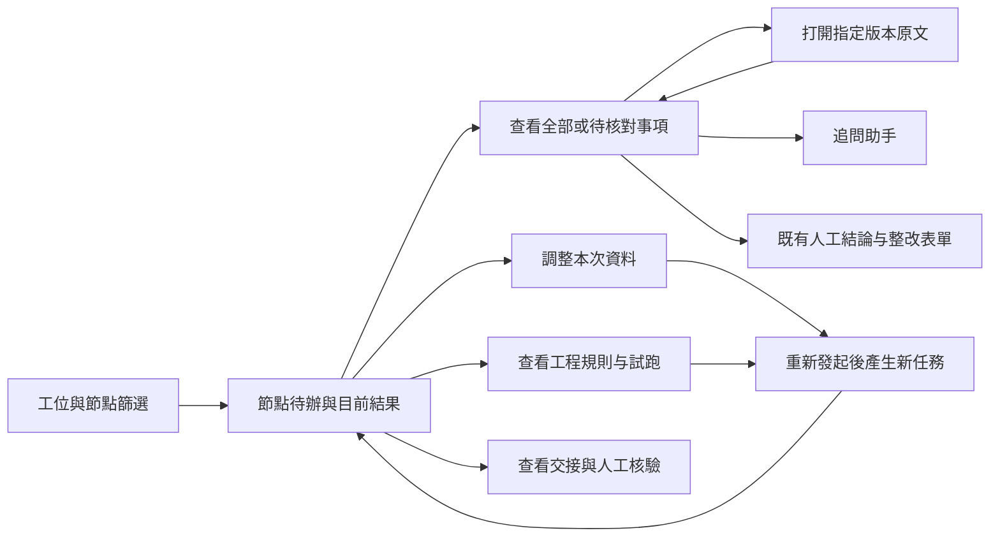

# Lab 現況與剩餘工作

更新：2026-09-09。這份清單按最新實作校準；README 的逐批紀錄保留當時狀態，不把早期「待做」當成現在仍未開發。

| 項目 | 已完成基礎 | 現在還差什麼 | 分類 |
|---|---|---|---|
| 工位 | 九份角色、69節點唯一歸屬、執行端工具隔離 | 全路徑驗收、輸出口语化的業務回放 | 待驗收／增補 |
| 文件 | 搜尋、跨頁批選、補充掛載、固定版本原文；頁碼選取、實際PDF頁數、API／任務／證據包範圍已接通 | 頁碼開關預設關閉；工具追加引用全路徑、大文件和真實案件重放驗收 | 待驗收／放行 |
| 規則 | 工程草稿、複合條件表單、原子映射、示例與任務OCR試跑、通用與R19條件替代、修改前後對照、工程文本規則發布預覽與回滾入口（正常登入流程已驗） | 試跑對象選取已實作；任務映射與前端套用已接線，完整登入與真實案件驗收、剩餘路徑核查、結構化條件發布資格、發布視覺／鍵盤與真實案件驗收；自然語言草稿接口及原表單入口已接通，合成模型下正常登入生成／保存／試跑已驗；待真實模型品質驗收 | 待補齊／驗收 |
| 交接 | 草稿、來源檢查、核驗API；原工作台建立入口與授權接收任務查詢；PostgreSQL跨連線核驗衝突實測通過；新任務交接輸入／依賴失效與工作程序按需載入、前端選用／需重驗提示已接線；正常登入選用與新任務切換、協作草稿建立到接收端已驗 | 真實原文／失敗恢復／視覺與鍵盤驗收、執行中途來源變動的PostgreSQL檢查點已驗；完整HTTP多程序併發與結果提交交易邊界驗收 | 待接線／驗收 |
| 結果UI | 分層卡片、口語提示、完整清單、證據定位；已接入待辦首頁；空结果与执行状态分开，排队实机已验；系统能力未完成独立提示已接线 | 已登入種子工程選資料／人工保存已驗；仍需帶真實原文的完整案件及可用性驗收 | 待驗收 |
| 工位導航 | 已接原工作台桌面節點樹及手機抽屜，保留工程總覽計數；工位待審查／待確認／待補正統計及篩選件數已接入並登入實測 | 具來源的跨節點需重驗只讀API已補，原工位需重驗／未知篩選已接線，正常回傳／需重驗／未知瀏覽器流程已驗，跨工程競態及PostgreSQL實測待驗；手機依使用者要求暫緩 | 待驗收／增補 |
| 證據側欄 | 本批复用原定位器增加inline模式，桌面並排、窄螢幕沿用彈窗 | 登入交接原文不可用／重試／返回焦點已驗；三頁實體合成PDF固定版本／恢復重試／翻頁已驗；中文／掃描與120頁合成文件前3頁、選取器／歷史版共用渲染已驗；真實案件、更大文件、縮放／跳頁與尺寸切換待驗 | 待驗收 |
| R35–R37、R39 | 專用核心、凍結事實及實際綁定；R39指定文件對及有來源的聲明文件清單引用覆蓋、異常文件對及逐對來源可信度隔離已接線並合成驗證；PT乳化劑施加方法、完整文件內容、應用事件、簽核週期、跨清單版本對照及尚未應用有據排除已接線及合成驗證 | R39專用OCR入口與預設深度辨識已補（預設12頁嘗試，非全頁完成）；單對及多文件原文欄位到引用版次比對已接通；兩份實際PDF及本機封面OCR已核查，仍缺引用身份欄位；機構身份核實、複合方案及其他業務事實適配待補，標準化表測試不代表真實解析已完成；剩餘技術能力與完整規則驗收，三類pendingCapabilities仍阻擋發布 | 待補齊 |
| 其餘待驗收規則 | 既有工具與部分資料；R11-02同對象參數與聲明對象清單全覆蓋比對已接線及合成案例驗收；R40聲明事件記錄／報告對應已接線，四態與節點計畫合成驗收通過 | R10/R11/R40/R43–R58/R63–R64/R66–R68逐條缺口驗收 | 待核查／補齊 |
| 標準 | 已入庫資料及部分查詢修復 | 26查詢／原因清單未結項，14976／13296／47014 C–F剩餘資料 | 待補齊 |
| 驗收工具 | 發布門檻、R35–37重放、三組品質統計 | 69×4及邊界、原36差異、真實樣本；PG/MinIO/Temporal本機實測已通過，最新一般回歸4487通過、72跳過；其中服務項已另以255條專項全部補驗，外部真人查詢未執行 | 待驗收 |
| 發布 | 版本與發布門檻、ID生成修復基礎 | 69全量驗收後發布；另行維護窗口完成ID演練／遷移 | 前置條件 |

## 結果優先的操作流程

## 本批UI實作與原型邊界

- 新ReviewNodeOverview接入現有workspace、有效任務、資料選取及三個既有工具元件；Lab預設待辦與結果，main未啟用開關時仍是對話。對話使用v-show保留內容與輸入，不重建會話。
- 工位導航只有篩選已有授權節點，配置鏡像以測試核對後端registry；不把節點數冒充待辦數，不推測其他節點已過期。
- 有當前任務但尚無結果時，不以舊通過結果補位。待核對篩選只排除有grounded引用且明確符合／不適用的項目；未知、缺引用及矛盾都保留，完整項目和原始序號可查看。
- 選取摘要屬下次發起輸入；缺件提示標明是節點既有資料，不能冒充剛選文件的檢查結果。啟動、人工確認、整改沿用既有權限及保存處理。
- inline定位器共用原來的固定版本讀取、Blob生命週期及來源校驗；不另寫一個文件播放器。主工作台在1280px以上使用右欄，窄螢幕沿用彈窗；關閉返回原焦點，切換工程節點清除舊預覽。
- 可交互原型：frontend/e2e/lab-rules/workstation-overview.html。正常、載入、失敗、空資料、唯讀、過期六態使用真實Vue元件和合成資料；文件／規則／交接彈窗使用模擬API，人工結論不寫入、審查按鈕不調模型。不是完整登入驗收。
- 原型覆蓋六個區域的入口；原型記錄保留初始狀態；交接建立現已接入原工作台，規則發布仍受验收門檻限制。

## 接下來的批次

1. 完整登入的首頁／工位導航／文件選取／人工保存已完成種子驗證；繼續非空真實原文、交接建立與跨節點待辦驗收。
2. 頁碼全路徑驗收與開關放行、規則對象映射與發布／回滾、交接消費／依賴；資料庫原有交易已實測，補HTTP多程序驗收。
3. 逐條補齊規則與標準，跑69條四態、原36差異；本機三服務實測已完成，收尾完整回歸並記錄部署環境差異。
4. 真實案例品質評估與分開發布；付費、維護窗口、stage2和施焊記錄沿用既有前置條件。

- 本批另修定位器的版本回退：一般文件引用帶documentVersionId時，按工程／文件／版本組裝原文請求；不採用目前版本URL。缺文件身份不回退，標準條款與無版本的舊引用保持原契約。inline初次打開立即載入，版本／頁碼變動重讀並沿用過期回應隔離；彈窗增加窄螢幕最大寬度。
- 前端89測試檔通過；瀏覽器通過六態、待核對／完整清單、既有文件入口、指定版本請求與版本切換、404不回退、inline／彈窗切換及390px彈窗界限，另通過390／900／1440深淺色原型、工具區回歸及main CSS比對。元件測試使用合成資料，不能代替完整登入及真實PDF驗收。

- 本批最後全量vue-tsc通過，修改檔ESLint、新首頁／結果卡Stylelint及diff check通過；已檢視桌面淺色與手機深色截圖。原型已送至Codex預覽，4394開發伺服器保留供本地查看；沒有部署生產。

## 2026-09-09：回到原工作台整合

- 真正入口為 `/workbench/inspection`，由 `AICheck/Workbench.vue` 嵌入 AIReviewB；獨立 e2e 原型不代表此入口已驗收。
- 原頂欄、工程切換、AI審查／完整工作台切換及節點樹沿用 main。Lab 工位與狀態篩選接到原桌面樹及手機抽屜，只篩選授權節點列表；工程切換會重置篩選。
- ProjectNodeTree 的 overviewGroups 保留工程總節點／文件數，不隨工位篩選變小。既有呼叫方不傳入時維持原行為。
- 修復嵌入頁面固定三列 grid 與新工具／結果區衝突造成的重疊：Lab 嵌入區改為垂直內容流；窄螢幕使用內容高度排列結果與人工表單，main 未啟用 Lab 時維持原樣。
- 實測使用正常登入的本機完整 Vue 應用與隔離記憶體後端（種子測試工程），不是 e2e transport mock。節點16選 A 工位後列表11/69、總覽69/提交4、當前節點16均符合預期；恢復全部工位正常。實際畫面確認重疊消除，瀏覽器 error 日誌為空。
- 前端89個測試檔通過；本次不觸發 AI 任務或保存人工結論。實際案件的選資料→審查→原文→保存，以及手機／深淺色完整工作台回歸仍待驗收。main 原版對照服務已準備，但登入對照尚未完成，不宣稱完成像素對照。
- 使用者預覽改為本機完整入口 `http://127.0.0.1:4395/#/workbench/inspection`；4394 的 HTML 僅是元件原型。

## 2026-09-09：桌面人工结论闭环

按用户最新安排，手机布局暂缓，优先桌面流程。

- Lab 保存前集中显示节点、人工判断、意见、实际随结论保存的已确认引用证据（版本／页码）以及当前结构化结果中待核对事项；没有结果、资料已变化、人工待办分别说明。待核对项只做提示，不替代人工判断或自动消除系统问题。
- 沿用原 buildFinalConclusionPayload，仅 confirmed 证据随结论保存；未确认的所选证据显示排除数量。右栏改称“已选引用证据”，避免与本次 AI 输入文件混淆。
- 保存请求固定确认时的工程、节点、意见、证据 ID 及 etag；确认期间切换节点（含切走再返回）、工程版本变化或失去权限时中止。取消返回保留意见，阻止重复开启确认；异步返回不清除其他节点的输入。
- 正常登入的本机完整应用实测：选择钢管质量证明书后首页显示已选1个版本；打开人工结论摘要；返回修改保留意见；在隔离内存种子工程保存“证据不足”成功，显示已保存内容并清空输入。浏览器 error 日志为空。没有发起 AI 审查，未修改生产数据。
- 89个前端测试文件通过，包含新增的工程／节点／generation／etag 失效与证据 payload 快照回归。页面样式检查及类型检查通过。
- 尚未完成：带真实原文及非空证据的全流程、长结果列表实测、页面范围、规则发布和交接闭环。此次局部成功不能代替完整业务验收。

## 2026-09-09：文件页码底层阶段（尚未开放入口）

按用户要求，每阶段同步实际交付与剩余范围。本批不处理手机布局。

- 阶段1完成：定义 inputDocumentPageRanges 为选定版本到 `{start,end}` 的映射，1起算、含首尾、每版本一个连续范围；省略版本表示整份固定版本。拒绝未知版本、布尔／小数／零／反向／结构错误。范围进入 documentScopeSnapshot 哈希；变更范围、篡改快照或给旧快照追加范围均阻止读取。首次39项针对性测试通过。
- 阶段2完成：selected_parse_results 共用入口按范围返回定位明确的 fields/tables/seals/fragments 副本；排除页码未知、范围外、跨界及嵌套位置冲突的记录，不保留全文／摘要等无页码后备内容。人工字段修正要求修正页码与字段页码一致；未限定版本保持旧行为。扩展93项测试通过，覆盖材料事实及R37/R39原有路径；Ruff修改文件通过。
- API仍明确拒绝 inputDocumentPageRanges，避免忽略参数后按整份执行；前端页码控件尚未开放。已定义的底层能力不能视为完整页码功能。
- 下一阶段：接入 grounded model input、独立 extracted_fields/evidence_links、正式readiness／证据包、任务建立与复制、pure_llm原文读取／页数上限检查；逐路审计后才能解除API阻挡。随后接桌面选择器、摘要及发起确认。节点补充挂载是否携带范围需明确同一契约，不得默默丢范围。
- 边界仍需补测：实际PDF页数越界、OCR未完成、大文件、历史重放、跨页表格提示及无页码人工修正提示；所排除内容不应被解释为不符合。

## 2026-09-09：模型依据页码阶段

- build_grounded_review_input 增加可选 review_run，检查冻结来源与版本集合，不允许扩大版本范围。存在页码范围时，OCR走共用按页入口，独立 extracted_fields／evidence_links 按相同页码与嵌套定位约束过滤；未指定范围维持原行为。
- 限定页码任务的来源指纹加入独立字段与证据链接，防止这些来源更新后旧任务静默读入新值。原整份文档任务指纹保持原契约。
- execution 的 load_ocr_result 与 prompt fallback 接入；有范围时重新组装 grounded input，不复用未限定范围的缓存；同步覆盖提示词字段和引用ID，并将 documentPageRanges 写入任务提示内容。
- 测试：首次页码／快照／grounding组合59 passed；加入实际 build_review_prompt_parts 缓存旁路测试后，模型页码与工位prompt回归28 passed。两组有重叠，不相加为独立总数。小模块Ruff通过，git diff --check通过；未触发付费模型调用。
- 尚未完成：任务建立／复制、readiness与证据包、业务工具追加事实与引用的全路径核查、pure_llm原文按页、实际PDF页数检查、桌面控件。API继续拒绝页码请求，不能宣称完整页码审查已可用。

## 2026-09-09：页码任务建立／重放阶段

整体仍粗估约50%，未以底层测试通过冒充用户功能完成。桌面优先，手机暂缓。

- AiRun→ReviewRun复制并标准化页码范围，工位初始化将范围与快照分别深拷贝，源对象修改不会改变任务；不同页码范围进入不同inputHash。
- 已有ReviewRun复用时拒绝范围不一致，并检查冻结来源；未开启工位模式不能默默丢弃范围后建立任务。
- replay保留原范围、快照与inputHash，复制不修改父任务；来源已变动时在插入子任务前拒绝重放，避免以旧指纹运行新资料。
- 48项针对性回归通过（任务生命周期、文档快照、模型页码、工位prompt），测试使用隔离repository替身，不写数据库、不调用模型。5项新增生命周期用例覆盖创建独立性／不同范围哈希、重复创建、重放保留、来源失效、非工位拒绝。
- 剩余：公开API仍阻挡页码，证据包／readiness、直接原文读取、工具追加事实范围、PDF实际页数校验、桌面选择器未全部接通；尚不能按页发起正式或预审任务。

## 2026-09-09：证据包与节点修正范围阶段（90%目标持续执行）

- 用户要求完成90%以上再确认；目标保持完整Lab计划，不能把页码子项冒充整体验收。整体当前仍约50%的粗估；继续执行，不请求阶段批准。
- 证据snapshot／manifest携带documentPageRanges并参与哈希；按范围在压缩／分片前过滤fields、tables、seals、fragments、evidenceLinks；无范围保持旧契约。AiRun附加证据包时强制使用明确的输入版本集，持久化分片不含范围外内容。
- 无可用页内证据时manifest为空且coverage不通过，不回退全文件。测试覆盖跨页表格、未知页引用、快照范围哈希变化及实际attach持久化路径。
- 节点级factPath修正加入范围检查，未定位或范围外修正不覆盖事实；限定任务的来源指纹也覆盖factPath修正。原整份任务行为保留。
- 首组证据包测试11通过；加入节点修正／任务／模型／快照后组合41通过（非累加独立总数），修改模块Ruff通过。未运行付费模型或外部发布。
- 审计发现pure_llm当前实现为跳过OCR并产生advisory输入，不是直接读取PDF的替代路径。此前“pure_llm原文按页”待办须依实际能力处理，不宣称存在已实现的原文模型阅读器。
- 后续继续：页数来源与越界校验、readiness／业务引用追加、API开关放行条件、桌面范围输入，以及其他Lab规则／交接／业务验收。页码API暂仍阻挡。

## 2026-09-09：页码接口与桌面闭环阶段

- 新固定版本PDF页数读取器：仅storageKey精确原文，本机或对象存储流到临时文件，解析失败仍关闭连接；不依赖客户端pageCount或同名回退。仅可读未加密PDF支持页码选择。
- 页码接口增加显式验收开关 AICHECK_REVIEW_PAGE_RANGES_ENABLED（默认关闭）；开启后必须指定授权版本，检查合法范围与实际页数，pure_llm不读取页内OCR因此拒绝范围请求。readiness与AiRun引用列表过滤页外引用，AiRun携带标准化范围进入后续任务／证据包。
- 桌面选择器增加起止页码与整份默认，首页显示范围，发起请求传递范围，确认时深拷贝避免中途修改。VITE_AICHECK_REVIEW_PAGE_RANGES_ENABLED默认关闭；补充挂载保留整份版本，范围只属于本次选择及新任务，UI明确说明。
- 后端页码组合56通过；真实API路由集3通过，包含实际PDF越界后不新增AiRun，正常范围传递到证据快照与分片。没有真实模型调用。PyMuPDF与Starlette有依赖弃用警告，非失败。
- 前端90个测试文件通过、完整vue-tsc通过、相关ESLint／选择器Stylelint通过。新增范围快照测试也执行实际handleStartReview，确认期间编辑范围不改请求。
- 正常登录的完整本机工作台4397实测：选钢管质量证明书第2–3页，首页正确显示；重新打开改结束页9再取消，已选范围仍2–3。浏览器error日志为空。此环境只验证桌面选择流程，未发起付费审查；后端4180仍未开启页码，API正向整合由隔离TestClient完成。
- 尚待：所有工具业务结果追加引用的范围核查、非空真实案件模型回放／原文定位、开关正式验收放行。用户90%目标保持active，不能以90个测试文件代表90%完成。手机仍暂缓。

## 2026-09-09：交接建立与真实 PostgreSQL 并发验收

- 原工作台的工位交接面板增加发起入口，选择授权接收任务、对象、事件、返修轮次、问题与已有页码引用；加载／保存失败保留输入，切换节点隔离过期响应。仍是协作草稿，不自动重跑。
- 新增接收任务查询，限定同租户／工程／业务包、可见版本及节点权限。来源限定页码时，交接不能引用范围外页面。
- 后端交接组合87项通过；前端90个测试文件和完整vue-tsc通过，相关ESLint／新增组件Stylelint通过。交接新入口尚待完整登录创建流程实测，不能标成业务验收完成。
- 独立本机PostgreSQL 16.10数据库实际执行5项测试全部通过：租户隔离、跨进程陈旧写入、幂等锁恢复、会话场景，以及新增交接核验冲突。新增用例验证第二写入者不能覆盖首条核验，刷新后旧previousId仍被拒绝，显式基于最新核验追加才成功，两条历史均保留。
- 校正旧待办：repository已有数据库交易／行锁／baseline比较，交接并非仅靠单程序锁；本轮补的是实际交接跨连接持久性证据，没有重写已有事务机制。HTTP多进程整条请求路径、下游消费与依赖失效仍待验收／实现。
- 整体仍约50–55%的粗估，未达用户90%目标。手机暂缓；MinIO／Temporal、全量规则与真实业务回放未因本批通过而计为完成。

## 2026-09-09：服务实测与规则修改对照

- 独立本机服务实测：PostgreSQL核心5项、outbox／raw-vault另5项通过；Temporal本地真实服务2项通过，含活动失败重试、服务器重启后恢复待处理信号、R12人工输入后继续同一工作流。活动使用确定性测试替身，不调用模型。
- MinIO独立目录 `/tmp/aicheck-minio-verify.CUqQSD`，仅监听127.0.0.1:19000。审计锚点对象锁与精确版本测试首轮1项通过；终止并重启同一目录后，EXPECT_EXISTING_ANCHOR=true再次1项通过，确认旧版本仍可读、COMPLIANCE保留仍有效。非生产服务。
- 本批后端collect-only收集4129项，Ruff当前289／基线289通过。包含三服务的完整后端回归进行中，尚未报为通过。
- 原ProjectRuleEditor增加修改前后对照，分别列文字、判定条件、适用范围与原子项绑定；区分数值3和文字“3”、布尔值，保留组合条件和单位。不改变判定或发布状态。
- 前端91个测试文件通过，完整vue-tsc、相关ESLint及Stylelint通过。4397真实工作台登录后验证新草稿对照、关闭后继续编辑保留输入、放弃后返回原节点；测试草稿未保存。规则发布／回滚闭环仍待完成。
- 整体约50–55%，目标仍为完整计划90%以上，手机暂缓。

## 2026-09-09：完整回归发现与修复

- 第一轮启用本机PostgreSQL／MinIO／Temporal的完整后端：4125通过、3失败、1跳过。逐项定位为monolith大小护栏、交接targets新路由未生成OpenAPI、PostgreSQL16缺pgvector。未以通过总数放行。
- 页码任务兼容与提示词范围逻辑抽入review_page_scope，保留原grounder与来源检查回调；原工作台导航抽成复用原ProjectNodeTree的WorkstationProjectTree与筛选组合函数。核心文件回到原基线之内，没有放宽护栏。
- 新路由OpenAPI已重新生成。相关后端52项通过、Ruff289／289通过、monolith通过；前端91个测试文件与完整vue-tsc通过，相关ESLint通过。实际4397工作台材料工位显示12/69，恢复全部正常，当前节点保持不变。
- 本机pgvector原安装仅支持PG17／18，按官方v0.8.5源码提交159b79aaad5983fb7459c1e3df2897fbb2d11788为PG16编译安装；仅在独立测试数据库启用，原旧库准备测试已通过。第二轮完整回归进行中。
- 69条静态能力清单见verification/current-rule-capabilities.json（相对于docs/lab），含工具、必要事实、试点状态及pendingCapabilities。69条可编译、36条试点，R39有3项明确能力缺口；其他规则没有声明pendingCapabilities并不表示已完成验收，清单不会替代源证据绑定的69×4业务验收。

### 本輪完整回歸收尾

第二輪後端4128通過、0失敗、1跳過（CNSE真人查詢未開啟）、6項依賴棄用警告，耗時332.30秒；前端91測試文件及vue-tsc通過。原3項失敗逐條消除，未放寬Ruff或monolith基線。紀錄：docs/lab/verification/2026-09-09-live-regression/。整體粗估約55%，仍未達90%目標，剩餘業務閉環與規則驗收繼續推進。

## 2026-09-09：规则试跑对象选取

- condition_candidates_from_run仅从冻结版本／页码的服务器OCR生成候选ID；ID包含字段名、值、单位和原文定位。对象映射要求明确对象编号、类型、字段候选及同一对象确认；未选字段不自动回退，候选不存在／重复、已标明对象不符、来源变化均阻止采用。
- 原RuleTrialPanel接入RuleObjectMapping，试跑后可按焊口／批次选择原文；候选展示值、单位、对象、版本／页码／字段编号。修改选择或对象清除确认，结果修改后失效；切换规则／任务清除旧候选。选择仅用于本次试跑。
- 结果附objectMappingSnapshot，包含规则修订、来源快照、操作人及选择哈希；未写入正式任务，不宣称人工证据背书或发布验收。正式任务的映射冻结与执行仍待接线，完整登录对象选择流程尚未验收。
- 同时补试跑权限校验：任务必须同租户，所有输入版本必须属于当前用户可见文件集。服务端不接受客户端注入的字段值作为OCR映射。
- 后端73项回归通过（规则条件／条件执行／映射与实际API），新增案例覆盖明确选择、缺字段、伪造候选、对象不符、未确认、来源变化／重复候选；API还验证返回快照与不可见文档拒绝。前端91测试文件、vue-tsc、相关ESLint／Stylelint通过，Ruff289／289无新增。
- 上轮4128通过是d58fa43b版本的完整回归，本轮为针对性验证，不将旧全量结果冒充当前全量。整体仍粗估约55%。

## 2026-09-09：新任务对象映射冻结与执行

- 新增review_condition_mapping，明确绑定规则ID／修订、来源快照、对象选择；规则或文件范围变化、未确认／无效候选均拒绝冻结。初始化时深拷贝为conditionObjectMappingSnapshot，参与inputHash，未携带映射的历史任务不改变原行为。
- API显式文件选择路径增加conditionObjectMapping校验：只接受当前已发布且有可执行绑定的规则、授权固定版本和OCR模式。AiRun携带已校验请求，ReviewRun在冻结规则／来源后再次校验；未启用工位模式不能静默丢弃选择。
- 条件执行读取冻结映射，工具输出携带映射快照hash；符合／不符合／证据不足／不适用均已测试。原始请求与事实仍沿用现有raw capture。
- 重复创建校验映射一致性；重放深拷贝映射及inputHash，来源或快照失效在写入新子任务前拒绝。旧执行快照不被改写。
- 后端核心78项通过；R19语义／真实API页码证据包／规则试跑等整合24项通过。全量collect-only共4150项可收集；Ruff289／289、monolith护栏、diff check通过。本批没有再次运行全部测试，也未发布规则。
- 尚待：前端将选取应用到下次审查的入口、实际请求全链路与正常登录验收，规则正式发布／回滚闭环。不能将后端接口完成冒充整个用户操作闭环。整体仍约55%，90%目标保持active。

## 2026-09-09：试跑选择带入下次审查

- 原RuleTrialPanel增加套用入口和正式复核／缺项预审选择；仅已发布、具绑定计划且完成对象确认的试跑可套用，唯读／处理中禁止操作。通过原ProjectRuleEditor、ReviewWorkstationTools回到现有文件选择状态，没有新建工作台。
- 试跑API返回授权固定版本的文件身份、名称、页码范围；前端套用时深拷贝对象和资料。首页工具区显示对象与规则修订，可移除对象选择；重新保存文件选择会清除映射，避免资料变化后误用。
- 发起确认列出对象，确认期间修改界面不改变待发送选择；请求携带conditionObjectMapping与固定文件／页码。保留显式空页码范围及版本顺序，使旧任务来源快照不会因客户端重排而失配。
- 实际TestClient路径已验证：API接收映射→AiRun→创建ReviewRun→冻结选择→条件工具使用SELECTED原文而非同名OTHER；规则修订不符拒绝且不新增AiRun。调度使用测试替身，未调用模型或开放规则发布。
- 后端首组28通过；补充版本顺序／来源元数据断言后相关14通过（有重叠，不累加）。前端92测试文件、完整vue-tsc、ESLint／Stylelint通过；新增测试覆盖深拷贝、草稿／缺绑定／缺版本拒绝、空范围及确认过程中对象变更。Ruff289／289、diff check通过。
- 尚待完整登入账户的套用操作与真实案件验收；未将合成数据TestClient或组件测试计为真实业务验收。下一批规则发布／回滚和交接下游。整体粗估55–60%，90%目标继续。

## 2026-09-09：工程規則發布與回滾入口

- 在原 `ProjectRuleEditor.vue` 接入 `ProjectRuleRelease.vue`，沿用 Element Plus 與原工作台；先填原因、查看節點及內容差異，再確認發布／回滾。操作期間停用版本切換與保存，修改原因／目標／版本後舊預覽失效，失敗保留輸入，重試沿用同一冪等鍵。
- 新增工程範圍的發布／回滾 API 包裝，復用既有正式操作。要求監檢工程及節點權限、必填預覽與 If-Match；平台規則不能經此入口修改。工程回滾限定現行版本至已回滾的歷史版本，有重疊生效版本時拒絕；成功重試返回原結果。
- 修正共用發布預覽：逐項列出所有被替換的工程版本，回滾對照方向改為目前內容→恢復內容，操作後狀態按已發布顯示。新任務採用新版本，歷史快照不改。
- 結構化條件仍受發布驗收阻擋，更新原因為「執行已接入、發布驗收未完成」。本批完成文本規則的操作入口，不能當作條件正式放行或69條工具發布已完成。
- 驗證：規則／作用域／條件／快照／OpenAPI／接口回歸初跑392通過、2條舊提示斷言失敗；更新提示斷言後兩條重驗通過，仍檢查拒絕及資料不變。新增工程發布6條測試全部通過（含發布與回滾重試、舊版本拒絕、角色限制、多版本差異、禁止回滾到草稿）。前端92測試檔、vue-tsc、修改檔ESLint／Stylelint通過；Ruff289/289，monolith無新增。
- 瀏覽器實際檢查4397原工作台登入後的規則入口、載入和平台唯讀、關閉返回。4180仍是較早啟動的後端；新版發布完整登入流程尚未验收，未把API測試冒充瀏覽器驗收，未發布生產。下一批需在新版隔離測試服務完成此流程，再補結構化條件發布資格與交接下游依賴。
- 整體估計仍約55–60%，屬粗估；此批完成不代表五批總計畫完成。剩餘真實業務驗收、標準資料和交接閉環仍列為未完成。

## 2026-09-09：發布流程完整登入實測與首次比較修正

- 正常監檢帳號在新版隔離服務4181／原工作台4398，完成草稿→發布→第二版替換→回滾；確認原因變更後預覽失效、未驗收條件仍拒絕發布。詳細記錄見 `docs/lab/verification/2026-09-09-rule-publication.md`。
- 修復新啟動Vite遇到的API型別排版錯誤。首次工程發布改為對照目前平台規則，平台本身不被修改；比較來源使用實際執行的規則選擇函數，平台版本變動也使舊預覽失效。修正後已用登入介面重驗。
- 發布／作用域16條測試與4條共用發布門檻回歸通過，前端92測試檔通過。真實案件、結構化條件資格、視覺截圖／鍵盤驗收仍待完成；未將此文本操作驗收當作69條發布驗收。
- 目前整體粗估約60%；下一主項仍為交接資料下游使用及依賴失效，沒有自動重跑或付費執行。

## 2026-09-09：交接下游輸入、依賴校驗與工作程序載入

- 新任務可明確提交 `handoffSelection`（對象／事件／返修輪次、交接ID、核驗ID、同對象確認），在建立AI任務前校驗工程、租戶、來源與接收節點權限及固定文件可見性。只接受最新已核驗、身份一致、來源仍有效且已選原文能定位的交接；不得與條件試跑的對象選取矛盾。
- AiRun→ReviewRun凍結 `handoffInputsSnapshot` 並納入inputHash，保留原始交接、人工核驗及來源任務依賴。資料進入該節點模型核對上下文與證據引用，不把自由文字直接改造成數值工具事實或本節點通過結論。歷史任務沒有此欄位時保持原行為。
- 新增依賴狀態GET接口；上游輸出、OCR、核驗撤回或祖先依賴變動時返回需重驗，生成提示與離線重放亦拒絕沿用。已有結果不改寫、不自動觸發付費重跑。
- PostgreSQL工作程序依快照只載入所需交接及來源／原接收任務、原文解析，避免只載入本任務而漏讀依賴；清理已刪除依賴的舊快取，保留其他請求釘住的物件，合併重複查詢結果。SQLite載入補交接與修正資料。
- 驗證：交接／頁碼／映射／OpenAPI相關回歸140通過；載入與並行原有保護回歸26通過；最後任務/API針對性23通過、核心16通過（涵蓋多級祖先失效）。實際獨立PostgreSQL資料庫測試1通過：載入SOURCE/TARGET/NEXT、不載入UNRELATED，刪除交接後再讀能發現失效。Ruff289/289，monolith無增長。
- **仍未完成**：前端選用入口、原工作台需重驗提示及完整登入跨工位流程；結構化交接與专用工具的進一步適配、跨程序執行中途變動驗收。此批未宣稱整個交接閉環已驗收，整體仍粗估約60%。

## 2026-09-09：原工作台交接選用與需重驗提示

- `ReviewHandoffUse`接入既有交接詳情：先列對象、事件、返修輪次及需要補入的固定版本，由人員確認下次針對同一對象後選用。選用時重新讀取交接，核驗ID或來源變動則拒絕。
- 保留已選資料與頁碼；交接引用超出範圍、與試跑對象衝突、補文件會改變固定試跑來源時，提示先核對，不靜默擴頁／改對象。相同交接去重，同次選取限制同一對象／事件／輪次，可明確移除交接。
- 原工具區顯示下次交接摘要，發起確認列交接份數及身份；在確認前深複製選擇，沿用原API提交handoffSelection。選取不啟動模型；調整文件／重套試跑會要求重新選取交接。
- 新任務依賴提示沿用後端狀態，來源失效時顯示「本次交接需要重新核驗」，保留舊結果並提供手動刷新。載入失敗顯示無法核對，不以舊有效狀態補位；切換工程／任務隔離過期回應。
- 前端93測試檔通過，涵蓋固定版本合併、頁碼不擴大、去重、錯誤身份、失效核驗、試跑來源衝突與請求深複製；修改檔ESLint／Stylelint通過。完整登入跨工位選用、撤回後提示及視覺／键盤驗收仍待下一批，不以此單元結果冒充實機業務驗收。整體仍保守估計約60%。

- 本批最後vue-tsc通過；測試引用補齊EvidenceLink ID，非業務判定變更。

## 2026-09-09：交接追溯與新任務切換實測修正

- 已在正常登入的原工作台走通重新核驗→交接選用→文件／對象摘要→發起確認→建立新任務→有效依賴提示；模型派發在隔離測試服務中不執行，沒有付費呼叫。詳細步驟見 `docs/lab/verification/2026-09-09-handoff-workbench.md`。
- 修复新任務用過的交接無法回看的斷點；readContext只描述瀏覽關係，原接收目標不變。歷史快照校驗與來源節點／固定原文權限均保留；過期或被退回的交接仍能在有權限時查看歷史，不能當作有效输入。
- 實測發現發起後刷新帶舊任務ID，已改為新任務優先刷新並隔離舊輪詢。再次發起後依賴狀態和後續輪詢均保持新任務，原失效結果未改寫。
- 後端相關72條回歸、重放／OpenAPI10條通過，前端93測試檔通過；Ruff289/289、monolith無增長。完整PDF內容、手動建立交接、截圖／鍵盤及真实案件仍待验收。
- 新記錄的UI未結項：排隊中任務可能顯示空的「待人工確認」結果卡，需下一批按實際進度修正。整體仍約60%，不把合成流程測試當作全量業務驗收。

## 2026-09-09：執行狀態與結果空白分開呈現

- 原工作台不再把空 findingDrafts 當成人工待確認結果；排隊、執行中、失敗、取消、等待人工輸入和執行結束各有說明。已有部分發現仍保留，不替換為舊任務的成功結果，不改後端判定。
- 已在正常登入的隔離工作台 4399、節點35確認排隊文案及空結果卡消失；前端93個測試檔通過，涵蓋各狀態的空資料及部分結果保留。
- 交接追溯與新任務切換修正已提交72e1d714。本批只完成狀態展示修正；完整原文／人工建立交接驗收、規則發布能力驗收、69條業務案例和標準資料仍未完成，整體暫估約60%。

- 本批收尾：vue-tsc、修改檔ESLint及git diff --check通過。

## 2026-09-09：自然語言規則草稿入口

- 新增工程／節點授權的 draft-suggestion 接口，沿用模型運行客戶端，限定描述長度及輸出結構。生成只返回未保存建議，不新增版本、不發布、不改歷史任務。原子項綁定禁止由模型指定。
- 既有工程規則編輯器的「新建工程草稿」增加描述→生成預覽→待確認問題→人工確認→套入表單流程。已有未保存編輯時不覆蓋；生成中隔離切換、保存與過期回應。後續沿用保存、條件表單、試跑、發布門檻。
- 測試使用模擬模型回應，未付費呼叫。後端草稿／條件／發布相關62條回歸、前端93測試檔通過；Ruff289/289。已覆蓋模型非法欄位、非法绑定、截斷／無效輸出、未授權及四態條件試跑。
- **待驗收**：登入後生成與保存／試跑的完整流程、實際模型生成忠實度和真實案例品質；不能把schema通過當成語義正確。整體仍粗估約60%，不宣稱達到90%。

- 最後補驗：草稿生成19條（含工程不存在節點拒絕）、OpenAPI契約7條通過；vue-tsc及ESLint通過。

## 2026-09-09：R39指定文件對的規程引用比對

- 新增evaluate_r39_procedure_reference及來源適配，接入實際AC-R39-01工具鏈；同工程、機構、方法及明確指定的指導書／規程固定版本，逐項比對引用編號和版本。缺值返回證據不足，明確不一致返回failed；不猜測版本等價，不把所選規程當成全工程適用規程清單。
- 四類獨立來源表ndt_reference_context／ndt_reference_basis／ndt_instruction_reference／ndt_procedure_identity由既有凍結讀取器提供原文位置。兩個文件均須在工程、租戶與所選版本範圍內；同名多筆、不可靠來源及引用錯文件均不放行。
- 同步atomic_binding_overrides.py、綁定YAML、tools规划.md。132條來源／R39回歸通過，最後43條綁定重建與節點回歸通過。新增子項成功仍不代表R39成功；完整文件對清單、方法專項要求及全量應用清單尚未完成，原pendingCapabilities保留。
- 本批是合成來源的確定性比對驗收，沒有人工標準採信背書、沒有模型實跑或生產發布。真實資料解析成這四類來源表及全量文件對覆蓋仍待驗收。

- 收尾驗證：工具註冊／工位／業務包回歸121通過，Ruff289/289、monolith及diff檢查通過。69節點計畫重新編譯並更新靜態能力清單；業務驗收狀態維持未完成。

## 2026-09-09：執行檢查點重新核對PostgreSQL交接來源

- 審查執行器沿用原ensure_document_sources介面，對帶handoffInputsSnapshot的PostgreSQL任務再開獨立唯讀REPEATABLE READ交易，讀取完整依賴圖與原文解析後核對。無交接任務維持原行為；不重載／替換共享內存，不提交呼叫端未完成寫入。
- 在原有執行檢查點（包括persist_drafts前）發現核驗、來源任務、OCR或交接刪除變動時，中止並返回既有REVIEW_INPUT_CHANGED_RECREATE_RUN；資料庫不可用返回HANDOFF_SOURCE_CHECK_UNAVAILABLE，不退回舊快取判定成功。
- 實際獨立PostgreSQL資料庫、writer／worker分離連線：4種執行中來源變動均被攔下，直接走run_step的persist_drafts亦不寫入新發現；加上資料庫故障和既有依賴載入共6條通過。測試不呼叫模型。
- 邊界：這是每個檢查點的資料庫快照核驗，並非從最後檢查至結果提交全程鎖住上游；提交後來源變動仍由既有依賴狀態標為需重驗。完整HTTP多程序併發流程與此交易邊界的整體驗收仍未完成。SQLite仍沿用既有內存核驗契約。

- 收尾回歸：文件範圍、並行重載、交接任務生命週期與實際API31條通過；Ruff289/289、monolith及diff檢查通過。

## 2026-09-09：系統能力未完成與缺文件分開提示

- ReviewRun展示新增相容欄位automationLimitations，由同一任務實際rule_check_results的pending_capability警告推導；不讀取目前可變規則配置，不回寫歷史快照或修改findingDrafts。去重並隔離其他任務／明確不同工程、租戶和節點資料。
- 原節點待辦首頁結果上方增加獨立說明：哪些部分系統尚未核對完整、需要誰核驗、補文件不一定能解決。R39三類缺口分別說明；無效能力宣告提示維護人員檢查，未知能力使用保守通用文案，不把錯誤代碼直接堆給使用者。
- 提示獨立於問題篩選和結果卡，不隱藏已有業務問題。沒有能力警告不推定自動核驗完整或通過。
- 前端94個測試檔通過，後端展示／API回歸通過；實際帶能力警告的登入案件畫面與人工理解效果仍待驗收，未把此批元件接線當成全部UI/UX驗收。

- 收尾：新增展示隔離／無效宣告3條測試、API相關7條回歸通過；vue-tsc、ESLint、Ruff289/289及monolith通過。

## 2026-09-09：R11施工方案與設計同對象參數比對

- R10／R11原有通用工具入口不能作為業務驗收證據。本批先補R11-02：新增專用evaluate_r11_project_parameters及節點11來源構建，替換該原子項的通用profile判斷；R10與R11簽核／技術要求未宣稱完成。
- 三類獨立來源表construction_comparison_context／basis／parameters，固定同一工程、對象類型／ID、方案及設計版本。來源要求清單須明確完整；逐欄核對所選兩份原文，數值必須附單位，單位不同或取值類型不明不做隱式轉換。
- 同名多筆、跨對象、缺來源、文件未選入、低可信度或非數值可信度均保留證據不足。明確不一致報failed，明確不適用依有來源的basis判定；不改原文和歷史結果。當前只驗收單一明確對象，工程全量對象清單仍待補齊。
- 原AC-R11-01/03/04及其他193個原子綁定語義保持不變，更新生成來源、YAML和tools规划.md；保留原有註解與試點狀態。首輪89條、最後設計／工位／業務包與綁定回歸61條通過，Ruff289/289與monolith通過。
- 測試為合成來源；真實文件解析成對應來源表、完整工程對象覆蓋與整條R11驗收未完成，不以此子項代替69條驗收。整體目標保持進行中。

- 最後新增單位／異常可信度邊界後，R11專用測試19條通過；69節點重新編譯並同步靜態清單，未提升業務驗收狀態。

## 2026-09-09：R11參數比對補全對象清單

- 新增獨立construction_comparison_inventory／members来源表，與既有逐對象context、basis、parameters一同從固定原文讀取。完整清單、成員與兩份文件版本必須明確且有來源；成員重複、清單外對象、未比較對象及嵌套清單不放行。
- 原子項實際輸入改為inventory＋objectComparisons；逐對象比對後再聚合，不再以一條管線的成功代表整個工程。缺清單的舊單對象任務保留證據不足；直接單對象工具能力仍保留其明確的selected_object範圍。
- 合成案例涵蓋兩對象全覆蓋、漏對象、不同值、重複、部分清單、無來源及全部不適用；原有單位、對象及原文隔離測試保留。這是聲明清單的完整性核對，真實工程清單本身是否完整仍需要來源與人工業務驗收，不偽造背書。
- R11簽核與施工技術要求仍待完成；本批不改發布狀態或歷史快照。

- 收尾：相關回歸108條，最後31條含嵌套清單拒絕通過；Ruff289/289、monolith與diff檢查通過。

## 2026-09-09：R11清單覆蓋結果可追溯與異常輸入修正

- R11工具結果新增coverage：清單是否已驗、應查數、已比對數、漏查對象及完整狀態。已知不一致與漏查對象同時保留；對象已有記錄但參數缺失時不宣稱覆蓋完成。
- 結果引用補齊清單成員來源，不只引用清單表頭。這是結構化工具結果，尚未宣稱在實際登入結果卡上完整呈現。
- 修正非物件清單／非物件scope引發異常的路徑，改為明確證據不足；清單無效時數量未知用null，不表示0項全部完成。原始輸入不改寫。
- 與原R11判定和工具註冊一起回歸；真實文件、整条R11簽核與技術要求仍未驗收。此次不調整規則發布狀態。

- 收尾：R11清單／參數／工具註冊113條回歸通過；Ruff289/289及diff檢查通過。

## 2026-09-09：草稿登入流程驗收與完整回歸修正

- 正常監檢登入原工作台走通描述→預覽→確認→套表單→保存→試跑，9mm不符合、10mm有引用符合、缺引用不足；模型使用合成回應，未付費或發布。細節見verification/2026-09-09-rule-draft-workbench.md。
- 長規則編輯改為對話框內捲動，固定標題／保存區，實際截圖確認。仍沿用原元件、字體與配色。
- 全後端先收集4266項；首輪4192通過／72跳過／2失敗。失敗均為部署報告，追出生成／預覽重複請求保護和權限映射缺口後修正；沒有放寬門檻。修正相關60條已通過；第二輪完整回歸4195通過、72項環境選擇性跳過、0失敗（248.21秒）。最後權限映射測試另含於21條草稿回歸，亦通過。72項跳過不算通過，服務專項另行執行。
- 生成接口帶Idempotency-Key時重放相同結果，不重複呼叫模型；同鍵不同描述拒絕。前端補傳請求鍵，preview亦沿用原idempotent保護。草稿生成加入review:save權限映射；發布路由模板與實際publish／rollback均映射原權限。

- 本批前端vue-tsc、ESLint、Stylelint通過；Ruff289/289、monolith與diff檢查通過。未新增發布或修改生產配置。

- 服務專項補驗：17個相關測試檔255通過、0跳過、0失敗（53.93秒）；包含本機PostgreSQL、MinIO及Temporal重試／worker重啟。補驗涵蓋本輪因服務開關跳過項，僅CNSE外部真人查詢仍未執行。一般回歸與服務專項有重疊，不相加成測試總數。證據：docs/lab/verification/2026-09-09-rule-draft-regression/。整體仍保守粗估約60%，未達90%，不以本批測試數量推算完成度。

## 2026-09-09：交接建立與接收端登入驗收

- 原工作台節點35建立未附引用的合成協作草稿，返回保留內容，節點24接收並展開相同對象／事件／問題；未核驗時下次使用被阻擋。未代替人工確認原文，也未啟動模型。
- 復用工位導航名稱，接收任務狀態改中文；系統審查完成不表示人工通過。交接問題標題改為「請協助核對」，保留任務編號。建立對話框限高／內部捲動、主要操作44px，原UI元件不變。
- 驗收記錄：docs/lab/verification/2026-09-09-handoff-create-workbench.md。真實原文、失敗恢復、深色／鍵盤與多程序交易仍待驗，未把此批當成完整交接業務驗收。整體目標仍進行中。

- 收尾驗證：前端94個測試檔通過、0失敗；vue-tsc、ESLint、Stylelint與diff檢查通過。修正後接收端再次讀取，中文問題標題及未核驗使用阻擋均確認。

## 2026-09-09：原文失敗恢復與交接返回修正

- 修正原文API將HTTP200業務錯誤JSON當成文件的問題：限於原文入口辨識錯誤信封、保留原因與operationId；原定位器提供重試，仍讀指定版本及頁碼。
- 登入驗收發現交接彈窗遮擋原文側欄，改為復用原定位器的上層視窗。實際查看／重試／關閉後，同一交接、未提交核驗說明與原文按鈕焦點均保留；其他節點結果仍並排展示。
- 前端95個測試檔、vue-tsc、ESLint、Stylelint及diff檢查通過。證據：docs/lab/verification/2026-09-09-original-recovery.md。真實PDF成功定位、來源恢復與保存失敗仍待驗，未提高規則發布狀態或宣稱整體達90%。

## 2026-09-09：固定版本PDF實體恢復與渲染

- 原工作台固定舊版原文缺失時未回退新版；恢復後重試通過。實機發現原生iframe空白，改在既有證據定位器內延遲載入PDF.js 6.3.289顯示頁面，仍沿用原API／權限／固定版本。
- 三頁實體合成PDF截圖可見舊版文字；下一頁及回引用頁通過。尚待中文特殊字型、掃描／大文件及其他文件選取入口統一驗收，不代替真實業務案件驗收。
- 證據：docs/lab/verification/2026-09-09-pdf-rendering.md。整體目標保持進行中，未宣稱達90%。

- 收尾：前端95個測試檔通過、vue-tsc通過；修改元件ESLint／Stylelint及diff檢查通過；vite build --mode base正式打包成功。worker隨應用打包。

## 2026-09-09：文件選取與中文PDF渲染統一

- 本次文件／歷史版本接入同一PDF渲染器；修正本次文件直接使用目前版預覽URL，改為帶登入讀取清單確切版本的Blob，關閉／換工程釋放資源。
- 中文映射、字體、WASM及ICC共200項資源隨應用提供，開發和構建內容一致。單頁畫布邊長上限4096，避免超大尺寸無限制配置。
- 登入驗收目前版3頁／歷史版120頁，中文、掃描圖片及超大頁（前3頁）顯示、回引用頁和返回版本清單通過。資料為6MB合成文件，未發起審查或更改選取。
- 前端96測試檔、vue-tsc、元件ESLint／Stylelint與最終Vite構建通過。證據：docs/lab/verification/2026-09-09-pdf-picker-chinese.md。更大文件、頁碼跳轉／縮放／無障礙及真實工程仍待驗收，整體目標保持進行中。

## 2026-09-09：R39規程引用文件對清單覆蓋

- 新增有來源的ndt_reference_inventory／members，按工程、機構、方法及指導書／規程固定版本逐組比對；清單、成員和原文引用全保留，不任取多筆第一筆。
- coverage列應查／已查／漏查文件對，缺資料或清單外／重複記錄不能宣稱完整。已知不一致保留，資料順序交換不改業務結果。
- 沿用原工具和AC-R39-01接線；無清單時保留原單文件對能力。方法技術要求及整條R39發布門檻不變，真實工程清單完整性仍待驗。
- 回歸156條、註冊／引用112條、最後清單25條均通過；Ruff289/289、monolith與diff通過。詳見docs/lab/verification/2026-09-09-r39-reference-inventory.md。整體目標持續進行，未宣稱已達90%。

## 2026-09-09：R39來源組裝隔離異常文件對

- 實際來源組裝原先遇到任一重複／清單外／缺身份記錄即丟棄整份引用比對輸入。現在對有效清單保留其他獨立文件對；有問題的文件對不任選第一筆，仍計為未完成。清單本身無效和原有來源可信度門檻仍阻擋。
- 八組來源案例覆蓋重複、缺失、清單外及缺身份資料，分別搭配另一組符合／不符合。已知不一致保留到編譯節點結果；資料重新排列後判定和覆蓋一致，證據行號指向重排後的對應記錄。
- 相關R39回歸132條通過；最後清單33條（含編譯節點結果）通過；Ruff289/289、monolith與diff通過。這是合成來源链路验收，真實文件／方法技術要求和整條R39發布仍未完成，整體目標持續。

## 2026-09-09：R39 文件對來源隔離

- 修正聲明清單比對的來源門檻：一組文件對低可信、來源衝突或可信度格式錯誤時，只排除該組輸入，保留其他獨立可信文件對的引用差異。保留來源診斷及未完成清單，不讓剩餘項目被誤判為全部通過。
- 共用清單或成員來源不可信仍阻止整組輸入；單文件對路徑保持原門檻。節點整體 grounding 門檻不變，可能仍為證據不足，但具體子工具的不一致結果保留供核對。
- 驗證：全部 R39 測試 366 passed；新增 15 項覆盖來源可信度／衝突、獨立差異保留、順序變動、共用清單失效及不可信差異不得判失敗。Ruff 289/289、monolith 與 diff 檢查通過。合成來源測試，不代表真實案件驗收。
- 方法專項技術要求仍待補齊。本次確認庫內部分方法標準 PDF 沒有可提取文字，尚未完成逐頁原文核對；未新增技術閾值、未解除 R39 pendingCapabilities，未發布生產。

## 2026-09-09：R39 滲透檢測方法專項開始落地

- 已按庫內NB/T47013.5-2015第6.3.2／表3原文實作乳化劑施加方法判定：刷塗及親油型噴灑可明確判不符合；不用乳化劑與資料不清分開。來源頁碼、檔案哈希及適用範圍記於 `docs/lab/verification/2026-09-09-r39-pt-emulsifier.md`。
- 已接入固定版本來源表、同文件／對象／事件事實組裝、來源可信度門檻、專用工具及AC-R39-01實際綁定；重複資料不任取首筆。整條R39仍保留發布阻擋，不能以這一項代替全部方法專項要求。
- 本批557項R39／工具註冊／綁定生成／工位隔離／發布驗收門檻回歸全部通過；Ruff289/289、monolith及diff檢查通過。測試為合成來源鏈路，尚未完成真實PT文件抽取與案件驗收。
- 剩餘：其他PT參數與方法專項、全量文件／應用清單、69條四態及真實案例驗收。未部署、未解除試點或pendingCapabilities，整體尚未達90%。

## 2026-09-09：R39 多文件內容清單覆蓋

- 原有內容工具增加有來源的完整文件清單入口，按工程／機構／文件／固定版本／文件類型／方法逐份核對，支援同時存在規程與指導書。既有單文件輸入保持原行為。
- 清單或成員重複、身份不明、來源不足時不能通過；漏查文件明列missingDocuments；單份資料重複、低可信或錯版不抹除其他文件的已知缺項。共用清單來源不可信仍阻止整組，節點全域證據門檻不變。
- 已接入來源表、既有R39事實／executor／工具註冊及實際綁定路徑，無新增發布狀態。587項R39／工具／綁定／工位／驗收門檻回歸通過；Ruff289/289、monolith及diff通過。新增30項清單案例使用合成解析資料，尚未替代真實工程清單核驗。
- 還差簽核週期及首次應用全量清單、其他方法技術要求與真實案件抽取驗收；保留三類pendingCapabilities，整體仍未達90%。詳見 `docs/lab/verification/2026-09-09-r39-document-inventory.md`。

## 2026-09-09：R39 應用事件清單覆蓋

- 首次應用驗證工具新增具來源的完整應用清單，按工程／機構／指導書版本／方法／對象／事件逐項核對；漏查應用與個別缺驗證資料均保留，不把一次記錄套給其他對象或事件。
- 接入既有固定來源reader、R39事實、工具參數與實際編譯節點；保留單事件入口、明確非首次應用的適用性判斷與全域證據門檻。共用清單不可信仍整組阻止，個別不可靠來源不抹除其他事件已知問題。
- 新增30项清單／跨事件／來源隔離案例；617項R39、工具、綁定、工位及發布門檻回歸通過。Ruff289/289、monolith及diff通過。這是合成解析來源驗證，未宣稱真實工程應用清單已完整。
- 尚待：簽核週期清單、其餘方法技術要求、真實資料抽取與全量規則驗收。pendingCapabilities與發布門檻不變，整體尚未達90%。契約見 `docs/lab/verification/2026-09-09-r39-application-inventory.md`。

## 2026-09-09：R39 簽核週期清單與舊版簽名隔離

- 簽核工具新增有來源的完整週期清單，按文件固定版本、審批週期和品質程序版本逐項核對，保留漏查週期及各輪結果。共用清單來源失效仍整組阻止，單輪重複／低可信不抹除其他已知未批准結果。
- 同時修正來源適配：被審文件另一版本上的簽名或簽名清單不得冒充當前版本；獨立審批登記表可提供明确對應版本的證據，仍需通過來源／身份門檻。這項檢查亦作用於原單週期入口。
- 新增31項驗證；648項R39、工具、綁定、工位與發布門檻回歸通過，Ruff289/289、monolith及diff通過。詳見 `docs/lab/verification/2026-09-09-r39-approval-inventory.md`。
- 目前引用、內容、首次應用及簽核各自已有聲明清單核對能力；跨清單的一致性、真實完整性與各方法技術要求仍需驗收。不能把四份各自完整的聲明當作整個工程已完整，三類pendingCapabilities保留，整體未達90%。

## 2026-09-09：R39 跨清單版本對照

- 新增inventoryConsistency專用核對：引用清單、內容清單及簽核清單按同文件版本對照；應用事件使用有來源的instructionId／版本到文件ID／版本映射，不能憑名稱猜連結。同指導書版本在不同事件指向不同文件時列衝突。
- 缺對照／錯版／多餘或重複映射返回證據不足並列具體issues，不把資料鏈路問題直接判工程不符合。四清單一致也不代表技術判定或真實工程完整性完成。
- 已接入來源門檻後的凍結事實、executor、100工具註冊及AC-R39-01實際綁定；保留原三類pendingCapabilities、36條試點及發布狀態。
- 本批685項R39／工具／綁定／工位／發布驗收門檻回歸通過；Ruff289/289、monolith及diff通過。合成清單來源下編譯節點仍保持未完成；真實抽取、零應用／未使用文件的有據排除、方法專項及全面驗收仍待完成，整體未達90%。詳見 `docs/lab/verification/2026-09-09-r39-inventory-consistency.md`。

## 2026-09-09：R39 尚未應用的有據排除

- 應用清單允許有來源的declaredApplicationCount=0與空members，首次應用子工具返回不適用；沒有明確整數零聲明、與成員數不符或另有應用記錄時仍證據不足。
- 跨清單核對增加unappliedInstructions，按文件固定版本確認reason=not_yet_applied、applied=false及引用；與實際應用映射衝突、錯版、重複、無來源均不排除。已使用與未使用指導書可同時存在，不用為未使用文件捏造應用事件。
- 已接入ndt_unapplied_instructions凍結來源及可信度門檻，清單子工具規則版本升為v2。新增22项，707項R39／工具／綁定／工位／發布門檻回歸通過，Ruff289/289、monolith與diff通過。
- 真實案件對尚未使用聲明的支持性、方法技術要求與69條全面驗收仍未完成，三類pendingCapabilities保持；整體尚未達90%。契約見 `docs/lab/verification/2026-09-09-r39-unapplied-instructions.md`。

## 2026-09-09：R39 真實資料入口缺口與OCR專用配置

- 實際程式核查發現ndt_procedure原無ocrProfileId／專用profile，原先R39回歸使用的ndt_*標準化來源表不能視為已由真實文件解析自動產生。這是待接線缺口，不以工具測試通過代替完成。
- 已新增ndt_procedure_v1並接入材料類型映射與OCR enrichment/postprocessing。嚴格同一行標籤抽取本文件編號／版次、引用規程編號／版次、方法、標準與部分工藝欄位；保留原頁碼／位置／可信度，不跨頁找值，不把引用編號作本文件編號。
- 同欄多值不任取首筆；與已有OCR欄位矛盾時保留原值並標field_value_conflict，供既有品質門檻核對。结构化模型提取保持既有shadow策略；不生成系統身份、complete／零應用聲明、人工核驗或業務表格。
- 本批712項OCR enrichment／快速首輪／頁碼、工位及R39回歸通過；Ruff289/289、monolith及diff通過。使用合成OCR碎片驗證，不是實際掃描工程文件驗收，未發起模型付費調用。
- 下一缺口：原文欄位到明確組織／文件／版本身份及R39業務事實的來源適配；其後真實文件端到端驗收。方法技術要求和69條全面驗收仍在原目標內，整體尚未達90%。詳見 `docs/lab/verification/2026-09-09-ndt-procedure-ocr.md`。

## 2026-09-09：R39 原文欄位到引用版次比對

- 新增固定版本OCR欄位適配，從ndt_procedure_v1解析出的本文件類型／編號／版次、機構名稱、方法與引用編號／版次建立單份指導書→規程比對。所有欄位須唯一、有同頁同位置原文支持、可信度至少0.75且無衝突；不跨租戶／工程或回退現行版本。
- 原文機構名稱精確匹配以identityMode=exact_source_organization_name明示；不捏造organizationId，organizationIdentityVerified=false。先以引用編號建立明確關係，再比較版次，不因共同選取或版本剛好相同就猜配對。
- 一旦存在顯式reference來源表，保持既有表路徑，不能藉欄位旁路其矛盾；多於兩份專用解析或身份不明仍證據不足。本批僅接通單對引用，尚未接通其他所有業務事實與多文件自動適配。
- 新增12项OCR enrichment→凍結事實→編譯工具案例；851項OCR／R39／工具／綁定／工位／發布門檻回歸通過，Ruff289/289、monolith與diff通過。測試起點為合成OCR碎片，沒有宣稱實際掃描件已驗收。
- 原文欄位適配的第一段已接通；機構身份核實、其餘事實、多文件及真實案件仍待完成，三類pendingCapabilities保持，整體未達90%。契約見 `docs/lab/verification/2026-09-09-r39-reference-ocr-fields.md`。

## 2026-09-09：R39 多文件OCR引用入口

- 將單對原文欄位適配擴展至多份指導書／規程：依原文機構名、方法及引用編號找唯一候選，再比較版次。多版本同編號不按版次挑有利結果；候選缺版次也不從候選身份中消失。
- 按文件版本隔離重複解析、低可信及缺欄資料，保留其他可核對文件對的結果；已選且明確標為ndt_procedure但未解析的文件列未完成。原單對返回契約保持。
- 多對結果scope為selected_ocr_document_pairs_only，coverage只指本次已識別的工藝文件，不生成工程完整清單或機構身份核實。selectionIssues與未核对版本保留，整條R39仍受pendingCapabilities阻擋。
- 新增18項多文件、重排、同編號不完整候選、來源問題及編譯節點驗證；869項OCR／R39／工具／綁定／工位／發布門檻回歸通過；Ruff289/289、monolith與diff通過。合成OCR來源驗證，真實掃描與其餘事實適配仍待完成，整體尚未達90%。詳見 `docs/lab/verification/2026-09-09-r39-multiple-ocr-pairs.md`。

## 2026-09-09：完整後端回歸與實際PDF入口核查

- 完整後端回歸4472通過、72跳過、無失敗（新增離線probe前）；新增probe與專用OCR相關8項通過。一般回歸的跳過不計通過，先前255項服務專項為另批紀錄，不相加。日誌見verification/2026-09-09-full-backend-r39.txt。
- 新增scripts.probe_ndt_pdf_sources離線工具，實際PDF經PyMuPDF→normalize→enrich，記錄來源雜湊、頁碼／位置、抽取欄位、缺欄和無文字頁；無法讀取輸入時輸出逐檔錯誤且非零退出。明確為人工指定profile的能力probe，不是自動分類或業務驗收。
- 兩份實際檢測方案共50頁：文字層覆蓋48頁；僅盈德方案第3頁抽出檢測單位，兩份皆缺編號、版次、方法及標準的明確欄位。兩份不是已核對的指導書／規程文件對，不偽造引用關係。
- 另以既有本機Vision工具實跑兩份首頁，保留原始觀測與座標；未呼叫付費模型。盈德封面公司名含「股份」，正文標籤無「股份」；名稱不能據此自動統一成同一機構。手寫簽名OCR有漏讀／誤字，不能作已簽核或真人核驗背書。
- 本階段是實際資料缺口定位，尚未完成真實R39判定閉環；其餘事實、機構身份、複合方案／掃描頁提取與69條驗收仍待補。三類pendingCapabilities及發布門檻保持，整體尚未達90%。詳見docs/lab/verification/2026-09-09-ndt-real-pdf.md。

## 2026-09-09：NDT掃描頁辨識入口修復

- 修正ndt_procedure_v1／ndt_procedure未加入業務PDF深度辨識名單的漏接；新上傳工藝PDF預設不再因正文有文字層就直接返回，接入既有深度OCR／fallback流程。明確textLayerOnly、preferTextLayer及其他顯式選項保持原意。
- 原生PyMuPDF輸出新增nativeTextCoverage及PDF_TEXT_LAYER_PARTIAL診斷，列無文字頁，保留已有正文；無文字頁可能是掃描或空白，不直接判缺文件。這是原生引擎覆蓋資訊，不代表後續視覺OCR的最終覆蓋狀態。
- 新增8項路徑／選項／實體PDF覆蓋驗證；879項相關回歸及8項OCR接口測試通過，Ruff289/289、monolith與diff通過。兩份實際PDF重跑均明確列第1頁未讀到文字；預设深度流程使用捕獲式引擎驗證，未宣稱完整視覺OCR實跑通過。
- 深度嘗試預設最多12頁，既有顯式頁數設定優先；長文件分段完成／最終覆蓋驗收仍待完成。R39其他業務事實及69條驗收待補，三類pendingCapabilities不變，整體未達90%。詳見docs/lab/verification/2026-09-09-ndt-routing.md。

## 2026-09-09：本機長文件未完成狀態

- 核查確認正式official_ocr_extract已有全文件分批機制與200頁／成本上限；本批不重寫該機制，也未啟動付費OCR。
- 補本機public pages中truncated／totalPages到結果狀態的缺失傳遞：record_parse_result附localRenderCoverage、剩餘頁碼和OCR_PAGE_COVERAGE_INCOMPLETE，正式readiness識別此阻擋，已成功抽取內容保留但outcome為partial。讀快取後返回也經此路徑；既有失敗不改成部分成功。
- 原生文字頁不冒充已渲染視覺頁；沒有明示渲染截斷的正式／原生結果保持原樣。此資訊僅反映本機視覺渲染覆蓋，不能當作全頁識別成功證據。
- 兩份實際PDF依NDT預設12頁渲染：22頁缺13–22，28頁缺13–28，兩者皆partial。新增4項測試，770項OCR／正式管線／readiness／R39回歸通過；Ruff289/289、monolith與diff通過。
- 本機長文件自動分段補全、全頁真實識別品質、其餘R39事實與69條驗收仍待完成，整體未達90%。詳見docs/lab/verification/2026-09-09-render-coverage.md。

## 2026-09-09：原文件詳情顯示部分完成與缺頁

- 修正原FileDetailDialog將incomplete顯示「已完成」、且無fieldName提示時直接隱藏的問題；改為「部分完成」，顯示缺頁／一般未完整核驗提示，沿用原ElAlert與資料詳情。
- backend readiness將缺頁原因及pageNos傳到blockingReasons首項，連續頁碼壓縮為範圍，提示保留已有內容並查看剩餘頁原文。保留其他品質阻擋，不把系統未完成誤說成缺文件或要求重傳。
- 現有本機重試仍沿用頁數限制，故不新增誤導性的「補完剩餘頁」按鈕。正式OCR既有全頁分批路徑不改，本批無付費呼叫。
- 前端97個測試檔全部通過、vue-tsc通過；後端14項readiness／render coverage通過，Ruff289/289、diff通過。屬資料契約與展示函數驗證，未宣稱本批真實登入流程已驗收。
- 本機全頁補全、真實R39資料與69條驗收仍待完成，整體未達90%。詳見docs/lab/verification/2026-09-09-readiness-ui.md。

## 2026-09-09：完整回歸與正式長文件續跑驗收

- 最新完整後端4487 passed、72 skipped、無失敗，134.65秒；涵蓋最近OCR頁面覆蓋、readiness和原文件詳情後端契約，新增長文件測試另跑不混入此數。
- 新增3項正式長文件執行測試：實體35頁PDF以3頁／30頁分批均走到第35頁；前34頁有檢查點時只補尾頁；7頁案例在第二批注入失敗後，已保存頁檢查點保留，續跑只執行未保存頁並取得全頁結果。正式客戶端用離線替身，未執行付費OCR，不冒稱辨識品質或Temporal實機重啟驗收。
- 長文件與既有正式OCR／成本控制共24項通過，Ruff289/289、diff通過。之前服務255項為另批紀錄，未重新累加。
- 下一已確認缺口：worker最終pageProgress仍以渲染頁數填完成數，partial／成本上限下可能過滿，待修；本機分段、真實事實適配與69條验收保持待辦。整體未達90%。詳見docs/lab/verification/2026-09-09-official-long-document.md。

## 2026-09-09：正式OCR實際頁進度與分塊續跑修復

- 修正worker最後pageProgress以已渲染頁數冒充已完成頁數：正式提取附recognitionPageCoverage，按完整頁或完整分塊恢復計數；未完成頁列OCR_PAGE_COVERAGE_INCOMPLETE並傳到既有缺頁提示。頁數全讀完但品質仍partial時，狀態不改為completed。
- 修正截斷後已有一個tile就跳過全頁的續跑問題：保留有效區塊，只補缺少或仍截斷區塊；記錄預期recoveryTileCount，重複區塊／印章ROI不算整頁完成。既有完成的純文字結果仍支持；沒有完成證據的partial舊結果不以渲染頁數猜完成數。
- 新增12項頁進度案例及2項真實提取函數的離線客戶端情境：成本停止3頁只完成1頁→1/3 partial；單頁僅第一塊完成→0/1 partial，續跑只補tile-2後1/1 completed。共52項正式OCR／readiness／長文件／成本控制回歸通過，Ruff289/289、monolith及diff通過。
- 此為離線客戶端與實體PDF流程驗證，未發起付費模型、未改寫歷史任務，未宣稱本輪Temporal實機重啟驗收。真實識別品質、本機全頁補全及69條驗收仍待完成，整體未達90%。詳見docs/lab/verification/2026-09-09-page-progress.md。

## 2026-09-09：R39原文引用核對保留缺頁狀態

- R39原文欄位引用適配接入OCR_PAGE_COVERAGE_INCOMPLETE／明示未完成coverage；選定文件尚有未讀頁時保留selectionIssues及coverage.complete=false，不只因現有身份欄位齊全就判整組通過，已有明确版次不一致仍保留。
- review_page_scope僅傳遞本次範圍相關的reviewCoverageGap，不洩漏範圍外頁碼／摘要。明確缺頁在範圍外可排除；未知或格式有誤的缺頁位置不能假定在範圍外。縮窄已投影範圍亦重新過濾。
- 新增11項跨範圍、整份／局部、已知失敗保留、未知缺頁及資料隔離案例；734項R39／頁碼／reader／render回歸通過；Ruff289/289、monolith和diff通過。
- 本批作用於R39原文欄位引用路徑，不宣稱所有結構化清單與其餘69條來源完整性已驗收。真實業務事實、全頁實際辨識與全量驗收仍待完成，整體未達90%。詳見docs/lab/verification/2026-09-09-r39-page-coverage.md。

## 2026-09-09：工位待辦數與原工作台實測

- 原WorkstationNodeFilter下拉增加每工位節點數／待處理數；目前工位摘要分列待審查（含復審中）、待人工確認、待補正（含補正中）。僅依已授權返回的節點status計數，不將待提交／AI處理中當人工待辦。
- 狀態選項數量依當前工位計算；切工位後若舊篩選無資料仍保留0件選項，不自動改變使用者篩選。工程總覽保留全量計數，目前節點不因篩選而切換。
- 已登入原4395工作台種子工程實測：全量69節點，2待審查／1待確認；A工位11節點／1待確認；再篩待確認只留1節點，總覽仍69、主頁仍R16。截圖已在本次對話核對，測試後恢復全量篩選。未發起付費任務或改寫結論。
- 前端97個測試檔及vue-tsc通過，diff通過。本批不是跨節點交接失效統計；具來源的需重驗計數、真實業務資料與69條驗收仍待補，整體未達90%。詳見docs/lab/verification/2026-09-09-station-counts.md。

## 2026-09-09：跨節點交接需重驗查詢

- 新增只讀GET /projects/{project_id}/review-handoff-node-statuses；沿用工作台active session／latest run選取方式，每個授權節點僅核對目前任務，不累計全部歷史任務。
- 復用單任務依賴檢查的租戶／工程／節點／文件來源權限；不可核對的來源返回unavailable及null而非false，不輸出該任務ID或文件細節。接口分列requiresRevalidationCount與unavailableCount，不自動重跑／修改歷史結論。
- 單任務與批次共用檢查補載ocr_parse_results及fact_corrections，避免只載交接／任務而漏掉來源校驗需要的集合。
- 新增7項API驗證：無交接、失效快照去重、目前會話任務、無權來源、節點范围、角色與開關；63項交接API／執行整合回歸通過，Ruff289/289、monolith與diff通過。尚待原工位UI接線及多程序PostgreSQL實測，不能把接口完成說成整個統計入口已完成。
- 真實業務資料與69條驗收仍待補，整體未達90%。詳見docs/lab/verification/2026-09-09-handoff-node-status.md。

## 2026-09-09：原工位需重驗篩選接線

- 原WorkstationProjectTree載入工程handoff-node-statuses；透過獨立handoffRevalidation欄位增加「交接需重驗」「交接尚未確認」篩選，保留原node.status和工程總覽。不修改權限或自動重跑。
- 原篩選器分列需重驗／未知數量，提供重新核對按鈕。載入／失敗時不顯示0件需重驗；缺漏、重複、矛盾或不屬當前工程的回傳視為未知。工程切換、重讀及卸載以generation排除舊回應。
- 前端98個測試檔、vue-tsc及後端58項接口測試通過，diff通過。已登入原4395工作台確認失敗顯示及69節點保持；當前4180程序尚未載入新接口，成功回傳的瀏覽器流程待用更新後測試服務驗收，不以純函數測試冒充完整UI通過。
- 待補：成功／需重驗／未知的實機篩選、工程切換競態及PostgreSQL多程序查詢；原真實業務資料與69條驗收仍未完成，整體未達90%。詳見docs/lab/verification/2026-09-09-handoff-filter.md。

## 2026-09-09：交接需重驗原工作台實機驗收

- 啟動獨立4185後端／4402原前端，登入監檢測試帳號；以既有路由測試建立可追溯交接，再加入無權來源案例。全部狀態回傳1需重驗／1未知，篩選分別只留R35／R36，原節點狀態及總覽69保留。
- 從需重驗清單進入R35原AI工作台，節點內同時顯示本次交接需要重新核驗；重新查詢後數量保持正確。左側按鈕改名「刷新工位交接状态」，與單任務核對區分。
- 已實際截圖並在本次對話核對；可重跑隔離服務夾具放frontend/e2e/lab-rules/serve-handoff-navigation.py。全部為本機種子資料，未呼叫付費模型、未修改生產或真實歷史結論。原4395／4180服務未停止。
- 正常回傳／需重驗／未知／進入節點已驗；數量隨來源變更的端到端更新、跨工程競態與PostgreSQL多程序仍待驗，整體未達90%。詳見docs/lab/verification/2026-09-09-handoff-navigation-live.md。

## 2026-09-09：交接來源變動與待辦數回歸

- 已驗證工位狀態 API 在有效來源、上游改動、恢復原來源、人工改判後依序回傳需重驗數 0→1→0→1；每步確認選中的下游任務正確、無自動重跑且歷史快照不變。
- 12 項相關 API／執行整合測試通過，Ruff 289／289。這是單程序種子資料回歸；瀏覽器動態刷新、跨工程競態及 PostgreSQL 多程序仍待驗收，未重列為已完成。
- 剩餘規則與真實工程資料验收仍未完成，整體尚不能確認達 90%。詳見 docs/lab/verification/2026-09-09-handoff-status-transitions.md。

## 2026-09-09：交接跨程序刷新修正

- 真實 PostgreSQL + 獨立 Python 寫入程序重現刪除交接後仍判 current；交接狀態接口改為主動增量刷新相關集合，通用強制探針補上消失集合比對。
- 跨程序來源更新／交接刪除後均標為需重驗，舊任務不變；71 項相關測試通過、0 skip，Ruff 289／289、monolith 通過。
- 多 HTTP 程序端到端、資料庫故障降級及瀏覽器工程切換仍待驗；未把本次 repository 實測寫成全部分散式驗收完成。剩餘規則與真實資料驗收仍阻止整體達 90%。詳見 docs/lab/verification/2026-09-09-handoff-postgres-refresh.md。

## 2026-09-09：交接刷新失敗與首次載入保護

- 兩個交接狀態接口改用嚴格刷新；資料庫讀取失敗回覆 503「暫時無法核對」，不回傳舊統計，也不洩漏連線錯誤細節。
- 首次補載只填入所需集合，真實 PostgreSQL 測試確認不重建其他工作台資料；其餘 repository 呼叫保留預設行為。
- 81 項相關測試通過、0 skip，Ruff 289／289、monolith 通過。故障為接口注入，未宣稱資料庫斷網實測；瀏覽器競態、性能及完整業務驗收仍待完成，整體尚未達可確認的 90%。詳見 docs/lab/verification/2026-09-09-handoff-refresh-failure.md。

## 2026-09-09：原工位瀏覽器切換競態驗收

- 直接使用現有 WorkstationProjectTree，以受控 HTTP 驗證 A 慢回應不覆蓋 B、503 不假報零待辦、重試恢復、錯誤工程拒用及卸載重進；等待請求完成與畫面刷新後断言，Chrome 無頁面例外。
- 新入口僅供 e2e 測試，沒有另建產品工作台。這次是合成工程元件驗收，真實登入雙工程流程仍待完成，不能替代整體業務驗收。
- 詳見 docs/lab/verification/2026-09-09-handoff-browser-races.md；剩餘規則、標準與真實資料驗收仍在進行，整體未證明達 90%。

## 2026-09-09：R40 記錄／報告對應鏈路

- R40 專用事實組裝與工具執行已接通：依工程、焊口／對象、方法及事件逐項核對唯一記錄和報告引用，保留缺件／歧義與已知不符合，不任取第一筆。
- 37 項相關測試通過，包含四態、來源門檻、多事件及完整節點計畫；R39／資產生成回歸通過，Ruff 289／289、monolith 通過。
- 仍屬標準化表合成驗收，實際 OCR 適配、檢測參數、設計要求與報告結果未完；binding 與生成規則列出 pendingCapabilities，整條 R40 維持阻擋發布，沒有增加試點或改歷史結果。
- 詳見 docs/lab/verification/2026-09-09-r40-correspondence.md；整體目標仍進行中，未證明達 90%。

## 2026-09-09：R40 選定文件與缺頁檢查

- 補上選定版本／文件／解析唯一性與頁碼覆蓋檢查：有缺頁不能把已抽出表格當完整，範圍外缺頁不擴大任務；來源歧義不能支持通過或不符合。
- 可追溯的已知引用錯誤在另有缺頁時仍保留，不用一個「資料不足」抹掉已查明問題。40 項相關測試通過，Ruff 289／289、monolith 通過。
- 屬標準化表合成驗收，R40 原文適配、檢測參數／設計要求／報告結果仍待完成，發布與整體 90% 均未獲證明。詳見 docs/lab/verification/2026-09-09-r40-source-coverage.md。
