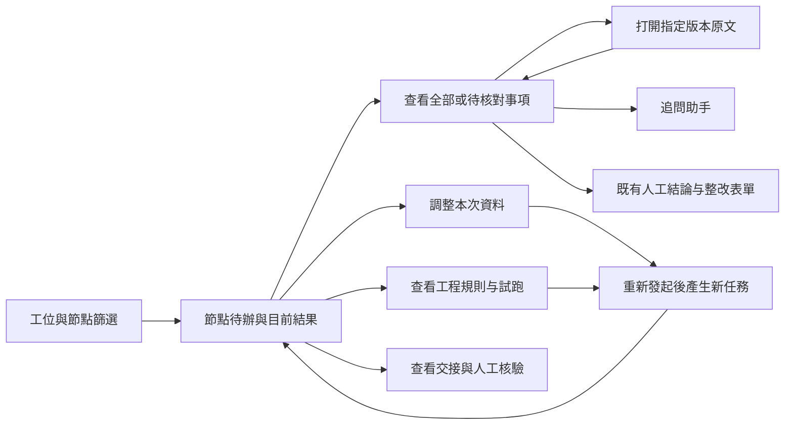

# Lab 現況與剩餘工作

更新：2026-09-09。這份清單按最新實作校準；README 的逐批紀錄保留當時狀態，不把早期「待做」當成現在仍未開發。

| 項目 | 已完成基礎 | 現在還差什麼 | 分類 |
|---|---|---|---|
| 工位 | 九份角色、69節點唯一歸屬、執行端工具隔離 | 全路徑驗收、輸出口语化的業務回放 | 待驗收／增補 |
| 文件 | 搜尋、跨頁批選、本次選取、補充掛載、歷史版本、PDF/圖片原文 | 使用者頁碼範圍、大文件及歷史重放 | 待開發／驗收 |
| 規則 | 工程草稿、複合條件表單、原子映射、示例與任務OCR試跑、通用與R19條件替代 | 對象映射、剩餘路徑核查、差異／發布閉環、自然語言草稿 | 待接線／開發 |
| 交接 | 草稿資料、雙方來源檢查、人工核驗API及介面 | 建立介面、下游消費／依賴、資料庫跨程序併發 | 待開發 |
| 結果UI | 分層卡片、口語提示、完整清單、證據定位；本批接入待辦首頁 | 完整登入工作台、實體設備及真實案件可用性驗收 | 待驗收 |
| 工位導航 | 本批加入獨立Lab工作台的工位／原始節點狀態篩選、窄螢幕抽屜 | embedded外層節點樹整合、具來源的跨節點需重驗統計 | 待接線 |
| 證據側欄 | 本批复用原定位器增加inline模式，桌面並排、窄螢幕沿用彈窗 | 完整登入的PDF定位／焦點返回／尺寸切換驗收 | 待驗收 |
| R35–R37、R39 | 專用核心、凍結事實及實際綁定 | 剩餘業務能力與完整規則驗收；R39三類pendingCapabilities仍阻擋發布 | 待補齊 |
| 其餘待驗收規則 | 既有工具與部分資料 | R10/R11/R40/R43–R58/R63–R64/R66–R68逐條缺口驗收 | 待核查／補齊 |
| 標準 | 已入庫資料及部分查詢修復 | 26查詢／原因清單未結項，14976／13296／47014 C–F剩餘資料 | 待補齊 |
| 驗收工具 | 發布門檻、R35–37重放、三組品質統計 | 69×4及邊界、原36差異、真實樣本、PG/MinIO/Temporal實機 | 待驗收 |
| 發布 | 版本與發布門檻、ID生成修復基礎 | 69全量驗收後發布；另行維護窗口完成ID演練／遷移 | 前置條件 |

## 結果優先的操作流程

## 本批UI實作與原型邊界

- 新ReviewNodeOverview接入現有workspace、有效任務、資料選取及三個既有工具元件；Lab預設待辦與結果，main未啟用開關時仍是對話。對話使用v-show保留內容與輸入，不重建會話。
- 工位導航只有篩選已有授權節點，配置鏡像以測試核對後端registry；不把節點數冒充待辦數，不推測其他節點已過期。
- 有當前任務但尚無結果時，不以舊通過結果補位。待核對篩選只排除有grounded引用且明確符合／不適用的項目；未知、缺引用及矛盾都保留，完整項目和原始序號可查看。
- 選取摘要屬下次發起輸入；缺件提示標明是節點既有資料，不能冒充剛選文件的檢查結果。啟動、人工確認、整改沿用既有權限及保存處理。
- inline定位器共用原來的固定版本讀取、Blob生命週期及來源校驗；不另寫一個文件播放器。主工作台在1280px以上使用右欄，窄螢幕沿用彈窗；關閉返回原焦點，切換工程節點清除舊預覽。
- 可交互原型：frontend/e2e/lab-rules/workstation-overview.html。正常、載入、失敗、空資料、唯讀、過期六態使用真實Vue元件和合成資料；文件／規則／交接彈窗使用模擬API，人工結論不寫入、審查按鈕不調模型。不是完整登入驗收。
- 原型覆蓋六個區域的入口；工位交接建立、規則發布等尚未開發的操作不做假的成功按鈕。

## 接下來的批次

1. 用完整登入工作台核驗本批首頁／導航／證據模式與人工結論，補embedded導航及真正跨節點待辦資訊。
2. 文件頁碼範圍、規則對象映射與差異／發布、交接建立／消費／依賴及資料庫併發。
3. 逐條補齊規則與標準，跑69條四態、原36差異及服務實機測試。
4. 真實案例品質評估與分開發布；付費、維護窗口、stage2和施焊記錄沿用既有前置條件。

- 本批另修定位器的版本回退：一般文件引用帶documentVersionId時，按工程／文件／版本組裝原文請求；不採用目前版本URL。缺文件身份不回退，標準條款與無版本的舊引用保持原契約。inline初次打開立即載入，版本／頁碼變動重讀並沿用過期回應隔離；彈窗增加窄螢幕最大寬度。
- 前端89測試檔通過；瀏覽器通過六態、待核對／完整清單、既有文件入口、指定版本請求與版本切換、404不回退、inline／彈窗切換及390px彈窗界限，另通過390／900／1440深淺色原型、工具區回歸及main CSS比對。元件測試使用合成資料，不能代替完整登入及真實PDF驗收。

- 本批最後全量vue-tsc通過，修改檔ESLint、新首頁／結果卡Stylelint及diff check通過；已檢視桌面淺色與手機深色截圖。原型已送至Codex預覽，4394開發伺服器保留供本地查看；沒有部署生產。
