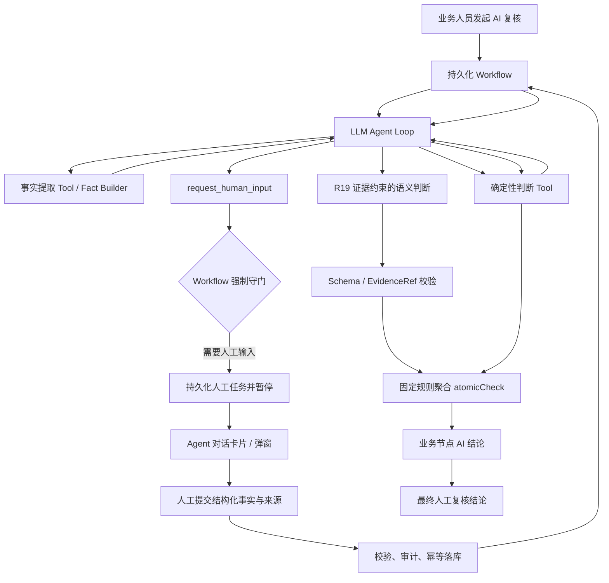
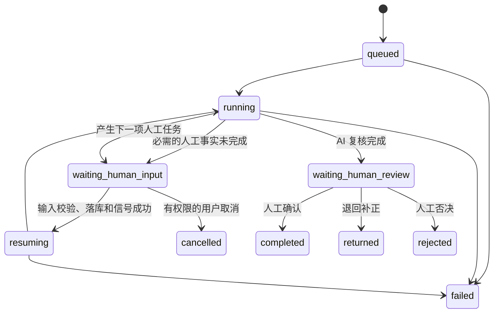

# 人工参与的 LLM 主导 Agent 对话构建方法

## 1. 文档目的

本文抽象一套可复用的 Agent 交互构建方法，用于以下业务场景：

- LLM 根据当前任务和上下文自主选择 Tool、组织执行顺序并与用户对话；
- 确定性的业务事实由程序提取，确定性的业务规则由 Tool 计算；
- 遇到系统无法可靠完成、法规要求人工确认或需要访问外部受限系统的环节，Agent 在对话中发起结构化人工输入任务；
- 后台工作流可以持久暂停，人工输入后从原位置恢复；
- 模型调用、Tool 调用、人工输入、证据、AI 结论和人工结论均可审计、可重放、可追溯。

R12“制造许可证官网人工核验”是当前工程中的第一个实例，但本方法不绑定 R12，可用于见证资料确认、现场事实确认、外部平台查询、歧义消解、证据补充和高风险结论复核等场景。

---

## 2. 核心设计原则

### 2.1 LLM 主导不等于 LLM 独占决策

各组件的职责必须清晰分离：

| 组件 | 核心职责 | 不应承担的职责 |
|---|---|---|
| LLM Agent | 理解任务、选择 Tool、安排调用顺序、发现信息缺口、发起人工任务、解释结果 | 凭空构造事实、覆盖确定性 Tool 结果、绕过强制人工步骤 |
| Fact Builder | 从文件、OCR、表格、项目数据中形成结构化业务事实 | 作出需要规则计算或人工核验的最终判断 |
| 业务 Tool | 根据输入事实执行确定性计算，或校验限定语义判断的结构、证据和边界 | 自行改变工作流状态、把不确定结果伪装成确定结论 |
| Workflow | 控制状态、重试、暂停、恢复、超时、取消和强制守门 | 代替 LLM 生成对话内容 |
| 人工参与者 | 提供系统无法获得或法规要求人工确认的权威事实 | 修改原始证据或未经授权改变规则 |
| 聚合器 | 按固定规则汇总 atomicCheck 结果，生成业务节点 AI 结论 | 重新推翻原子 Tool 已生成的确定性结果 |
| 前端 | 展示事件、证据、Tool 状态和人工任务，收集结构化输入 | 从自然语言文本猜测后台状态 |

因此，本方法的控制关系是：

> 默认模式下，LLM 负责“下一步做什么和如何与人协作”，Tool 负责“事实和确定性结果”；在 R19 这类开放格式、宽口径语义审核中，LLM 还负责形成逐原子项语义判断，但 Tool/服务端负责 EvidenceRef、Schema 和条款边界校验，固定聚合器负责节点 result，Workflow 负责“必须做什么以及能否继续”。

### 2.2 双重守门

人工步骤必须同时具备两层约束：

1. **LLM 对话层守门**：系统提示词和 Tool 描述要求模型在满足触发条件时调用 `request_human_input`。
2. **Workflow 确定性守门**：即使模型未调用、调用失败或模型服务不可用，只要规则配置认定该人工任务必需，工作流仍创建任务并进入 `waiting_human_input`。

LLM 提升交互的灵活性，Workflow 保证业务安全下限。

### 2.3 结论与依据分离

每个 atomicCheck 至少保留下列内容：

- `requiredFacts`：该原子项所需事实；
- `toolResults`：Tool 的结构化结果；
- `evidenceRefs`：文件、页码、区域、引文等证据定位；
- `clauseRefs`：标准、版本、条款号和原文定位；
- `reasonCode`：机器可识别的判断原因；
- `result`：`passed`、`failed`、`evidence_insufficient`、`not_applicable` 或 `human_review_required`；
- `explanation`：面向人的解释，可由模板或 LLM 根据上述内容生成。

在 `tool_result_primary` 模式中，LLM 可以解释 Tool 结果，但不得把 `failed` 改写成 `passed`。在 `llm_semantic_primary` 模式中，LLM 可以形成 atomicCheck 的 `result`，但 `passed`、`failed`、`not_applicable` 必须引用已登记 EvidenceRef；提交记录必须通过服务端校验，节点结论仍由固定聚合器生成。任何模式都不得把缺失证据描述为已验证。

---

## 3. 适用场景与边界

### 3.1 适合采用人工参与 Agent 的场景

- 需要登录外部官网、验证码、专网或人工账户权限；
- 外部系统没有稳定 API，网页自动化也不能作为权威结果；
- 标准或业务规则明确要求监检人员、审核人员进行确认；
- OCR 提取出多个候选值，且错误选择会影响安全结论；
- 文件本体缺失，需要人工补充证据；
- 业务存在少量不可穷举的语义分支，需要 LLM 组织 Tool 和提问；
- 审核过程较长，需要关闭页面后仍能继续；
- 必须保留“谁、在何时、根据什么来源确认了什么”的证据链。

### 3.2 不应为了对话而引入 LLM 的场景

- 输入和算法固定、一个确定性 Tool 即可完整判断；
- 业务条款绑定固定，只需从数据库读取；
- 单纯的日期覆盖、数值阈值、集合包含、许可证范围映射；
- 聚合规则已经明确，可以由程序直接生成节点结论；
- 使用 LLM 只会把确定性结果变成不可重现的自然语言判断。

这些场景仍可由 Agent 调用 Tool，但判断本身不应交给模型自由推理。

### 3.3 两种 Agent 执行模式

| 模式 | 适用条件 | LLM 产物 | Tool/服务端产物 | 节点结果 |
|---|---|---|---|---|
| `tool_result_primary` | 输入结构稳定、规则可计算，如 R13-R18 的分类、覆盖、日期、批次和限值判断 | Tool 编排、缺口发现、结果解释 | 业务 atomicCheck result | 固定聚合器 |
| `llm_semantic_primary` | 输入格式不稳定、标准核查较宽、需要跨文件语义比对，如 R19 | 带 ClauseRef、EvidenceRef、置信度和缺口的 atomicCheck 语义判断 | OCR/表格/证据读取，判断 Schema 与证据校验 | 固定聚合器 |

`llm_semantic_primary` 不是“让模型自由给结论”。它至少包含四个确定性边界：固定原子项、固定条款包、已登记 EvidenceRef 白名单、固定节点聚合优先级。若模型无法形成满足这些边界的结果，必须进入 `evidence_insufficient` 或发起人工任务。

### 3.4 R19 为什么采用更完整的交互模式

R19 同时审查产品质量证明文件、验证性复验报告、境外材料标准、类似工况经历、国内相近材料、企业标准以及首次使用时的焊接工艺评定。当前工程不能预先穷举这些文件的版式和全部比较字段，因此仅靠固定 Fact Builder 会让大量真实业务停在“字段未建模”。R19 采用如下分工：

1. 服务端固定加载 `TSG D7006-2020 D2.4.1(8)` 与 `TSG 31-2025 2.1.2(1)-(6)`，模型不得选择或替换依据；
2. `get_document_ocr_result`、`extract_document_fields`、`extract_table_records` 和 `locate_evidence_fragment` 向模型提供原文事实与可跳转 EvidenceRef；
3. LLM 对 AC-R19-01 至 AC-R19-08 进行跨文件语义分析；
4. `validate_r19_semantic_judgment` 校验结果 Schema、ClauseRef 和 EvidenceRef，本 Tool 不生成或改写业务结果；
5. 证据不足、矛盾或需要专业确认时，LLM 调用 `request_r19_human_input`，Workflow Guard 在模型遗漏或不可用时仍会补建任务；
6. 人工响应作为新的结构化证据注入恢复后的 Agent 上下文；
7. 服务端按固定优先级聚合八个原子项，生成 R19 节点 AI 结论，再进入最终人工复核。

---

## 4. 总体架构



Agent Loop 可以运行多轮，但一次复核必须由持久化 Workflow 承载，不能只依赖一个 HTTP 长连接或前端页面存活。

---

## 5. 标准执行流程

### 5.1 阶段一：建立任务上下文

系统加载以下上下文：

- 项目、业务节点、atomicCheck 和规则版本；
- 固定绑定的标准具体条款；
- 输入文件版本及其内容哈希；
- 已提取事实、证据定位和缺失事实；
- 本节点允许调用的 Tool 白名单；
- 人工参与触发规则；
- 已完成的人工任务和历史 Tool 结果。

LLM 不直接接收整库数据，而只接收本次任务所需的最小上下文和可引用 ID。

### 5.2 阶段二：LLM 选择 Tool

LLM 根据 Tool 的 `name`、`description` 和 JSON Schema 决定下一步。典型顺序为：

1. 查询/提取事实；
2. 检查事实完整性；
3. 调用确定性判断 Tool；
4. 发现必须由人工完成的事实时，调用人工输入 Tool；
5. 人工输入返回后，继续调用确定性 Tool；
6. 根据结构化结果形成可审计说明。

### 5.3 阶段三：创建人工任务并暂停

调用人工输入 Tool 后，系统不把它当作普通同步 Tool。系统应：

1. 生成稳定的任务输入快照和 `inputHash`；
2. 持久化人工任务；
3. 输出 `agent.human_input.required` 事件；
4. 将 ReviewRun 状态改为 `waiting_human_input`；
5. 结束本轮 Agent Loop；
6. 由 Workflow 持久等待信号，而不是占用进程或线程。

### 5.4 阶段四：人工提交

前端根据任务的 `responseSchema` 渲染表单。人工提交时必须：

- 覆盖任务要求的每个核验对象；
- 选择结构化结果，必要时填写官网字段；
- 提供来源 URL、附件或现场记录；
- 勾选真实性确认；
- 携带 `If-Match` 和 `Idempotency-Key`；
- 通过权限、状态、数据格式和 `inputHash` 校验。

### 5.5 阶段五：恢复执行

有效输入先写入业务数据库，再向 Workflow 发送只包含命令标识和哈希的恢复信号。Workflow 恢复后：

1. 从数据库重新读取人工输入；
2. 将任务标记为 `completed`；
3. 进入 `resuming`；
4. 将人工输入作为 Tool Result 注入新的 Agent 上下文；
5. 继续执行剩余 Tool；
6. 生成 atomicCheck 结果和节点 AI 结论；
7. 进入 `waiting_human_review`，等待最终人工复核结论。

人工业务输入不应直接完整写入 Workflow History，以避免敏感信息泄漏和历史膨胀。

---

## 6. 状态机



约束如下：

- 同一 ReviewRun 同一时刻最多有一个阻塞型人工任务处于 `pending`；
- 非当前 `waiting_human_input` 状态不得接收人工任务响应；
- 输入文件或规则版本变化后，旧任务必须标记为 `stale`，不得直接复用；
- `waiting_human_input` 是正常业务状态，不是错误状态；
- 最终人工复核与过程中补充事实是两类不同任务，不应混用。

---

## 7. Tool 分类与统一契约

### 7.1 事实获取 Tool

用途：读取项目数据、OCR、文件、表格和证照候选值，只返回事实与证据定位。

```json
{
  "name": "inspect_license_candidates",
  "description": "从本次复核输入文件中提取许可证号、单位名称、许可范围、有效期及其页码和坐标。只返回候选事实，不代表已通过官网核验。",
  "parameters": {
    "type": "object",
    "properties": {
      "reviewRunId": { "type": "string", "description": "复核运行标识" },
      "documentVersionIds": {
        "type": "array",
        "items": { "type": "string" },
        "description": "限定读取的文件版本"
      }
    },
    "required": ["reviewRunId", "documentVersionIds"],
    "additionalProperties": false
  }
}
```

### 7.2 确定性判断 Tool

用途：日期覆盖、名称归一化后比较、范围映射、签字数量与角色、字段完整性、阈值判断等。

统一输出建议：

```json
{
  "toolResultId": "TR-...",
  "status": "completed",
  "result": "passed | failed | evidence_insufficient | not_applicable | human_review_required",
  "reasonCodes": ["LICENSE_SCOPE_NOT_COVERED"],
  "facts": {},
  "evidenceRefs": [],
  "clauseRefs": [],
  "missingFacts": [],
  "diagnostics": [],
  "toolVersion": "1.0.0"
}
```

### 7.3 人工输入 Tool

用途：由 LLM 说明为什么需要人、需要人核验哪些对象，以及系统期待什么格式的结果。

推荐抽象为一个公共 Tool：

```json
{
  "name": "request_human_input",
  "description": "当业务规则明确要求人工确认，或当前系统无法取得权威事实时，创建结构化人工输入任务并暂停复核。不得用它替代系统已有的确定性 Tool。",
  "parameters": {
    "type": "object",
    "properties": {
      "taskType": { "type": "string", "description": "已注册的人工任务类型" },
      "reasonCode": { "type": "string", "description": "触发人工参与的机器可识别原因" },
      "title": { "type": "string" },
      "instructions": { "type": "string" },
      "subjectRefs": {
        "type": "array",
        "items": { "type": "string" },
        "description": "需要逐项核验的事实或候选对象 ID"
      },
      "blocking": { "type": "boolean", "const": true }
    },
    "required": ["taskType", "reasonCode", "title", "subjectRefs", "blocking"],
    "additionalProperties": false
  }
}
```

LLM 只选择已注册的 `taskType`。任务标题、输入对象和前端提示可由模型提出，但最终 `responseSchema`、校验器、权限和是否必需由服务端任务类型注册表决定，不能由模型临时定义。

### 7.4 行为型 Tool

发送联络单、修改业务数据、提交外部系统等会产生外部副作用，应与只读 Tool 分开：

- 默认不加入审核 Agent 的 Tool 白名单；
- 必须具备显式授权和二次确认；
- 必须支持幂等和结果回查；
- Tool 描述必须明确副作用；
- 失败不能被模型解释为成功。

---

## 8. 人工任务数据模型

### 8.1 任务模型

```json
{
  "taskId": "HIT-...",
  "taskType": "official_registry_verification",
  "schemaVersion": "1.0",
  "reviewRunId": "RRUN-...",
  "nodeId": 12,
  "atomicCheckIds": ["AC-R12-01"],
  "title": "核验制造许可证官网登记信息",
  "description": "逐张查询许可证号并核对登记信息",
  "reasonCode": "OFFICIAL_REGISTRY_REQUIRES_HUMAN",
  "required": true,
  "blocking": true,
  "status": "pending",
  "inputHash": "sha256:...",
  "reviewRunInputHash": "sha256:...",
  "subjectRefs": ["LICENSE-CANDIDATE-01"],
  "subjects": [],
  "responseSchemaRef": "human-task://official_registry_verification/1.0",
  "uiSchemaRef": "human-task-ui://official_registry_verification/1.0",
  "requestedBy": "llm_agent | workflow_guard",
  "agentTraceId": "TRACE-...",
  "createdAt": "2026-07-15T10:00:00Z",
  "updatedAt": "2026-07-15T10:00:00Z",
  "expiresAt": null,
  "responses": []
}
```

### 8.2 人工响应模型

```json
{
  "responseId": "HIR-...",
  "taskId": "HIT-...",
  "inputHash": "sha256:...",
  "actor": {
    "userId": "USER-...",
    "displayName": "监检人员",
    "role": "inspector"
  },
  "values": {},
  "sourceRefs": [
    {
      "type": "url",
      "url": "https://...",
      "accessedAt": "2026-07-15T10:10:00Z"
    }
  ],
  "attachmentIds": [],
  "comment": "",
  "attested": true,
  "submittedAt": "2026-07-15T10:12:00Z"
}
```

人工输入是新的业务事实，不是聊天文本。聊天消息可以展示它，但判断 Tool 必须读取经过校验的结构化 `values`。

### 8.3 任务类型注册表

公共框架应通过注册表管理不同人工任务：

| 配置项 | 说明 |
|---|---|
| `taskType`、`schemaVersion` | 稳定类型与版本 |
| `triggerPolicy` | 哪些节点/原子项/事实缺口必须触发 |
| `responseSchema` | 后端校验 JSON Schema |
| `domainValidator` | 跨字段和业务合法性校验 |
| `uiSchema` | 控件、分组、提示、来源输入方式 |
| `allowedRoles` | 哪些角色可以提交 |
| `resultAdapter` | 转换为标准 Tool Result 的逻辑 |
| `stalePolicy` | 哪些输入变化导致任务失效 |
| `retentionPolicy` | 响应、附件和模型流的保留期限 |

---

## 9. LLM Agent Loop

### 9.1 基本循环

```python
messages = build_agent_context(review_run, node_binding, available_facts)

for turn in range(MAX_AGENT_TURNS):
    response = llm.stream(messages=messages, tools=allowed_tools)
    persist_model_stream(response.events)
    messages.append(response.assistant_message)

    if not response.tool_calls:
        break

    for call in response.tool_calls:
        authorize(call, review_run, allowed_tools)
        validate_arguments(call)

        if call.name == "request_human_input":
            task = create_or_reuse_human_task(call, review_run)
            persist_task_and_pause(review_run, task)
            return {"status": "waiting_human_input", "taskId": task.id}

        result = execute_tool(call)
        persist_tool_call_and_result(call, result)
        messages.append(as_tool_message(call, result))

guard_result = enforce_required_steps(review_run)
if guard_result.requires_human_input:
    task = create_guard_task(guard_result)
    persist_task_and_pause(review_run, task)
    return {"status": "waiting_human_input", "taskId": task.id}

return aggregate_atomic_checks(review_run)
```

R19 在基本循环中增加 `submit_r19_semantic_review`：模型必须一次提交全部八个原子项；服务端拒绝未知原子项、重复原子项、未知 EvidenceRef、缺失 ClauseRef，以及没有证据却声明 `passed / failed / not_applicable` 的结果。提交通过后，服务端忽略模型可能自报的节点 result，并重新固定聚合。

### 9.2 恢复后的上下文

恢复时不应依赖模型记住暂停前的会话，而应重新构造上下文：

- 原始任务和规则版本；
- 已完成 Tool Call 的精简结果；
- 人工任务的结构化响应；
- 未完成 atomicCheck；
- 新一轮允许调用的 Tool；
- 暂停前的 `agentTraceId` 和摘要。

必要时可以继续同一 `conversationId`，但业务正确性不能依赖供应商侧会话状态。

### 9.3 模型提示词规则

系统提示词至少应声明：

1. 只能使用当前提供的证据、规则和 Tool Result；
2. 固定标准条款绑定不是模型推理任务；
3. 确定性判断必须调用对应 Tool，不能自行心算后直接给结论；
4. 满足人工触发条件时必须调用 `request_human_input`；
5. 人工任务完成前，不得声称官网、现场或人工事实已核验；
6. Tool 返回 `failed` 或 `evidence_insufficient` 时不得擅自改为通过；
7. 只能调用白名单 Tool，不得编造 Tool 名称；
8. 达到最大轮次仍无法完成时，返回结构化缺口，不得无限循环；
9. 面向用户的说明应引用 `evidenceRefId` 和 `clauseRefId`；
10. 结论必须符合约定的输出 Schema。

R19 还必须声明：企业标准只对“境内制造单位使用境外牌号材料”分支适用；首次使用状态不明确时不得豁免焊接工艺评定；不能用产品质量证明文件单独替代验证性复验报告，也不能用复验报告替代企业标准。

---

## 10. 流式交互与事件协议

### 10.1 事件类型

前端不应只接收一段最终文本，而应订阅标准事件：

| 事件 | 用途 |
|---|---|
| `agent.message.delta` | 面向用户的回答增量 |
| `agent.reasoning.delta` | 模型 API 明确返回的 `reasoning_content` 增量 |
| `agent.tool_call.started` | Tool 开始执行 |
| `agent.tool_call.completed` | Tool 完成及结果摘要 |
| `agent.tool_call.failed` | Tool 失败及可恢复信息 |
| `agent.human_input.required` | 创建阻塞型人工任务 |
| `agent.run.paused` | Workflow 已持久暂停 |
| `agent.human_input.accepted` | 人工输入校验和落库完成 |
| `agent.run.resumed` | Workflow 恢复 |
| `agent.conclusion.created` | AI 结论生成 |
| `agent.run.failed` | 运行失败 |

统一事件信封：

```json
{
  "eventId": "EVT-...",
  "sequence": 102,
  "tenantId": "TENANT-...",
  "reviewRunId": "RRUN-...",
  "conversationId": "CONV-...",
  "traceId": "TRACE-...",
  "eventType": "agent.tool_call.completed",
  "timestamp": "2026-07-15T10:00:00Z",
  "payload": {},
  "payloadHash": "sha256:..."
}
```

SSE 适合服务端单向推送；如果后续需要双向实时控制，可使用 WebSocket。无论采用哪一种，人工响应仍通过有幂等和并发保护的业务 API 提交，不能只通过临时流通道提交。

### 10.2 `reasoning_content` 的处理

- 只透传并保存模型供应商 API **明确返回**的 `reasoning_content` 或同类字段，以及其他实际流式增量；
- 不尝试读取、反推或伪造模型未返回的内部隐藏状态；
- 每个增量记录模型、调用批次、顺序号、时间、trace 和内容哈希；
- 原始模型返回与面向业务的“可审计判断摘要”分开保存，二者不能相互替代；
- 原始流可能包含敏感业务数据，应配置访问角色、脱敏、加密、保留期和导出审计；
- UI 可以在执行中折叠展示模型返回的推理流，但后台状态只认结构化事件，不能通过推理文本判断 Tool 是否完成或任务是否暂停；
- 供应商不返回 `reasoning_content` 时，只展示 Tool 轨迹和业务判断摘要，不应生成伪造的“原始思维链”。

### 10.3 断线重连

前端保存最后的 `sequence` 或 `Last-Event-ID`。重连后先读取持久化事件，再继续订阅新事件，以保证：

- 页面刷新不丢 Tool 轨迹；
- 人工任务仍可重新打开；
- 同一事件不会重复渲染；
- 最终结论不依赖浏览器内存。

---

## 11. API 设计

推荐公共 API：

```text
POST /api/review-runs
GET  /api/review-runs/{reviewRunId}
GET  /api/review-runs/{reviewRunId}/events?after={sequence}
GET  /api/review-runs/{reviewRunId}/human-input-tasks/active
GET  /api/review-runs/{reviewRunId}/human-input-tasks/{taskId}
POST /api/review-runs/{reviewRunId}/human-input-tasks/{taskId}/responses
POST /api/review-runs/{reviewRunId}/human-decision
POST /api/review-runs/{reviewRunId}/cancel
```

人工响应接口必须要求：

- `Authorization`：身份和角色；
- `If-Match`：ReviewRun 修订版本；
- `Idempotency-Key`：重复提交保护；
- `taskId + inputHash`：输入快照一致性；
- JSON Schema 和业务校验；
- 审计日志；
- Workflow 命令状态可回查。

典型冲突处理：

- 任务已完成：返回 `409 invalid_state`；
- 文件/规则已变化：返回 `409 stale_input`；
- 字段缺失：返回 `422 invalid_input`；
- 同一幂等键和相同载荷：返回第一次结果；
- 同一幂等键和不同载荷：返回幂等冲突。

---

## 12. 持久化与审计

### 12.1 ReviewRun 聚合数据

建议至少包含：

```text
ReviewRun
├── inputDocumentVersionIds / inputHash
├── ruleSetId / ruleSetVersion / clauseBindingVersion
├── status / revision / etag
├── agentTraces[]
│   ├── modelAttempts[]
│   ├── returnedReasoningContent
│   └── assistantContent
├── toolCalls[]
│   ├── argumentsHash
│   ├── resultRef / resultHash
│   └── timing / error
├── humanInputTasks[]
├── atomicCheckResults[]
├── aiConclusion
└── humanDecision
```

### 12.2 审计要求

- 原始证据不可被后续结果覆盖；
- Tool 输入输出、人工任务和结论尽量采用追加式记录；
- 保存 Tool 版本、规则版本、提示词版本、模型名称和参数；
- 记录人工提交者、角色、时间、来源和真实性确认；
- 内容较大时保存对象存储引用和哈希，数据库保存索引；
- 每条证据能跳转到文件版本、页码和坐标；
- 每个结论能反向追踪到 atomicCheck、Tool Result、人工响应和标准条款；
- 修改后的重新执行应创建新运行或新版本，不应静默改写旧结论。

---

## 13. 聚合规则

节点 AI 结论始终由固定聚合器生成。对于 `llm_semantic_primary`，聚合器输入是经过 Schema 和 EvidenceRef 校验的 LLM atomicCheck 判断，而不是未经验证的模型文本。建议采用以下优先级：

1. 任一必检 atomicCheck 为 `failed`，节点为 `failed`；
2. 无 `failed`，但任一必检项为 `evidence_insufficient`，节点为 `evidence_insufficient`；
3. 无上述状态，但存在 `human_review_required`，节点为 `human_review_required`；
4. 所有适用必检项均为 `passed`，节点为 `passed`；
5. 所有原子项均为 `not_applicable`，节点为 `not_applicable`。

LLM 可以生成结论说明、列出风险和建议下一步，但 `result` 必须取自聚合器。需要行业特殊优先级时，应在节点配置中显式版本化，而不是写入提示词后由模型临时决定。

---

## 14. 前端交互模式

### 14.1 对话时间线

对话区按事件渲染：

- 用户任务消息；
- Agent 面向用户的说明；
- 可展开的模型返回推理流；
- Tool 调用卡片：名称、输入摘要、状态、耗时、结果；
- 证据卡片：文件名、页码、引文、定位跳转；
- 条款卡片：标准名称、版本、条款号、原文跳转；
- 人工输入卡片：待处理、已完成、已失效；
- 节点 AI 结论；
- 最终人工结论。

### 14.2 人工输入弹窗

弹窗由 `taskType + schemaVersion` 决定，建议包含：

1. 为什么必须人工参与；
2. Agent 已提取的候选事实和原文件定位；
3. 官方入口或操作说明；
4. 每个对象的结构化核验字段；
5. 来源 URL/附件/截图；
6. 差异说明和备注；
7. 真实性确认；
8. 提交、暂存、取消或关闭。

关闭弹窗不取消任务。页面顶部和对话时间线应持续显示“等待人工输入”，用户重新进入运行后可以继续处理。

### 14.3 进度表达

- 不显示虚构的百分比；
- 显示可验证阶段：提取事实、调用 Tool、等待人工、恢复校验、生成结论；
- 人工任务未完成时明确说明“AI 复核已暂停”；
- Tool 失败与证据不足使用不同视觉状态；
- AI 结论与人工结论分区展示，不能混成一个状态。

---

## 15. 并发、幂等与失效控制

### 15.1 `inputHash`

人工任务的 `inputHash` 应由以下内容稳定计算：

- ReviewRun 输入文件版本；
- 与任务相关的候选事实；
- 规则和条款绑定版本；
- 影响任务结果的项目参数。

只要上述内容变化，待处理任务应失效并重新创建，避免人工对旧文件作出的确认被用于新文件。

### 15.2 幂等

- `create_or_reuse_human_task` 对相同 `taskType + inputHash` 只创建一次待处理任务；
- 响应提交使用 `Idempotency-Key`；
- Workflow Signal 使用 `commandId` 去重；
- Tool 的只读执行可以通过 `toolName + version + argumentsHash` 复用结果；
- 有副作用的 Tool 必须具有业务幂等键。

### 15.3 并发

提交人工输入时使用 ETag/修订号做乐观锁。两个用户同时处理同一任务时，第一个有效提交成功，后一个收到冲突并刷新，而不是覆盖前者。

---

## 16. 异常和恢复策略

| 异常 | 处理方式 |
|---|---|
| LLM 未调用必需人工 Tool | Workflow Guard 创建任务 |
| LLM 服务不可用 | 重试；达到阈值后由确定性流程继续到可执行边界，必要时创建人工任务 |
| Tool 超时 | 按 Tool 策略重试，保留失败事件，不伪造结果 |
| 人工长期未输入 | 保持 `waiting_human_input`，可提醒但不自动通过 |
| 人工输入不完整 | 返回字段级错误，不恢复 Workflow |
| 输入文件变化 | 旧任务标记 `stale`，重新构造任务 |
| 页面或 SSE 断开 | 从持久化事件和当前 ReviewRun 状态恢复 |
| Workflow Worker 重启 | 由持久化 Workflow 恢复等待或执行状态 |
| 重复 Signal | 通过 `commandId` 幂等忽略 |
| Agent 超过最大轮次 | 返回结构化 `agent_turn_limit`，由 Guard 或人工处理 |
| 用户取消 | 记录取消原因，关闭未完成任务，进入 `cancelled` |

---

## 17. 安全控制

- 每个节点使用最小 Tool 白名单，模型不能动态访问任意代码、文件或网络；
- Tool 参数必须做 JSON Schema、租户范围和对象归属校验；
- 文档内容视为不可信输入，防止其中的提示注入改变系统指令；
- 外部 URL 做协议、域名和重定向限制，不能由后端盲目访问人工提供的网址；
- 人工任务按角色授权，敏感字段按字段级权限展示；
- 模型返回的 `reasoning_content` 和其他流式内容单独配置访问权限、脱敏与保留期；
- 日志不得记录令牌、Cookie、验证码、私钥和不必要的个人信息；
- Tool 返回的网页内容、文件内容和人工文本不能直接拼接为新的系统指令；
- 重要业务结论必须能在不依赖模型自然语言的情况下，由结构化记录复核。

---

## 18. 业务节点接入模板

每个需要人工协作的业务节点，先形成以下绑定：

```yaml
nodeId: RXX
description: 业务节点审查目标
clauseBindings:
  - clauseRefId: CLAUSE-...
atomicChecks:
  - atomicCheckId: AC-RXX-01
    description: 原子审查目标
    requiredFacts:
      - fact_a
      - fact_b
    tools:
      - inspect_xxx
      - compare_xxx
    humanInput:
      requiredWhen:
        all:
          - fact: official_result
            operator: missing
          - fact: candidate_count
            operator: gt
            value: 0
      taskType: official_registry_verification
      responseSchemaVersion: "1.0"
    aggregation:
      tool: aggregate_atomic_check
      failureReasonCodes:
        - OFFICIAL_RECORD_MISMATCH
```

接入评审时必须回答：

1. 哪些事实可以由系统自动取得？
2. 哪些判断可以由确定性 Tool 完成？
3. 哪些信息必须由人工提供，依据是什么？
4. 人工需要看到哪些证据和操作说明？
5. 人工响应如何被校验并转换成 Tool Result？
6. 哪些输入变化会导致人工响应失效？
7. 节点结论如何固定聚合？
8. LLM 在其中实际拥有哪一项选择权？

---

## 19. 构建步骤

### 步骤一：形成触发矩阵

按 `业务节点 → atomicCheck → requiredFacts → tools → humanTrigger → outputSchema` 梳理完整关系，明确哪些步骤自动、半自动或人工完成。

### 步骤二：先完成 Fact Builder

对文件字段、表格行、项目参数、证据定位建立统一事实模型。Fact Builder 不完整时，Agent 只能围绕自然语言猜测，不能形成可靠复核。

对于 R19，不要求在试点前穷举所有企业标准和境外材料标准版式，但必须先具备“通用文档上下文 Builder”：文档版本索引、OCR/表格预览、稳定 EvidenceRef、页码/坐标/原文、人工响应证据和按需检索 Tool。后续再将高频稳定字段逐步下沉为专用 Fact Builder。

### 步骤三：实现确定性 Tool

将集合、日期、范围、数值、签字、名称等可确定规则实现为可单测 Tool，并统一结果 Schema 和 reason code。

### 步骤四：建立人工任务注册表

定义任务类型、触发条件、响应 Schema、业务校验、UI Schema、角色、失效策略和结果适配器。

### 步骤五：实现 Agent Loop

支持 Tool Calling、流式事件、模型重试、最大轮次、Tool 白名单和恢复上下文重建。

### 步骤六：实现 Workflow Guard

用确定性配置检查必需 Tool 和必需人工任务是否完成。模型遗漏时由 Guard 补齐，未完成时禁止进入节点结论。

### 步骤七：实现持久暂停和恢复

人工输入先落库，Workflow 只接收命令 ID 和哈希；恢复后重新读取并校验业务数据。

### 步骤八：实现通用前端渲染器

时间线按事件渲染，人工任务按 `uiSchema` 渲染，避免每个节点复制一套弹窗代码。特殊复杂任务可以注册专用组件。

### 步骤九：建立审计和权限

打通模型流、Tool、证据、条款、人工输入、AI 结论、人工结论的追踪链，并配置敏感内容权限和保留期。

### 步骤十：测试后发布

先作为试点规则运行，验证误触发、漏触发、恢复和审计完整性，再发布正式 BindingSet/规则版本。

---

## 20. 测试矩阵

### 20.1 单元测试

- 每个事实提取器的正常、缺失、歧义和 OCR 错误样本；
- 每个确定性 Tool 的边界值和 reason code；
- 人工任务触发条件；
- 响应 Schema、跨字段校验和输入失效；
- 聚合器的全部状态组合；
- Agent Tool 参数校验和最大轮次。

### 20.2 Agent 行为测试

- 模型按预期先提取事实再请求人工；
- 模型跳过人工 Tool 时 Guard 能补建任务；
- 模型编造 Tool 时调用被拒绝；
- 人工结果返回后模型只基于 Tool Result 解释；
- 模型服务不可用时流程仍保持安全状态。
- R19 模型必须覆盖 AC-R19-01 至 AC-R19-08，未知或重复原子项被拒绝；
- R19 引用不存在的 EvidenceRef、无 ClauseRef 或无证据却声明通过时被拒绝；
- R19 企业标准条件分支和首次使用工艺评定分支能够进入人工确认；
- R19 人工响应恢复后成为新 EvidenceRef，并由模型重新完成剩余判断；
- R19 节点 result 与固定聚合器一致，不能采用模型自报的节点结果。

### 20.3 API 和并发测试

- ETag、幂等键、重复提交、越权、跨租户；
- 旧 `inputHash` 响应被拒绝；
- 两人同时提交只接受一次；
- Workflow 命令已落库但 Signal 暂时失败时可重试。

### 20.4 Workflow 集成测试

- `running → waiting_human_input → resuming → waiting_human_review`；
- Worker 重启后仍能恢复；
- 重复 Signal 不重复应用；
- 暂停状态可以取消；
- 多次人工任务可以依次执行。

### 20.5 前端测试

- 流式事件顺序和断线重连；
- 人工任务关闭后可再次打开；
- 字段错误能准确定位；
- 文件证据与标准条款可以跳转；
- 已完成、失效、无权限状态正确展示；
- AI 结论和人工结论不混淆。

---

## 21. R12 实例映射

R12 的特殊问题是：软件可以从制造许可证样本中提取许可证号和单位信息，但当前必须由人工到官网完成权威核验。其映射如下：

| 通用环节 | R12 实现 |
|---|---|
| Fact Builder | 从 OCR/字段中提取制造许可证候选；从特性表、材料表和质量证明文件中提取元件、制造单位、规格等 |
| LLM 调度 | 先调用候选检查，再请求官网核验 |
| 人工任务 | `official_registry_license_verification` |
| 人工输入 | 官网查询结果、登记许可证号、单位名称、状态、许可范围、有效期、来源 URL、附件和真实性确认 |
| 确定性 Tool | 官网登记信息与证照候选匹配；制造许可范围与设计/材料元件要求匹配 |
| Workflow | `waiting_human_input → resuming` 后继续复核 |
| 聚合 | 根据每家制造单位和每类元件的结构化结果生成 R12 atomicCheck 及节点 AI 结论 |

R12 说明了此模式的关键点：

- LLM 是主控交互者，决定何时把问题交给人；
- 人工提供的是权威事实，不直接随意填写最终 AI 结论；
- 人工事实返回后仍由确定性 Tool 完成后续比较；
- 即使 LLM 未正确发起任务，R12 Workflow Guard 也必须阻止自动通过。

---

## 22. 当前工程实现情况与抽象方向

### 22.1 当前已实现

当前工程已经形成三类实现：R12 为外部官网人工核验，R13-R18 为 LLM 编排确定性 Tool，R19 为证据约束的 LLM 语义主导复核：

- `backend/libs/review_orchestrator/r12_agent.py`：许可证候选提取、R12 人工任务创建、校验、应用和结果适配；
- `backend/libs/review_orchestrator/execution.py`：LLM Tool Loop，支持 `inspect_r12_license_candidates`、`request_official_registry_verification`，并保存模型接口返回的 `reasoningContent`；
- `backend/apps/review_worker/workflows.py`：在 `waiting_human_input` 持久等待人工输入信号，随后进入 `resuming`；
- `backend/apps/api/routes.py`：查询当前人工任务、提交响应、ETag、幂等和 Workflow 命令；
- `frontend/src/views/AICheck/R12RegistryVerificationDialog.vue`：R12 官网核验交互；
- 后端单元测试、API 测试、Temporal 集成测试和前端检查已经覆盖 R12 主链路。
- `backend/libs/review_orchestrator/r13_facts.py`、`r14_facts.py`：分别构造 R13/R14 的结构化业务事实和证据引用；
- `backend/libs/review_tools/r13_tools.py`、`r14_tools.py`：执行证书覆盖、元件适用性、等级材质、必检项目、专项报告和压力等级等确定性判断；
- `backend/libs/review_orchestrator/execution.py`：R13/R14 使用受控 LLM Tool Loop，保存 `reasoningContent`、Tool Call 和 Tool Result；模型漏调或不可用时由 AtomicCheck Tool Plan 完整兜底。
- `backend/libs/review_orchestrator/r19_agent.py`：构建不依赖固定文件版式的 R19 文档上下文、稳定 EvidenceRef、八个固定语义问题、人工任务、响应校验和固定聚合输入；
- `backend/libs/review_orchestrator/execution.py`：R19 运行 `llm_semantic_primary` 多轮 Tool Loop，允许读取 OCR/字段/表格、定位证据、校验判断、提交八项结果或请求人工输入，并把供应商返回的 `reasoning_content`、Tool Call 和结果写入事件及模型调用审计；
- `backend/libs/review_tools/r19_tools.py`：`validate_r19_semantic_judgment` 只校验判断 Schema、ClauseRef 和 EvidenceRef，不替模型作语义判断；
- 人工输入 API 和 Temporal Worker 已按 `taskType` 分发 R12/R19，R19 使用 `r19_semantic_evidence_confirmation`，可持久暂停并在人工响应后重建上下文恢复；
- `frontend/src/views/AICheck/components/R19SemanticEvidenceDialog.vue`：按 R19 问题列表渲染确认结果、结构化值、说明、EvidenceRef、来源和附件，提交后恢复 Agent；Workbench 已同时识别 R12 与 R19 待办任务；
- R19 节点不再执行原来的通用占位 Tool 结论，而采用“LLM atomicCheck 判断 → 服务端校验 → 固定聚合节点 result → 最终人工复核”。

R13-R18 没有 R12 的官网强制人工步骤，因此不会为了架构一致而无依据地暂停；它们采用“LLM 调度 + Fact Builder + 确定性 Tool + Workflow Guard”。R19 的文件格式和语义分支更开放，因此模型判断权更大，但其固定问题、固定依据、EvidenceRef 白名单、人工守门和节点聚合仍由程序控制。

### 22.2 R19 二次验收结论（2026-07-16）

R19 的业务 Agent 试点闭环已经实现：启动 ReviewRun、构建开放格式文档上下文、运行多轮 Tool Loop、提交或拒绝八个原子项、创建阻断式人工任务、人工响应恢复、固定聚合节点 AI 结论、进入最终人工复核。二次验收还补齐了以下安全约束：

- 人工任务的 `inputHash` 只由 ReviewRun 输入版本和固定问题集合生成，不采用模型自由文本，避免同一问题因措辞变化重复建单；
- 人工确认/否定必须引用任务中已登记的 EvidenceRef、合法来源或者附件，只有说明文字不能形成确定性确认；
- 人工返回 `unknown` 时可以记录为审计事实，但不能支撑模型的 `passed`、`failed` 或 `not_applicable`；人工证据只能用于其对应的 atomicCheck；
- 人工任务返回 AI 已定位的证据候选、文件版本、页码、原文片段和置信度，前端支持选择 EvidenceRef 及跳转原文；
- R19 标准条款包已经显式固化设计材料表、质量证明、境外标准及使用经历、国内对比资料、验证性复验、焊接工艺评定和条件性企业标准，不再使用旧规则自动拆分出的残缺证据名称；
- 已增加“ReviewRun 启动 → 暂停 → 人工响应 → 恢复 → 八项提交 → 固定聚合”的集成测试。

但“类似 Codex 的逐 token 实时过程展示”尚未完成，不能与上述业务闭环混为一谈。当前 `QwenRuntimeClient` 和 `LiteLLMClient` 使用同步 `chat_sync`，所以系统只能在每次模型响应结束后读取一次 `reasoning_content` 并写入 `agent.reasoning.delta`；前端工作台也尚未通过 SSE/WebSocket 持续订阅 ReviewRun 事件。因此目前是“按模型轮次保存和审计”，不是“按 token 实时流式”。要达到实时交互效果，还需要：模型客户端 SSE 解析、Worker 逐增量持久化/发布、ReviewRun 事件订阅接口、前端 Agent Timeline 增量渲染以及断线续传/背压/权限和日志保留策略。

### 22.3 下一步公共化改造

建议按以下顺序抽象，避免后续节点继续复制 R12 代码：

1. 将 `humanInputTasks` 从 R12 字段约定升级为正式公共领域模型；
2. 建立 `HumanTaskTypeRegistry`，注册 Schema、校验器、权限、UI 和结果适配器；
3. 将 `request_official_registry_verification` 抽象为公共 `request_human_input`，R12 只提供任务类型配置；
4. 将 `ensure_r12_human_input_task` 的强制兜底抽象为配置驱动的 `HumanInputGuard`；
5. 将当前 API 中已支持 R12/R19 的 `taskType` 分发继续抽象成正式任务类型注册表；
6. 将 R12 弹窗拆为通用人工任务容器和 R12 专用字段组件；
7. 建立通用事件表/事件流，而不是前端从 ReviewRun 嵌套字段轮询推断过程；
8. 将 `reasoningContent`、assistant 内容、Tool Call 统一纳入 Agent Trace 事件模型；
9. 为 R12 之外的新节点提供配置模板、脚手架和契约测试；
10. 保持 R12 现有行为不变，在公共框架上完成回归后再迁移下一节点。

推荐模块结构：

```text
backend/libs/agent_runtime/
├── loop.py
├── context_builder.py
├── event_stream.py
├── tool_registry.py
└── trace.py

backend/libs/human_input/
├── models.py
├── registry.py
├── service.py
├── guard.py
├── validators.py
└── task_types/
    └── official_registry_verification.py

frontend/src/components/AgentConversation/
├── AgentTimeline.vue
├── AgentEventRenderer.vue
├── ToolCallCard.vue
├── HumanInputTaskCard.vue
└── HumanInputDialogHost.vue
```

---

## 23. 完成定义

一个新的“人工参与、LLM 主导”业务节点只有满足以下条件才算完成：

- [ ] atomicCheck、requiredFacts、条款和 Tool 已明确绑定；
- [ ] 可自动取得的事实已由 Fact Builder 结构化；
- [ ] 可确定判断已实现 Tool，且有边界单元测试；
- [ ] 人工触发条件不是只写在提示词中，而是有 Workflow Guard；
- [ ] 人工任务具有版本化 Schema、UI、权限、校验和失效策略；
- [ ] Workflow 可以持久暂停、重启恢复、取消和重复信号去重；
- [ ] 前端可以展示流式事件、Tool 轨迹、证据、条款和待办任务；
- [ ] 模型 API 返回的 `reasoning_content` 按策略流式展示并审计保存；
- [ ] 人工输入通过 ETag、幂等键和 `inputHash` 保护；
- [ ] AI 节点结论由固定聚合器产生；默认模式下 LLM 只负责说明，`llm_semantic_primary` 模式下 LLM 可形成经证据校验的 atomicCheck 判断；
- [ ] AI 结论和最终人工结论分别保存；
- [ ] 任一结论可以反查证据、标准条款、Tool 版本、人工响应和模型调用；
- [ ] 已通过单元、API、Workflow、前端、权限和故障恢复测试；
- [ ] 试点规则验证完成后才发布为正式规则版本。

## 24. 一句话方法论

> 用 LLM 驱动对话和 Tool 编排；确定性场景由 Fact Builder 与业务 Tool 作出可重复判断，开放语义场景由 LLM 形成受固定条款和 EvidenceRef 约束的原子判断；再用持久化 Workflow 和结构化人工任务守住证据边界，最后由固定聚合器生成可审计的业务节点 AI 结论。
