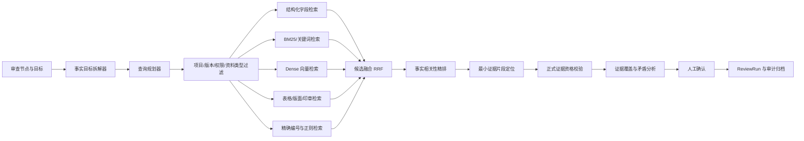

# 项目证据查找 RAG 优化方案

> 文档状态：方案草案（v3，2026-07-21 修订）  
> 编制日期：2026-07-21  
> 适用范围：工程监检项目资料的证据查找、证据定位、证据覆盖分析与人工确认  
> 核心原则：RAG 负责提高候选召回率，确定性规则负责证据准入和业务判断，人工负责最终确认。
>
> v2 修订要点：新增审核 agent 现状约束（2.4）、FactTarget 配置化要求（5.1、阶段 0.5）、ReviewRun 集成设计（5.8）、embedding/BM25/精排技术选型与延迟预算（7.4、7.5、8.3）、比较工具复用 `deterministic_tools.py`（6.4、阶段 4、14.1）、审核 agent 配套改造（14.4）。  
> v3 修订要点：取消上线前集中人工标注，评测改为“存量确认证据回放 + 上线后延迟真值自学习”（12.1、12.4）；验收门槛拆分为零标注上线门槛与运行期门槛（12.3）；阶段 0 改为零标注基线与反馈采集管道；阶段 5 增加自学习闭环运行。

## 1. 执行摘要

项目可以并且应该使用 RAG 优化证据查找，但不应直接采用“向量检索 + 大模型生成答案”的普通 RAG。

工程监检中的“证据”不是一段看起来相关的文本，而是能够证明某个审查事实、来自正确资料类型、属于当前项目和当前版本，并且可以定位到具体页码和版面坐标的原文。普通 RAG 容易召回语义相似但证明力不足的内容，也容易把文件标题、目录、模板文本或其他项目资料误当成证据。

推荐建设“受约束的 Hybrid Evidence RAG”，形成以下职责边界：

- RAG：扩大召回范围，发现同义表达、隐式表述和跨文件证据。
- 资料类型与权限规则：先过滤不允许参与当前审查的文件。
- 事实定位器：从候选块中提取最小可引用原文，并保留页码、坐标和来源片段。
- 确定性比较工具：完成许可证范围、级别、单位名称、日期区间等业务比较。
- 人工确认：确认正式证据及最终结论。

目标链路为：

```text
审查目标拆解
→ 权限、项目、版本、资料类型硬过滤
→ 结构化字段、关键词、语义向量、表格和版面并行召回
→ 融合排序与精排
→ 最小事实原文定位
→ 正式证据资格校验
→ 事实覆盖与矛盾分析
→ 人工确认
```

## 2. 当前实现现状

### 2.1 已具备的基础能力

项目已经具备建设 Evidence RAG 的主要基础设施：

- 项目文件已完成 OCR、字段抽取、切片和向量数据入库。
- PostgreSQL 已提供 pgvector 和 HNSW 检索路径。
- 标准知识检索已经具备精确条款、别名、关键词、向量和 PageIndex 路由。
- 证据匹配已经具备资料类型边界、事实目标拆分、页码与 bbox 校验。
- 正式证据和“可能相关但不可正式引用”的建议资料已经分层展示。
- ReviewRun 已具备检索轨迹、版本快照和人工确认机制。

截至 2026-07-21，广东 LNG 测试项目的资料索引状态为：

| 项目 | 当前值 |
|---|---:|
| 项目文件 | 30 份 |
| 知识切片 | 4524 条 |
| 向量记录 | 4524 条 |
| 向量完整率 | 100% |
| 当前向量模型 | `offline-hash-v1` |

### 2.2 当前两条检索链路的差异

#### 标准条款检索

标准条款侧已经实现 Hybrid RAG，支持：

- 精确条款编号检索。
- 标准编号和业务别名匹配。
- 本地关键词评分。
- pgvector 或本地向量候选。
- PageIndex 长文档章节路由。
- 检索质量惩罚和 RetrievalTrace。

主要实现位于：

- `backend/libs/knowledge_retrieval.py`
- `backend/libs/knowledge_indexing.py`
- `backend/libs/db/repository.py`

#### 项目证据检索

项目证据侧当前以预计算为主：

- 按资料类型、责任方和文本上下文进行硬过滤。
- 将审查资料项拆成事实目标。
- 从 OCR 字段、片段和印章中选择候选原文。
- 依据命中事实数、结构化字段数和定位质量打分。
- 生成 `nodeEvidenceLinks` 和 `advisoryEvidenceLinks`。
- `/检索证据` 当前主要读取这些已生成候选，没有实时执行语义向量召回。

主要实现位于：

- `backend/libs/material_targeting.py`
- `backend/apps/api/routes.py`
- `frontend/src/views/AIReviewB/ConversationalReviewWorkbenchB.vue`

### 2.3 当前主要不足

1. `offline-hash-v1` 主要反映字符和 n-gram 相似度，无法稳定识别复杂同义表达和隐式事实。
2. 项目证据检索尚未真正连接已有的向量检索能力。
3. 候选主要在单个字段或 OCR 片段中选择，对跨行、表格行、标题栏组合和跨页事实支持有限。
4. 节点名称或资料项名称较宽泛，若直接作为一个查询，容易召回大量“相关但不能证明”的内容。
5. 当前打分更接近规则加权，缺少“候选是否直接回答事实问题”的精排模型。
6. 缺少完整的证据覆盖矩阵和跨文件矛盾检查。
7. 事实目标拆解目前依赖 `material_targeting.py` 中 `evidence_fact_targets` 的硬编码中文关键词匹配和节点特判（如 `nodeId == 1` 分支），无法扩展到 69 个业务节点，`queryTerms`、`comparisonRule`、`allowedMaterialTypes` 等配置也无处存放。
8. 审核 agent（ReviewRun）的 12 步执行图不包含任何实时材料证据检索步骤，材料证据完全依赖 OCR 完成后 `run_material_targeting` 的预计算结果；图内的 `retrieve_knowledge` 仅检索标准条款库。

### 2.4 审核 Agent 工作流的相关约束

本方案的落地点是审核 agent，因此必须考虑其现状约束：

1. ReviewRun 是严格线性的 12 步图（`load_context` → `load_ocr_result` → `run_rule_engine` → `retrieve_knowledge` → `build_prompt` → `llm_generate_findings` → 校验门禁 → `persist_drafts`），由 `backend/libs/review_orchestrator/execution.py` 编排，通过 inline 或 Temporal 模式执行。
2. `execution.py` 约 4100 行，混合了 run 创建/冻结、图步骤、LLM 调用、R12–R19 前置规划、校验门禁和人工决策，任何新增步骤都有较高回归风险。
3. 节点逻辑靠硬编码枚举扩展：`r13_facts.py` 至 `r24_r34_facts.py` 按节点号命名，`execute_review_run_inline` 内大量 `if node_id ==` 分支，R12/R19 为独立 agent。
4. 主图 `llm_generate_findings` 阶段是单次 chat + JSON 解析，没有 tool-calling；模型发现证据不足时无法按需补检索。
5. 知识条款侧（`knowledge_retrieval.py`）已有多路召回、路由和 RetrievalTrace 基建；材料侧是另一套关键词/事实打分，两套“检索”心智并存。
6. 确定性比较工具已存在于 `review_orchestrator/deterministic_tools.py`（如 `check_all_equal`、`check_date_covers`），并已接入 R13–R18 的受控 tool loop 和审计链路。

本方案所有新增能力必须与上述现状对齐：复用而不是重建检索与比较基建，配置化而不是继续硬编码节点知识。

## 3. 建设目标与非目标

### 3.1 建设目标

- 提高同义表达、隐式表达和跨文件证据的召回率。
- 保持或提升正式证据的准确率，不能以召回率换取错误支撑。
- 所有正式证据都可追溯到当前文件版本、页码、bbox 和原始 OCR 片段。
- 将“资料相关”“包含目标事实”“能够支持结论”明确分层。
- 支持审查目标的逐事实覆盖、缺失和冲突分析。
- 检索过程可复现、可审计、可评测、可回滚。
- 不改变现有人工最终确认的责任边界。

### 3.2 非目标

- 不允许模型根据文件名或摘要直接生成正式结论。
- 不允许向量相似度直接决定资料是否满足审查要求。
- 不允许模型生成不存在的页码、bbox、原文或许可证字段。
- 不允许跨项目、跨租户、跨权限范围或跨历史版本检索。
- 不用 RAG 替代许可证范围、日期覆盖等确定性业务比较。
- 第一阶段不以 GraphRAG 或完全自治 Agent 作为主检索方案。

## 4. 总体设计原则

### 4.1 RAG 只负责召回和排序

RAG 输出的是候选，不是正式证据，更不是审查结论。候选必须经过资料类型、原文定位和事实形态校验后，才能进入正式证据列表。

### 4.2 先硬过滤，后软排序

下列条件必须在语义检索前或检索结果进入业务层前强制过滤：

- 租户和项目一致。
- 当前用户具有文件及节点访问权限。
- 文件版本为 ReviewRun 冻结版本或当前指定版本。
- 文件未撤回、作废或归档失效。
- 资料类型允许支持当前事实目标。
- 节点、责任方和提交状态符合当前业务范围。

### 4.3 以事实目标为检索单位

不能只使用“设计单位许可资质”之类的节点名称检索。一个审查目标应拆成多个可验证事实，每个事实分别生成查询、候选和覆盖状态。

### 4.4 正式证据必须可定位

正式证据至少包含：

- `documentId`
- `documentVersionId`
- `pageNo`
- `bbox`
- `quotedText`
- `sourceFragmentIds`、字段 ID、表格单元格 ID或印章 ID之一
- `factTargetCode`
- `materialTypeCode`
- `retrievalTraceId`

缺少事实原文或坐标的结果只能进入建议层，不能支撑正式结论。

### 4.5 模型不能越过确定性结果

许可证范围、许可证级别、有效期覆盖、单位名称一致性等判断必须由确定性规则或受控 Tool 完成。模型可以解释结果，但不能覆盖 Tool 的结论。

## 5. 目标架构



### 5.1 事实目标拆解器

输入：节点、资料审查点、业务规则和证据项。  
输出：一组结构化的 `FactTarget`。

建议数据结构：

```json
{
  "factTargetCode": "license_validity_end",
  "name": "许可证有效期截止日期",
  "question": "设计许可证的有效期截止日期是什么？",
  "allowedMaterialTypes": ["design_license"],
  "expectedValueType": "date",
  "required": true,
  "comparisonRule": "covers_project_schedule_end",
  "queryTerms": ["有效期", "有效期至", "截止日期", "证书有效期"]
}
```

事实目标应优先来自已配置的 `evidenceItems`、原子检查项和业务规则，不应由模型临时自由生成。模型仅可在受控词表内补充同义查询。

#### 现状差距与配置化要求

当前 `material_targeting.py` 的 `evidence_fact_targets` 通过硬编码中文关键词（如 `"许可范围" in normalized`）和节点特判生成事实目标，仅覆盖少量节点，且无法承载上述 `FactTarget` 结构中的 `question`、`expectedValueType`、`comparisonRule` 等字段。

因此 **FactTarget 配置化是本方案的前置任务**（见阶段 0.5）：

- 将事实目标定义迁入 business pack 或数据库配置表，按节点和资料审查点维护。
- 配置内容包含：`factTargetCode`、`allowedMaterialTypes`、`expectedValueType`、`required`、`comparisonRule`、`queryTerms`、字段名映射。
- 现有 `evidence_fact_targets` 的硬编码规则转换为首批配置数据，代码规则保留为无配置时的默认回退。
- 配置具备版本号，ReviewRun 创建时固化所用配置版本。

### 5.2 查询规划器

每个事实目标至少形成三类查询：

1. 精确查询：许可证编号、图号、标准号、日期等可正则识别内容。
2. 关键词查询：业务术语、同义词、常见 OCR 变体。
3. 语义查询：完整事实问题，用于 Dense retrieval。

查询规划器还应携带以下过滤条件：

- `tenantId`
- `projectId`
- `nodeId`
- `documentVersionIds`
- `allowedMaterialTypes`
- `responsibleParty`
- `currentUserScope`
- `factTargetCode`

### 5.3 多路候选召回

#### 结构化字段召回

优先检索 OCR 已抽取字段、表格列、标题栏键值和印章识别结果。结构化字段对许可证编号、日期、单位、级别、压力和温度等事实最可靠。

#### 关键词/BM25 召回

用于精确业务词、编号、短语、OCR 近似词和局部上下文。关键词检索不能仅检索文件标题，应覆盖片段原文和结构化字段。

#### Dense 向量召回

用于发现同义表达和隐式表述。应将当前 `offline-hash-v1` 升级为真正的中文语义 embedding，并保留模型版本和索引版本。

#### 表格与版面召回

对以下内容应使用独立索引单元：

- 表格行。
- 键值对。
- 图纸标题栏。
- 印章区域。
- 页眉和页脚以外的文本块。
- 相邻 OCR 片段组成的上下文窗口。

#### 精确规则召回

编号、日期、压力、温度、管道等级、许可证级别等事实应同时使用正则和标准化规则召回，避免语义模型漏掉短值。

### 5.4 候选融合

建议使用 Reciprocal Rank Fusion（RRF）融合多路结果，而不是直接比较不同召回器的原始分数。

融合时保留：

- 每个召回渠道的排名。
- 命中的查询词和事实目标。
- Dense 相似度。
- BM25 或关键词得分。
- 结构化字段置信度。
- 页码与 bbox 完整性。
- 资料类型和责任方匹配情况。

### 5.5 精排

精排目标不是判断“文本是否与节点相关”，而是判断：

> 该候选原文是否直接回答当前事实问题，并且是否具有足够证明力？

推荐精排特征：

| 特征 | 说明 |
|---|---|
| 事实直接性 | 是否直接给出目标值，而不是只描述文件用途 |
| 资料类型适用性 | 文件类型能否证明该事实 |
| 结构化命中 | 是否来自字段、表格行、印章或标题栏 |
| 定位完整性 | 是否有页码、bbox 和来源片段 |
| 上下文完整性 | 片段是否包含必要主语和限定条件 |
| OCR 质量 | OCR 置信度、字符异常和表格错位情况 |
| 项目一致性 | 项目名称、单位、图号等是否与当前工程一致 |
| 版本有效性 | 是否属于 ReviewRun 冻结版本 |

精排模型只能调整候选顺序，不能绕过硬过滤或将不合格候选升级为正式证据。

### 5.6 最小证据片段定位

候选块通常比正式引用原文更长。定位器应从候选块中选择能够独立表达事实的最小片段：

- 单个结构化字段。
- 一个表格行或相关单元格组合。
- 一个印章区域及其相邻单位名称。
- 当前 OCR 片段加必要的前后相邻片段。

定位结果必须映射回原始页面坐标。若组合多个片段，应记录全部 `sourceFragmentIds`，bbox 可保存为联合区域或多个子区域。

### 5.7 正式证据资格校验

候选进入正式证据前必须通过以下检查：

1. 来源资料类型在该事实目标的允许列表内。
2. `quotedText` 不是文件名、目录标题或元数据。
3. `pageNo` 有效。
4. `bbox` 有效且位于对应页面范围内。
5. 原文满足目标值形态，例如日期目标必须包含可解析日期。
6. 原文与当前项目、单位或业务对象存在必要关联。
7. 当前文件版本未撤回、未作废且属于 ReviewRun 输入快照。
8. 没有违反权限和租户边界。
9. 候选没有被人工驳回。

未通过定位或证明力检查的结果进入 `advisoryEvidenceLinks`，并记录具体拒绝原因。

### 5.8 与审核 Agent（ReviewRun）的集成设计

Evidence Search 不是独立旁路服务，必须与 ReviewRun 执行图明确接合。集成分两期：

#### 一期：图内新增检索步骤（随阶段 2 交付）

在现有 12 步图中，`load_ocr_result` 之后、`run_rule_engine` 之前新增 `retrieve_material_evidence` 步骤：

```text
load_context
→ load_ocr_result
→ retrieve_material_evidence   ← 新增
→ run_rule_engine
→ retrieve_knowledge
→ build_prompt
→ llm_generate_findings
→ 校验门禁
→ persist_drafts
```

该步骤的约束：

- 检索范围严格锁定 ReviewRun 冻结的 `inputDocumentVersionIds`，不检索实时最新版本。
- 输入为该节点的 FactTarget 配置（取 ReviewRun 固化的配置版本）。
- 输出 `RetrievalTrace` 与知识条款侧同构，一并写入 `repo.state["retrieval_traces"]`，参与 `outputHash` 与审计视图。
- 检索到的正式候选与已有人工确认证据合并后进入 `run_rule_engine` 与 prompt 上下文。
- 检索服务失败或超时，回退到预计算 `nodeEvidenceLinks`，并在 Trace 中记录降级原因；不阻断图执行。

#### 二期：LLM 阶段的受控检索工具（阶段 3 之后评估）

在 `llm_generate_findings` 阶段将 `evidence_search` 注册为受控工具（受现有 `FORBIDDEN_AGENT_TOOLS` 白名单机制约束），允许模型在证据不足时按事实目标补检索。二期只有在一期指标稳定后启动，且模型补检索的结果同样必须通过正式证据资格校验。

#### 会话 `/检索证据` 共用服务

审查会话的 `/检索证据` 命令与图内步骤调用同一个 `evidence_retrieval` 服务，差异仅在于：会话侧允许使用当前指定版本而非冻结版本，并将结果渲染为 `evidence_card`。两处不得各自实现检索逻辑。

## 6. R01“设计单位许可资质”示例

### 6.1 审查目标

核对设计单位是否具有适用的设计许可，许可证范围是否覆盖当前工程和设计活动，许可证有效期是否覆盖整个施工计划工期。

### 6.2 事实覆盖矩阵

| 事实编码 | 目标事实 | 主要来源 | 能否由设计文件替代 |
|---|---|---|---|
| `designer_name` | 设计单位名称 | 许可证、图纸标题栏、设计印章 | 只能辅助一致性检查 |
| `license_number` | 许可证编号 | 设计许可证 | 否 |
| `license_scope` | 许可范围 | 设计许可证 | 否 |
| `license_level` | 许可级别 | 设计许可证 | 否 |
| `license_valid_from` | 有效期起始日期 | 设计许可证 | 否 |
| `license_valid_to` | 有效期截止日期 | 设计许可证 | 否 |
| `project_name` | 当前工程名称 | 图纸、合同、施工计划 | 是，作为工程关联事实 |
| `design_activity` | 当前设计活动和管道类别 | 设计说明、管道特性表 | 是，作为被覆盖对象 |
| `schedule_start` | 施工计划开始日期 | 施工计划 | 否 |
| `schedule_end` | 施工计划结束日期 | 施工计划 | 否 |
| `design_seal` | 设计印章单位 | 图纸印章页 | 只能辅助一致性检查 |

### 6.3 查询示例

针对 `license_scope`：

- 精确词：`许可范围`、`压力管道设计`、`工业管道`、`GC1`、`GC2`、`GCD`。
- 语义问句：`该设计许可证允许从事哪些压力管道设计活动？`
- 硬过滤：`materialTypeCode = design_license`。

针对 `design_activity`：

- 精确词：`管道类别`、`管道级别`、`设计压力`、`设计温度`、`介质`。
- 语义问句：`当前工程包含什么级别和参数范围的压力管道设计？`
- 硬过滤：`materialTypeCode = design_document`。

### 6.4 确定性比较

RAG 找到事实后，应由 Tool 完成以下比较：

```text
单位一致性：许可证机构名称 ≈ 图纸设计单位 ≈ 印章单位
范围覆盖：许可证范围 ⊇ 当前工程设计活动和管道类别
级别覆盖：许可证级别 ⊇ 当前工程最高管道级别
日期覆盖：许可证起始日 ≤ 施工开始日 且 许可证截止日 ≥ 施工结束日
```

任何关键事实缺失时，结论只能是“证据不足”或“待人工确认”，不能因为其他设计文件相关而推断许可证有效。

上述比较工具不新建模块，统一在 `backend/libs/review_orchestrator/deterministic_tools.py` 中扩展（该模块已有 `check_all_equal`、`check_date_covers` 等同类工具，并已接入受控 tool loop 和审计链路），避免出现第二套比较逻辑。

## 7. 数据与索引设计

### 7.1 分层索引单元

建议同时维护以下层级：

| 层级 | 用途 |
|---|---|
| 文档级 | 资料类型、责任方、项目、版本、文件状态过滤 |
| 页面级 | 长文档页路由、页面主题和预览 |
| 文本块级 | 普通段落和上下文语义检索 |
| OCR 片段级 | 精确 bbox 定位和短事实检索 |
| 字段级 | 编号、单位、日期、级别、压力、温度等 |
| 表格行/单元格级 | 特性表、材料表、计划表、报告结果 |
| 印章级 | 单位名称、印章类别和区域定位 |

### 7.2 必备索引元数据

每个可检索单元至少应保存：

```json
{
  "tenantId": "TENANT-DEFAULT",
  "projectId": "P-2026-GDLNG-002",
  "nodeIds": [1],
  "documentId": "DOC-...",
  "documentVersionId": "DV-...",
  "fileId": "KF-...",
  "materialTypeCode": "design_license",
  "responsibleParty": "contractor",
  "pageNo": 1,
  "bbox": [100, 120, 460, 180],
  "sourceFragmentIds": ["FRAG-..."],
  "sectionPath": ["设计许可证", "许可范围"],
  "contextType": "project_evidence",
  "sourceMethod": "ocr_fragment",
  "ocrConfidence": 0.96,
  "evidenceUsable": true,
  "indexVersion": "...",
  "embeddingModel": "..."
}
```

### 7.3 Parent-Child 切片

建议使用小块召回、大块补上下文：

- Child：字段、表格行或较短 OCR 片段，用于精确召回和定位。
- Parent：所在段落、页面区域或章节，用于精排和解释上下文。

正式引用仍使用 Child 的原文和坐标，Parent 只用于判断语义和消除歧义。

### 7.4 Embedding 与索引版本

- 将 `offline-hash-v1` 保留为离线兜底，不作为正式语义检索主模型。
- 使用真实中文语义 embedding 重新生成项目证据向量。
- 查询向量和文档向量必须使用相同模型与维度。
- 每条向量保存 `embeddingModel`、`indexVersion` 和输入内容哈希。
- ReviewRun 保存所用索引版本，保证结果可复现。
- 新旧索引并行一段时间，通过影子检索比较后再切换。

#### Embedding 选型与部署

部署环境为离线/内网（`offline-hash-v1` 的存在即源于此约束），embedding 必须本地部署，复用现有 `Dockerfile.embedding` 与 `requirements-embedding.txt` 的嵌入服务基建。候选模型（阶段 1 用存量确认证据回放集实测后定版）：

| 候选 | 维度 | 说明 |
|---|---:|---|
| BGE-M3 | 1024 | 中文效果稳定，支持 dense + sparse 混合输出，CPU 可推理 |
| Qwen3-Embedding-0.6B | 1024 | 与现有 Qwen 运行时同生态，需 GPU 或量化 |
| bge-large-zh-v1.5 | 1024 | 资源占用小的保底选项 |

选型硬约束：

- 模型可离线打包，无外部 API 依赖。
- 单条切片向量化 P95 不超过 200ms（批量索引场景可放宽）。
- 查询侧向量化 P95 不超过 300ms，计入检索总延迟预算。
- 需给出 CPU-only 环境的可用方案（量化或选 CPU 友好模型）。

### 7.5 中文关键词检索实现

PostgreSQL 没有原生 BM25，中文另有分词问题。第一阶段不引入 Elasticsearch 等外部引擎，按以下顺序落地：

1. 首选：`tsvector` + 中文分词（zhparser 扩展；若部署受限则应用层 jieba 分词后写入 `tsvector`），用 `ts_rank_cd` 近似 BM25。
2. 兜底：`pg_trgm` 三元组相似度，覆盖 OCR 错字和无分词场景。
3. 精确编号、日期等继续走正则和结构化字段等值查询，不依赖全文检索。

分词词典需加入业务词表（GC1/GC2/GCD、许可证类别、管道术语等），与 FactTarget 配置的 `queryTerms` 共用维护入口。

## 8. 排序策略

### 8.1 建议排序阶段

1. 各召回器独立返回 Top N。
2. 使用 RRF 合并并去重。
3. 应用硬过滤和质量惩罚。
4. 精排模型输出事实直接性得分。
5. 确定性规则补充资料类型、定位和字段形态得分。
6. 每个事实目标保留 Top K，并控制同一文件重复候选数量。

### 8.2 建议特征权重

以下权重仅作为初始实验值，应通过评测集校准：

| 特征 | 初始权重 |
|---|---:|
| 精排事实直接性 | 0.35 |
| 资料类型适用性 | 0.20 |
| 结构化字段或表格命中 | 0.15 |
| 定位完整性 | 0.10 |
| 关键词/BM25 | 0.08 |
| Dense 相似度 | 0.07 |
| OCR 和来源质量 | 0.05 |

上述加权只作用于**已通过第 5.7 节正式证据资格校验的候选之间的排序**。资格校验是布尔闸门，不参与加权，任何高分都不能抵消资格缺陷；未通过校验的候选无论总分多高，只能进入建议层。这与 5.5 节“精排只能调序、不能升级候选资格”的原则一致。

以下情况直接淘汰或重罚：

- 文件标题或目录标题。
- 无页码、无 bbox。
- 资料类型不允许。
- 历史版本、撤回文件或无权限文件。
- 只命中“设计”“许可证”等宽泛词。
- 原文没有出现目标事实值。

### 8.3 精排选型与延迟预算

精排使用本地 cross-encoder（首选 bge-reranker-v2-m3，保底 bge-reranker-base），不使用在线 LLM 做实时精排；LLM 精排仅用于离线评测对比。

P95 总延迟 2.5 秒按以下预算分解：

| 阶段 | 预算 |
|---|---:|
| 查询规划与向量化 | 300ms |
| 多路召回（并行） | 600ms |
| RRF 融合与硬过滤 | 100ms |
| 精排（每事实目标 Top 20 候选） | 1000ms |
| 资格校验与定位 | 300ms |
| 序列化与传输 | 200ms |

精排是预算大头，控制手段：

- 精排输入截断到每事实目标 20 条以内。
- GPU 环境用 batch 推理；CPU-only 环境将候选数降到 10 条或降级为纯规则加权排序。
- 精排超时直接跳过精排，按 RRF + 确定性特征排序返回，并在 Trace 中标记 `rerankSkipped`。

## 9. 证据覆盖、冲突与结论生成

### 9.1 覆盖矩阵

每个审查点返回逐事实状态：

- `confirmed`：已有人工确认的正式证据。
- `candidate`：存在可定位候选，等待确认。
- `advisory`：存在相关资料，但不能作为正式证据。
- `missing`：未找到候选。
- `conflicting`：多个来源给出不一致结果。

### 9.2 冲突检测

至少检测：

- 同一许可证的编号、机构名称或有效期不一致。
- 图纸设计单位与许可证机构不一致。
- 图纸或特性表中的管道级别高于许可证范围。
- 施工计划结束日晚于许可证截止日。
- 同一字段在不同版本中发生变化。
- OCR 字段和原文片段不一致。

### 9.3 结论边界

- RAG 未找到证据，不等于事实不存在。
- 找到相关文件，不等于文件支持结论。
- 找到部分事实，不等于完成审查目标。
- 关键事实缺失时必须输出缺项清单。
- 存在冲突时不得自动给出“符合”。

## 10. API 与前端交互建议

### 10.1 新增证据检索 API

建议新增：

```text
POST /api/projects/{projectId}/inspection/nodes/{nodeId}/evidence-search
```

请求示例：

```json
{
  "reviewPointId": "MRP-1-design_license-05AB35",
  "factTargetCodes": ["license_scope", "license_valid_to"],
  "query": "检索设计许可证的许可范围和有效期",
  "topK": 20,
  "reviewRunId": null
}
```

响应示例：

```json
{
  "retrievalTraceId": "RTR-...",
  "formalCandidates": [],
  "advisoryCandidates": [],
  "coverage": [
    {
      "factTargetCode": "license_scope",
      "status": "candidate",
      "formalCandidateCount": 2,
      "advisoryCandidateCount": 1,
      "confirmedEvidenceLinkIds": [],
      "missingReason": null
    },
    {
      "factTargetCode": "license_valid_to",
      "status": "missing",
      "formalCandidateCount": 0,
      "advisoryCandidateCount": 0,
      "confirmedEvidenceLinkIds": [],
      "missingReason": "no_candidate_in_allowed_material_types"
    }
  ],
  "rejectedCandidateSummary": {
    "wrongMaterialType": 8,
    "missingLocator": 3,
    "titleOnly": 5
  }
}
```

`coverage` 每项对应一个事实目标，`status` 取第 9.1 节定义的五种覆盖状态。

### 10.2 `/检索证据` 命令改造

建议按以下顺序执行：

1. 读取当前节点、ReviewRun、权限范围和冻结文件版本。
2. 调用新的 Evidence Search 服务进行实时检索。
3. 合并人工已确认的既有证据。
4. 将结果分为“可定位证据候选”和“可能相关文件”。
5. 展示检索覆盖、拒绝原因和检索轨迹。
6. 检索服务不可用时，回退到当前预计算 `nodeEvidenceLinks`。

### 10.3 前端展示

每条候选建议展示：

- 文件名、版本、页码。
- 事实目标名称。
- 命中原文。
- 主要召回渠道。
- 为什么被选中。
- 是否满足正式证据条件。
- 不满足时的明确原因。
- 查看原文和加入上下文操作。

不建议只展示一个不透明的“相似度”。应同时显示“事实直接性”“资料类型适用性”和“定位完整性”。

## 11. 检索轨迹与审计

每次检索应生成 `RetrievalTrace`，至少记录：

- 查询原文和事实目标。
- 查询规划结果及同义词扩展。
- 项目、节点、权限、版本和资料类型过滤条件。
- 各召回器的候选数量、Top K 和耗时。
- 使用的 embedding、精排模型及索引版本。
- RRF 和精排前后的排名。
- 每个候选的接受或拒绝原因。
- 正式候选、建议候选和缺失事实。
- ReviewRun、用户和操作 ID。

检索轨迹不得保存模型的隐藏推理，只保存结构化输入、工具调用、分数、规则结果和可审计说明。

## 12. 评测体系

### 12.1 评测数据集建设

评测集长期至少覆盖：

- 69 个业务节点中的高频节点。
- 许可证、图纸、施工方案、质量证明、焊接、无损检测和压力试验资料。
- 扫描图片、表格、PDF 文本层和低质量 OCR。
- 正向证据、近似干扰、标题干扰、错误资料类型和历史版本。
- 跨文件覆盖、事实缺失和事实冲突。

每条评测样本至少包含：

- 审查点和事实目标。
- 允许的资料类型。
- 正确 documentVersionId。
- 正确页码和 bbox。
- 正确原文。
- 是否足以支撑正式结论。

#### 评测集建设策略：反馈驱动，不做上线前集中标注

不安排上线前的集中人工标注。评测集通过三个近零增量成本的来源逐步积累：

1. **存量确认证据回放**：系统中已有的人工确认 `nodeEvidenceLinks`（含 confirm/reject 记录）直接转换为首批评测样本——被确认的文件版本、页码、bbox 和原文即正确答案，无需任何新增标注。
2. **线上确认即标注**：上线后审查工程师的每一次证据确认、带结构化原因的驳回、ReviewRun 草稿的 accept/edit/reject，自动转换为评测样本；确认为正样本，带原因的驳回为负样本。这些是审查工作本身的动作，不产生额外标注工时。
3. **少量周期性抽检替代集中标注**：每周抽取 5%–10% 新增样本由审查工程师复核（复用 `EvidenceLocatorDialog` 的定位预览做复核界面），用持续小成本替代前置大成本。

样本入集的净化规则与自学习边界见 12.4。上文列出的覆盖面要求（节点、资料类型、正负样本形态）作为评测集的**长期目标构成**，通过运营中定向补采达成，而不是上线前一次性建齐。

### 12.2 核心指标

| 指标 | 说明 |
|---|---|
| `Recall@20` | 正确证据是否进入前 20 条候选 |
| `Precision@5` | 前 5 条中真正回答事实问题的比例 |
| `MRR` / `nDCG` | 正确候选排序质量 |
| 正式证据准确率 | 被标为正式候选的结果是否都具备证明力 |
| bbox 定位准确率 | 引用区域是否覆盖正确原文 |
| 事实覆盖率 | 审查目标的必要事实被覆盖比例 |
| 错误支撑率 | 不适用资料被用于支撑结论的比例 |
| 标题误用率 | 文件名、目录标题被当作证据的比例 |
| 跨版本泄漏率 | 非冻结版本进入结果的比例 |
| 权限泄漏率 | 无权限资料进入结果的比例 |
| P95 延迟 | 实时证据检索的响应时间 |

### 12.3 验收门槛：上线门槛与运行期门槛

由于不做上线前集中标注，验收分两层。

**上线门槛**（零标注即可验证，发布前必须全部满足）：

- 权限泄漏率：0。
- 跨项目和跨版本泄漏率：0。
- 文件标题误用率：0（规则可判定，不依赖金标）。
- 正式证据定位完整率：100%。
- bbox 有效率：不低于 98%。
- 影子模式下，新检索对**存量已确认证据**的 `Recall@20` 不低于 95%，即新链路不丢已被人工认可的老答案。
- P95 检索延迟控制在 2.5 秒以内，模型降级时仍可返回预计算候选。

**运行期门槛**（延迟真值样本累计达到阈值后生效，建议不少于 300 条有效样本）：

- 正式证据错误支撑率：不高于 1%。
- 相对现有预计算基线，`Recall@20` 提升不少于 15 个百分点。
- 灰度范围扩大、特征权重调整和精排阈值变更，以本层指标为决策依据；样本量未达标前只允许在已灰度范围内运行。

### 12.4 上线后自学习闭环

#### 延迟真值机制

以“人工最终确认的证据”作为延迟到达的真值（delayed ground truth）：

1. 每次检索固化 `RetrievalTrace`（候选列表、各通道排名、分数、过滤条件）。
2. 事后人工确认某条证据时，回查该节点当时的 Trace，判定被确认证据当时是否进入 Top 20 / Top 5 及其排名。
3. `Recall@20`、`Precision@5`、`MRR` 等指标据此按周滚动计算并按节点分组展示，不需要独立金标集。
4. 人工在候选之外自行补充的证据（检索完全漏掉的情形），记为最高价值的召回失败样本，进入定向优化队列。

#### 样本净化规则（防反馈污染）

- 确认样本须满足：所属 ReviewRun 已完成，且冷静期（建议 14 天）内未被撤销或改判，方可转为有效真值。
- 驳回必须携带结构化拒绝原因才能成为负样本；无原因驳回只做统计，不入集。
- 按（`factTargetCode`、`documentVersionId`、`bbox`）去重；同一目标出现互相矛盾的确认时，样本对进入人工复核队列，复核前双双冻结。
- 每周抽检 5%–10% 新增样本；抽检不合格率超过 10% 时，暂停对应来源（节点或人员维度）的样本自动入集并告警。
- 评测样本记录完整出处：`reviewRunId`、`retrievalTraceId`、确认人、时间和当时的索引版本。

#### 允许自学习的范围

自学习仅限**离线计算、版本化发布、影子对比、可一键回滚**的更新：

| 更新对象 | 方式 | 人工审批 |
|---|---|---|
| FactTarget `queryTerms` 同义词 | 从确认证据原文和召回失败样本挖掘候选词，进入建议队列 | 需要，审批后写入配置并升版本 |
| 8.2 节特征权重 | 按累计样本离线重校准，影子对比达标后灰度 | 需要（发布审批） |
| 精排阈值与 Top K | 离线校准 | 需要（发布审批） |
| FactTarget 配置修订建议 | 基于 `missing` / `conflicting` 高发目标生成修订提示 | 需要 |

#### 永不自学习的范围

- 正式证据资格校验（5.7）的任何规则。
- 权限、项目、版本、资料类型硬过滤。
- 确定性比较工具的业务逻辑。
- embedding 模型不做在线微调；更换模型必须走阶段 1 的双索引影子流程。

## 13. 分阶段实施计划

### 阶段 0：零标注基线与反馈采集管道

不做集中人工标注。交付物：

- 存量确认证据回放：将已有人工确认的 `nodeEvidenceLinks` 转换为首批评测样本，并据此记录当前规则匹配的基线表现。
- 硬安全基线自动化：权限泄漏、跨版本泄漏、定位完整性、标题误用等零标注可验证指标的自动化检查脚本。
- 完善 RetrievalTrace 和拒绝原因枚举（这是 12.4 延迟真值回查的前提，必须先行）。
- 建设反馈采集管道：证据确认/驳回、人工决策事件自动转换为评测样本，实现 12.4 的净化规则和出处记录。
- 固化 R01、R02、R12、R16、R19 等代表性节点的回归案例（从已完成 ReviewRun 回放生成，不需要新标注）。

退出条件：反馈事件能够自动进入评测集并通过净化规则；存量样本可稳定复现当前基线。

### 阶段 0.5：FactTarget 配置化（前置任务）

交付物：

- 事实目标配置模型落库或进入 business pack（`factTargetCode`、`allowedMaterialTypes`、`expectedValueType`、`required`、`comparisonRule`、`queryTerms`、字段名映射、配置版本号）。
- 将 `material_targeting.py` 中 `evidence_fact_targets` 的硬编码规则转换为首批配置数据，代码规则保留为无配置回退。
- ReviewRun 创建时固化所用 FactTarget 配置版本。
- 提供配置维护入口（可先用脚本导入 + 后台查看）。

退出条件：R01 等代表性节点的事实目标完全由配置驱动，输出与现有硬编码结果一致（回归对比通过）。

> 该阶段是查询规划器（5.2）和覆盖矩阵（9.1）的输入前提，必须先于阶段 2 完成；可与阶段 1 并行。

### 阶段 1：真实语义向量与双索引

交付物：

- 按 7.4 节完成 embedding 选型实测并定版（含离线部署与 CPU-only 方案）。
- 重新向量化项目资料。
- 保留旧索引，支持影子检索和一键回滚。
- 校验查询向量和文档向量的模型、版本及维度一致性。
- 按 7.5 节落地中文关键词检索（zhparser/jieba + tsvector，pg_trgm 兜底）。

退出条件：新索引完整率达到 100%，影子检索无权限或版本泄漏。

### 阶段 2：项目证据 Hybrid Retrieval 与 ReviewRun 集成

交付物：

- 抽取通用的项目证据检索服务 `evidence_retrieval`，复用 `knowledge_retrieval.py` 的多路召回、RRF 和 RetrievalTrace 基建。
- 接入结构化字段、BM25、Dense、表格和精确规则召回。
- 按 5.8 节在 ReviewRun 执行图中新增 `retrieve_material_evidence` 步骤（冻结版本范围、Trace 入 `retrieval_traces`、失败回退预计算候选）。
- `/检索证据` 改为调用同一服务，支持实时召回和预计算回退。

退出条件：召回率达到目标，正式证据边界没有回退，图内检索步骤的 Trace 可在审计视图中查看。

### 阶段 3：事实精排与最小原文定位

交付物：

- 建立事实问题级精排。
- 支持 Parent-Child 上下文。
- 支持表格行、标题栏、印章和相邻片段的最小证据定位。
- 输出正式与建议候选的明确分类原因。

退出条件：Precision@5、bbox 定位和标题误用指标达到验收门槛。

### 阶段 4：覆盖矩阵与确定性比较工具

交付物：

- 按审查目标输出逐事实覆盖矩阵。
- 在 `review_orchestrator/deterministic_tools.py` 中扩展单位一致性、范围包含、级别覆盖和日期区间工具（复用现有 `check_all_equal`、`check_date_covers`，不新建比较模块）。
- 增加跨文件矛盾检测。
- ReviewRun 结论严格引用已确认事实。
- 评估二期集成：将 `evidence_search` 注册为 `llm_generate_findings` 阶段的受控工具（见 5.8 节）。

退出条件：R01 等复杂目标可解释地输出“已覆盖、缺失、冲突和待确认”。

### 阶段 5：灰度发布与自学习闭环运行

交付物：

- 影子模式比较旧检索和新检索（含对存量已确认证据的不丢答案校验）。
- 按节点或项目灰度启用，样本量未达 12.3 运行期门槛前不扩大灰度。
- 按 12.4 运行自学习闭环：延迟真值指标周报、同义词建议队列、特征权重离线重校准与审批发布。
- 监控错误支撑、检索延迟、模型失败、索引漂移和反馈抽检不合格率。

退出条件：上线门槛全部满足并持续保持；运行期指标随样本积累呈收敛趋势；出现异常时能够回退至现有确定性候选。

## 14. 代码改造建议

### 14.1 后端

| 文件/模块 | 建议职责 |
|---|---|
| `backend/libs/material_targeting.py` | 保留资料类型与正式证据闸门；`evidence_fact_targets` 硬编码规则迁移为配置数据并保留回退 |
| `backend/libs/knowledge_indexing.py` | 增加项目证据分层切片、真实 embedding 和索引版本管理 |
| `backend/libs/db/repository.py` | 扩展带项目、版本、资料类型过滤的 pgvector 检索；tsvector/pg_trgm 关键词通道 |
| `backend/libs/knowledge_retrieval.py` | 抽取可复用的多路召回、RRF 和 RetrievalTrace 结构，供证据检索复用 |
| `backend/libs/evidence_retrieval.py` | 新增，负责项目证据查询规划、召回、融合和精排（复用 `knowledge_retrieval` 基建，不重建） |
| `backend/libs/evidence_validation.py` | 新增，负责定位、资料类型、事实形态和正式证据校验 |
| `backend/libs/review_orchestrator/deterministic_tools.py` | 扩展范围包含、级别覆盖、单位一致性、日期区间比较（不新建 `evidence_comparison.py`） |
| `backend/apps/api/routes.py` | 新增 Evidence Search API，并接入 `/检索证据` |
| `backend/libs/review_orchestrator/execution.py` | 新增 `retrieve_material_evidence` 图步骤；检索轨迹和确认事实固化到 ReviewRun |

### 14.2 前端

| 文件/模块 | 建议职责 |
|---|---|
| `frontend/src/types/ai-review-b.ts` | 增加检索轨迹、事实目标、候选分层和拒绝原因类型 |
| `frontend/src/types/aicheck.ts` | 扩展 EvidenceLink 的召回渠道、精排和覆盖字段 |
| `frontend/src/views/AIReviewB/ConversationalReviewWorkbenchB.vue` | 展示事实覆盖、正式候选、建议资料和检索原因 |
| `frontend/src/views/AICheck/components/EvidenceLocatorDialog.vue` | 支持多 bbox、表格单元格和相邻片段预览 |

### 14.3 测试

建议增加：

- `backend/tests/test_evidence_retrieval.py`
- `backend/tests/test_evidence_reranking.py`
- `backend/tests/test_evidence_validation.py`
- `backend/tests/test_evidence_retrieval_security.py`
- `backend/tests/test_fact_target_config.py`（配置化后与硬编码结果的回归对比）
- 确定性比较新工具的用例并入现有 `deterministic_tools` 测试
- `frontend/e2e/evidence-rag.spec.ts`

现有材料匹配和 Review B 测试继续作为不可回退的证据边界回归集。

### 14.4 审核 Agent 配套改造（P2，可并行推进）

以下改造不阻塞 RAG 主线，但能降低集成风险、提高节点扩展性，建议并行排期：

| 改造项 | 说明 |
|---|---|
| 拆分 `execution.py` | 按 run 生命周期 / 图步骤 / LLM 规划 / 人工决策拆为独立模块（约 4100 行的单文件是插入新图步骤的主要回归风险来源） |
| 节点插件化 | 定义 `FactProvider` 协议（输入节点 + FactTarget 配置，输出 `businessFacts`），将 `r13_facts.py`–`r24_r34_facts.py` 和 `if node_id ==` 分支逐步收敛为注册表 + 配置；R12/R19 保留为特殊 agent 但走同一注册表 |
| R13–R18 tool loop 简化评估 | 当前 loop 中多数工具 `parameters: {}`，LLM 仅“点名”调用；评估改为纯确定性编排 + LLM 解释，或给工具真实参数，以节省 token 和延迟 |
| 两套检索心智收敛 | 材料靶向与知识检索统一到同一 Trace 结构和召回抽象下，前端与审计视图使用一致术语 |

## 15. 风险与应对

| 风险 | 应对措施 |
|---|---|
| 语义模型召回相似但无证明力文本 | 硬过滤、事实精排、正式证据资格校验 |
| OCR 错误导致事实值错误 | 字段与原文双检、置信度、人工确认 |
| 表格切片破坏行列关系 | 表格行/单元格独立索引并保留结构坐标 |
| 模型或索引升级造成结果漂移 | 索引版本、影子模式、ReviewRun 冻结和回滚 |
| 实时检索延迟较高 | 预过滤、HNSW、缓存、并行召回和预计算回退 |
| 权限或版本泄漏 | 数据库层过滤、检索后复验和安全回归测试 |
| 模型不可用 | 回退到当前确定性 `nodeEvidenceLinks` |
| 人工反馈污染模型 | 按 12.4 净化规则执行：完成态 + 冷静期样本方可入集、结构化驳回原因、周期抽检熔断、只做离线有审批可回滚的更新 |
| 冷启动阶段缺乏质量指标 | 上线门槛只用零标注可验证指标；灰度范围受样本量约束，运行期指标达标前不扩大 |
| 单人确认偏差进入真值 | 样本记录确认人，抽检按人员维度统计不合格率并可按人熔断 |

## 16. 验收清单

- [ ] 事实目标完全由配置驱动（含 `queryTerms`、`comparisonRule`），ReviewRun 固化配置版本。
- [ ] 项目证据检索已使用真实语义 embedding（选型经存量确认证据回放集实测定版，含离线部署方案）。
- [ ] BM25、Dense、结构化字段和版面召回可以独立观测。
- [ ] ReviewRun 执行图包含 `retrieve_material_evidence` 步骤，检索范围锁定冻结版本，Trace 进入审计视图。
- [ ] 所有召回在项目、权限、版本和资料类型范围内执行。
- [ ] 每条正式候选具有页码、bbox、原文和来源片段。
- [ ] 文件标题、目录和元数据不能成为正式证据。
- [ ] 设计文件不能证明设计许可证范围和有效期。
- [ ] `/检索证据` 返回逐事实覆盖情况。
- [ ] 正式候选和建议资料分开展示。
- [ ] 检索服务失败时可回退到预计算候选。
- [ ] ReviewRun 固化检索模型、索引版本和 RetrievalTrace。
- [ ] R01 可完成单位、范围、级别和有效期覆盖比较。
- [ ] 权限泄漏率和跨版本泄漏率为 0。
- [ ] 12.3 上线门槛（零标注可验证项）全部满足，影子模式不丢存量已确认证据。
- [ ] 反馈采集管道上线：确认/驳回自动转评测样本，净化规则和抽检机制生效。
- [ ] 延迟真值指标（Recall@20、Precision@5）可按周产出并按节点分组。
- [ ] 自学习更新（同义词、权重）全部走离线审批发布，可一键回滚。

## 17. 最终建议

本项目不应在“是否使用 RAG”和“是否使用规则”之间二选一。最优方案是：

> 使用 Hybrid RAG 提高事实候选召回率，使用资料类型与定位规则控制正式证据资格，使用确定性 Tool 完成业务比较，使用人工确认完成最终责任闭环。

实施顺序上，应优先完成评测基线、真实 embedding 和项目证据 Hybrid Retrieval；GraphRAG 可在事实抽取稳定后，用于许可证、单位、项目、活动、日期和资料版本之间的关系分析，但不应替代原文证据链。

该方案能够复用项目现有 OCR、字段抽取、pgvector、PageIndex、ReviewRun 和人工确认能力，改造成本低于重建一套通用 Agentic RAG，同时更符合工程监检对准确性、可追溯性和审计性的要求。
